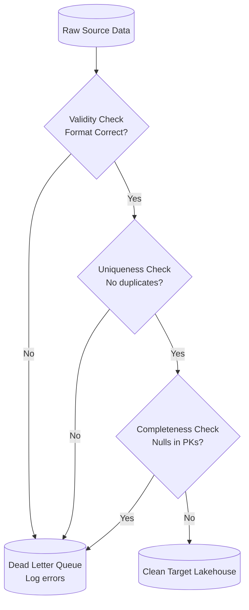

# Module 8.1: Data Quality Fundamentals

Welcome to **Data Quality Fundamentals**. Data pipelines move millions of records daily, but if the data is incorrect, incomplete, or corrupted, your downstream BI dashboards and ML models will yield incorrect results ("Garbage In, Garbage Out"). In this module, you will learn the six core dimensions of Data Quality and how to identify common data corruption patterns.

---

## 1. Detailed Theory

### The Six Dimensions of Data Quality
To evaluate if a dataset is fit for purpose, you must measure it against six core dimensions:
1. **Accuracy**: The degree to which data correctly describes the real-world object or event (e.g., checking that a customer's registered email is valid and active).
2. **Completeness**: The proportion of stored data against the potential of 100% complete records (e.g., checking if the `customer_billing_address` field is populated for all paid transactions).
3. **Consistency**: Verifying that data values are identical across separate systems (e.g., checking that a user's transaction amount in the Salesforce CRM matches their Stripe ledger record).
4. **Validity**: Enforcing that data conforms to defined format rules and type bounds (e.g., checking that `phone_number` contains only digits or `transaction_date` matches ISO-8601 formats).
5. **Uniqueness**: Ensuring no duplicate records exist in the target table (e.g., checking that each `transaction_id` appears exactly once in the sales fact table).
6. **Timeliness (Freshness)**: The data is up-to-date and available when needed (e.g., verifying that today's sales records are loaded before the 9:00 AM executive report runs).

### Common Quality Issues
- **Data Drift**: Gradual shifts in the statistical properties of incoming data over time.
- **Schema Changes (Drift)**: Unannounced additions or deletions of database columns in source systems, causing downstream ETL code to fail.

---

## 2. Architecture Diagram: The Data Quality Gates



---

## 3. Production Use Cases

1. **Customer Data Validation System**: A user profile ingestion pipeline. Before loading new users into the core CRM database, the pipeline validates that the `email` column matches regex patterns (Validity), that `user_id` is unique (Uniqueness), and that `sign_up_date` is not in the future (Accuracy).

---

## 4. Real Company Examples

- **Capital One**: Relies on automated data quality checkpoints at the boundary of their transactional ingestion pipelines to ensure client banking profiles conform to validation rules before processing.

---

## 5. Coding Examples

### Row-Level Data Quality Validation (Python/Pandas Concept)

This script shows how an ingestion task programmatically verifies the six dimensions of data quality on a raw data block.

```python
import pandas as pd
import re

# 1. Load raw transactional data
raw_data = [
    {"user_id": "U001", "email": "alice@email.com", "age": 28, "signup_date": "2023-10-15"},
    {"user_id": "U002", "email": "bob_email_com", "age": -5, "signup_date": "2023-10-15"}, # Invalid format, negative age
    {"user_id": "U001", "email": "alice@email.com", "age": 28, "signup_date": "2023-10-15"}, # Duplicate record
]

df = pd.DataFrame(raw_data)

# 2. Validity Check: Regex for email validation
email_pattern = r"^[\w\.-]+@[\w\.-]+\.\w+$"
df["is_valid_email"] = df["email"].apply(lambda x: bool(re.match(email_pattern, x)))

# 3. Accuracy Check: Age cannot be negative
df["is_valid_age"] = df["age"] > 0

# 4. Uniqueness Check: Identify duplicate user IDs
df["is_unique"] = ~df.duplicated(subset=["user_id"], keep="first")

# 5. Evaluate Data Quality
print("Data Quality Assessment:")
for idx, row in df.iterrows():
    if not (row["is_valid_email"] and row["is_valid_age"] and row["is_unique"]):
        print(f"Row {idx} Failed Validation! Details: Email={row['is_valid_email']}, Age={row['is_valid_age']}, Unique={row['is_unique']}")
    else:
        print(f"Row {idx} Passed Validation.")
```

---

## 6. Hands-on Labs

**Lab: Metric Classification**
**Objective**: Classify data dimensions.
**Instructions**:
Classify the following verification checks into the correct data quality dimension (**Accuracy**, **Completeness**, **Consistency**, **Validity**, **Uniqueness**, or **Timeliness**):
1. Verifying that the `zip_code` column matches US postal formats.
2. Checking if the `birth_date` is not in the future.
3. Ensuring that no two rows have the same `email`.
4. Checking that the row count matches between source database and staging.

---

## 7. Assignments

**Assignment: Data Drift Impact**
Explain the concept of **Data Drift** in Machine Learning pipelines. Describe a scenario where a gradual shift in incoming transaction values (e.g., inflation causing average purchase sizes to double over 6 months) causes a trained fraud detection model to lose accuracy if features are not monitored for drift.

---

## 8. Interview Questions

1. **What are the six dimensions of Data Quality?**
   *Answer Hint: Accuracy (real-world correctness), Completeness (no missing values), Consistency (matches across systems), Validity (correct formats), Uniqueness (no duplicate records), and Timeliness (data is fresh).*
2. **What is Schema Drift and how does it impact data pipelines?**
   *Answer Hint: Schema drift occurs when source databases add, delete, or rename columns without notifying the data team. If the ingestion pipeline expects a static schema, it will crash or output null values. Solve it by using schema validation checks at ingestion boundaries.*

---

## 9. Best Practices (FDE Standards)

- **Fail Fast**: Enforce validation rules at the entry point of the pipeline (Bronze layer boundary) to isolate dirty records before they reach downstream tables.
- **Log Failures to a DLQ**: Never discard failed rows silently. Write invalid records to a Dead Letter Queue (DLQ) directory for troubleshooting.

---

## 10. Common Mistakes

- **Swallowing Type Exceptions**: Casting strings to integers without `try...catch` handlers, causing the entire ingestion run to crash when a single malformed row appears.
- **Ignoring Duplicate Counts**: Assuming source databases never contain duplicate keys, leading to double-counting errors in downstream BI reports.
