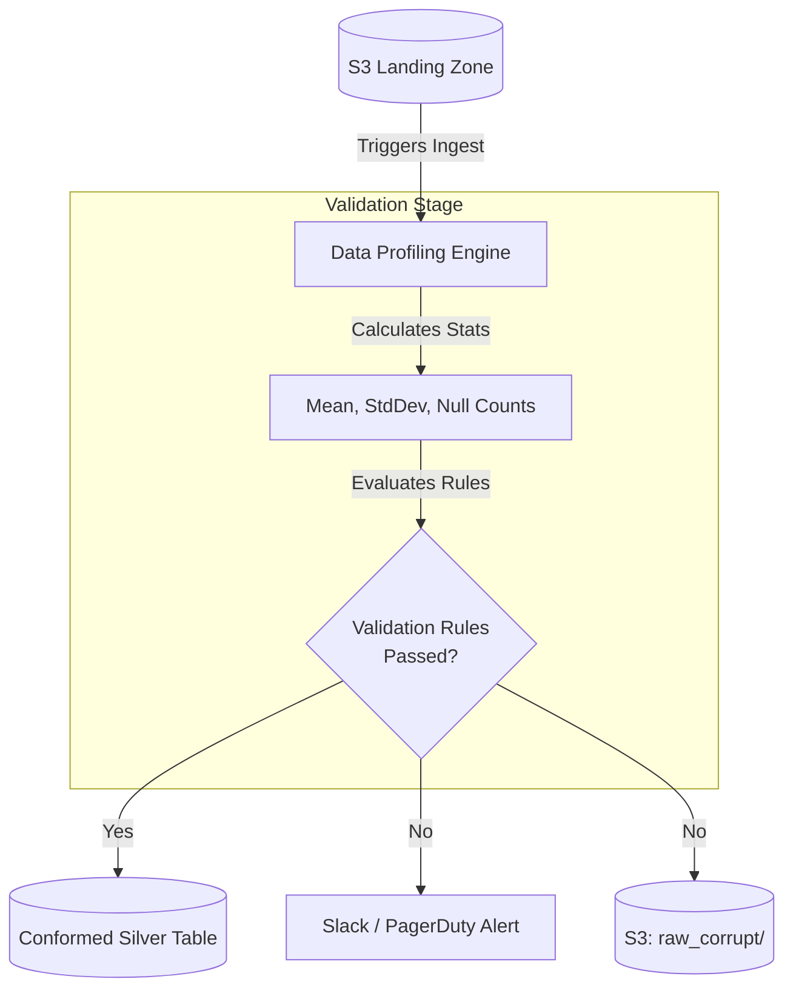

# Module 8.2: Data Validation

Welcome to **Data Validation**. Writing custom validation logic for every pipeline is inefficient. To build enterprise-scale data platforms, you must configure validation frameworks that profile incoming columns, detect statistical anomalies, and enforce business rules dynamically.

---

## 1. Detailed Theory

### Validation Rules
A production validation framework enforces rules on multiple layers:
- **Null Checks**: Ensuring primary key columns (`user_id`, `transaction_id`) contain no null values.
- **Range Checks**: Verifying numerical values fall within logical boundaries (e.g., checking that `transaction_amount` is greater than 0, or `percentage` is between 0 and 100).
- **Data Type & Format checks**: Validating columns conform to specified datatypes (integer, date) and regex patterns (emails, phone numbers).
- **Referential Integrity**: Ensuring foreign keys in fact tables match active primary keys in dimension tables.
- **Business Rules**: Validating complex conditional logic (e.g., verifying that `order_shipping_date >= order_purchase_date`).

### Data Profiling
Before setting validation rules, you must analyze the statistics of your dataset:
- **Column Profiling**: Calculating summary statistics (min, max, mean, standard deviation, null percentage) for each column.
- **Distribution Analysis**: Evaluating row frequencies to identify outliers.
- **Anomaly Detection**: Identifying statistical anomalies (e.g., a sudden 500% increase in null values in a daily batch).

---

## 2. Architecture Diagram: Automated Profiling and Validation Flow



---

## 3. Production Use Cases

1. **Automated Data Validation Framework**: An ingestion pipeline that utilizes **Great Expectations** to validate incoming transaction datasets daily. The pipeline runs null checks on primary keys, format checks on emails, and range checks on transaction values, blocking the run and sending a Slack alert if any rules fail.

---

## 4. Real Company Examples

- **Amazon (Deequ)**: Created and open-sourced **Deequ**, a library built on top of Apache Spark designed to run data profiling and validation checks on petabyte-scale datasets.

---

## 5. Coding Examples

### Implementing Data Validation via Great Expectations (Python)

```python
import great_expectations as ge
import pandas as pd

# 1. Load staging dataset
data = {
    "transaction_id": ["T101", "T102", "T103", None],
    "amount": [15.50, 99.99, -5.00, 20.00],
    "email": ["user1@email.com", "user2@email.com", "bad_email", "user3@email.com"]
}
df = pd.DataFrame(data)

# 2. Wrap pandas DataFrame with Great Expectations wrapper
ge_df = ge.from_pandas(df)

# 3. Define Validation Rules (Expectations)
result_id = ge_df.expect_column_values_to_not_be_null("transaction_id")
result_amount = ge_df.expect_column_values_to_be_between("amount", min_value=0.0)
result_email = ge_df.expect_column_values_to_match_regex("email", regex=r"^[\w\.-]+@[\w\.-]+\.\w+$")

# 4. Evaluate Validation Results
print("Validation Results:")
print(f"Transaction ID Check: Success={result_id['success']}")
print(f"Amount Range Check: Success={result_amount['success']}")
print(f"Email Format Check: Success={result_email['success']}")
```

---

## 6. Hands-on Labs

**Lab: Building a Profiling Task**
**Objective**: Build a profile function.
**Instructions**:
Write a python function that takes a Pandas DataFrame and returns a summary profile DataFrame containing columns: `column_name`, `data_type`, `null_count`, `null_percentage`, and `unique_values_count`.

---

## 7. Assignments

**Assignment: Referential Integrity Checks**
Explain how you would design an automated referential integrity check in a dbt model to verify that every `product_id` in a `fact_sales` table matches an active `product_id` in the `dim_product` table. What action should dbt take if it finds orphaned product IDs?

---

## 8. Interview Questions

1. **What is Great Expectations and why use it?**
   *Answer Hint: Great Expectations is an open-source Python library for validating, documenting, and profiling data. Use it because it provides declarative validation rules (Expectations) that can be integrated into Spark or Pandas pipelines to catch data quality issues before they reach production databases.*
2. **What does Data Profiling do?**
   *Answer Hint: Data Profiling calculates summary statistics (such as min/max values, null percentages, distinct counts, and frequency distributions) for each column in a dataset to help developers understand the shape and quality of the data.*

---

## 9. Best Practices (FDE Standards)

- **Define Tolerable Null Limits**: Some columns can have nulls, but within bounds. Set thresholds (e.g., "fail if null percentage in email exceeds 5%").
- **Automate Schema Validation**: Always validate the schema (column names and types) before executing values checks to prevent script execution crashes.

---

## 10. Common Mistakes

- **Hard-Coded Validation Logic**: Writing hundreds of lines of nested `if...else` statements in Python to validate values, making it hard to update or document rules. Use validation frameworks.
- **Ignoring Outliers**: Setting range check boundaries too wide, allowing incorrect anomaly values (e.g., inputting a transaction amount of `$1,000,000` due to a decimal typo) to slip past checks.
