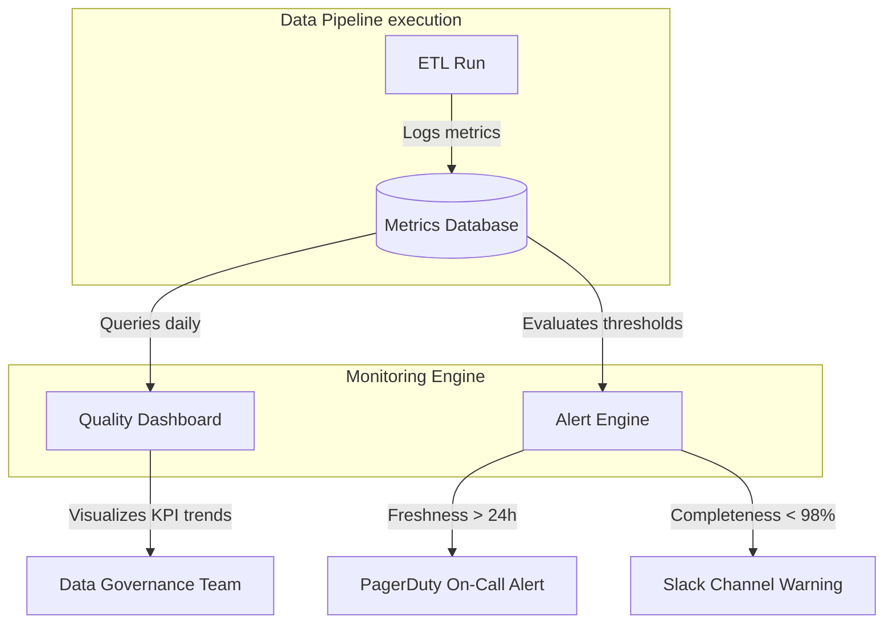

# Module 8.3: Data Quality Monitoring

Welcome to **Data Quality Monitoring**. Running validation checks is the first step, but you must monitor quality metrics over time, display dashboard summaries, and set up alerting integrations to notify the team before downstream dashboard users detect issues.

---

## 1. Detailed Theory

### Core Monitoring Metrics
- **Completeness %**: The ratio of non-null fields to total records over time.
- **Accuracy %**: The percentage of records that pass business rules checks.
- **Freshness (SLA Compliance)**: The time elapsed since the last data update. If a table updates daily, freshness should be less than 24 hours.
- **Duplicate Rate**: The count of duplicate primary key records divided by total rows.
- **Error Rate**: The percentage of rows failing validation checks.

### Alerting Strategies
Data alerts should follow the severity of the issue:
- **Slack Alerts**: For warning-level errors (e.g., table updates 1 hour late, or duplicate rates exceed 0.1%).
- **PagerDuty Alerts**: For critical pipeline failures (e.g., table is empty, or a schema change breaks the ETL run).

---

## 2. Architecture Diagram: Observability & Alerting Flow



---

## 3. Production Use Cases

1. **Enterprise Data Quality Dashboard**: An Airflow pipeline triggers **Soda SQL** checks at the end of each daily ingest run. The checks log results to a central database. A dashboard displays completeness, freshness, and error rates, alerting developers immediately via Slack if thresholds are breached.

---

## 4. Real Company Examples

- **Uber (Wuji)**: Uses an internal data quality platform that monitors thousands of tables globally, tracking data freshness and distribution statistics automatically to notify owners.

---

## 5. Coding Examples

### Implementing Soda SQL Checks (YAML Configuration)

This configuration defines the quality thresholds evaluated by Soda SQL after an ETL run.

```yaml
# checks/orders.yml
# Soda SQL checks definition
checks for orders_table:
  - row_count > 0                           # Verify table is not empty
  - invalid_count(email) = 0:               # Validate formatting
      valid format: email
  - missing_percent(customer_id) < 1%      # Enforce completeness threshold
  - schema:
      fail:
        when required column missing: [order_id, amount]
        when type changed:
          amount: decimal
```

---

## 6. Hands-on Labs

**Lab: Warning vs. Critical Alerts**
**Objective**: Establish severity tiers.
**Instructions**:
Write down the specific severity (Warning or Critical) and alerting route (Slack or PagerDuty) you would configure for:
1. A transaction fact table is empty after a batch load.
2. A customer profile table has a duplicate rate of 0.05%.
3. A table that updates hourly has not received new rows in 4 hours.
4. A column description is missing in the data catalog.

---

## 7. Assignments

**Assignment: SLA Tracking Calculations**
Write a SQL query that queries an execution log table `job_runs` (containing columns `job_name`, `status`, `start_time`, `end_time`) to calculate:
1. The average execution duration of each job.
2. The percentage of runs that completed successfully.
3. The count of jobs that breached an SLA threshold of 2 hours.

---

## 8. Interview Questions

1. **What is the difference between data freshness and data latency?**
   *Answer Hint: Data Latency is the time taken to process and move data from source to target. Data Freshness is the age of the data (the time elapsed since the last update). A table can have low latency (runs in 5 seconds) but be stale (has not run in 3 days).*
2. **How does Soda SQL help in data quality pipelines?**
   *Answer Hint: Soda SQL is an open-source data quality tool that allows developers to define declarative checks in YAML files. It runs SQL queries against database tables to verify counts, null percentages, and schemas, throwing errors if checks fail.*

---

## 9. Best Practices (FDE Standards)

- **Monitor Freshness at the Source**: Check data freshness at the source landing zone (S3/GCS bucket write timestamps) to catch ingestion blocks early.
- **Log Metrics Centrally**: Store data quality test results in a central database to build historical dashboards and track quality trends.

---

## 10. Common Mistakes

- **Alert Fatigue**: Configuring PagerDuty alerts for minor warning-level issues (like missing row counts in a test table), causing developers to ignore alerts.
- **No SLA Limits**: Failing to configure timeouts or SLA alerts, letting a hanging ETL job run indefinitely without alerting the team.
