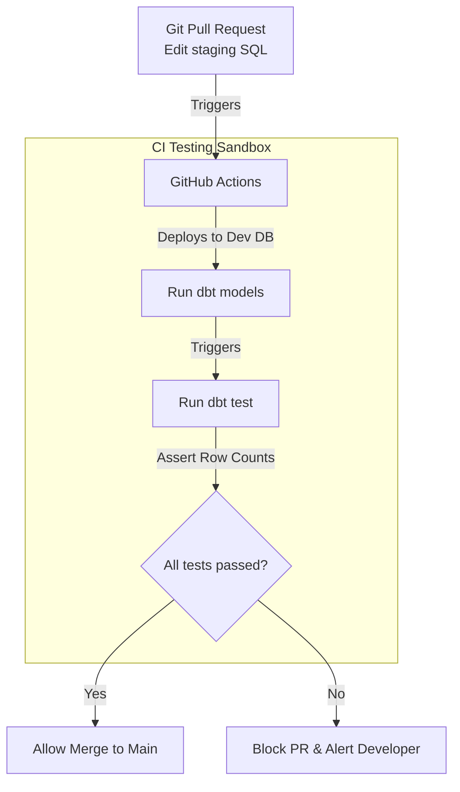

# Module 8.4: Data Testing

Welcome to **Data Testing**. In software engineering, writing unit tests protects code against bugs. In data engineering, writing data tests protects pipelines against bad data inputs. In this module, you will learn how to write source-to-target validations, row count reconciliations, and dimensional structure tests.

---

## 1. Detailed Theory

### Ingestion (ETL) Testing
- **Source-to-Target Validation**: Verifying that every row extracted from the source database was loaded into the target table, ensuring no rows were lost in transit.
- **Row Count Validation**: Comparing source and target count statistics.
- **Data Reconciliation**: Calculating checksums or totals of numeric fields (e.g., checking that the sum of payments in the source database matches the sum of payments in the staging table).
- **Transformation Validation**: Testing that business logic was applied correctly (e.g., verifying that tax calculations in the target table match expected formulas).

### Warehouse Testing
- **Fact Table Validation**: Verifying that foreign key columns contain no null values and match active records in the dimension tables (referential integrity).
- **Dimension Validation**: Checking that primary key columns are unique and valid.
- **SCD Validation**: Verifying that SCD Type 2 tables have active records with open valid-to dates (e.g., `valid_to = '9999-12-31'`) and contain no overlapping validity periods.

---

## 2. Architecture Diagram: CI/CD Pipeline Data Testing Gate



---

## 3. Production Use Cases

1. **Automated Data Testing Platform**: A CI/CD pipeline integrated with GitHub Actions. When a developer submits a pull request to update a dbt model, the pipeline deploys the model to a staging database, runs tests (row count verification, SCD validity checks, checksum checks), and blocks the merge if any tests fail.

---

## 4. Real Company Examples

- **Spotify**: Enforces strict integration tests on their core pipelines, generating mock data to verify that Spark transformations behave correctly before deployment.

---

## 5. Coding Examples

### Writing Data Validation Tests in SQL

```sql
-- Test 1: Referential Integrity Check
-- This query returns rows in the fact table that have no matching dimension key (should return 0 rows)
SELECT f.transaction_id, f.customer_key
FROM fact_sales f
LEFT JOIN dim_customer c ON f.customer_key = c.customer_key
WHERE c.customer_key IS NULL;

-- Test 2: SCD Type 2 Date Overlap Check
-- This query returns duplicate active records for a single natural key (should return 0 rows)
SELECT customer_id, COUNT(*)
FROM dim_customer
WHERE is_current = TRUE
GROUP BY customer_id
HAVING COUNT(*) > 1;

-- Test 3: Data Reconciliation Check
-- Checking if total sales amount matches between source staging and target fact
SELECT 
    (SELECT SUM(amount) FROM staging_payments) AS source_total,
    (SELECT SUM(revenue) FROM fact_sales) AS target_total,
    ABS(COALESCE((SELECT SUM(amount) FROM staging_payments), 0) - COALESCE((SELECT SUM(revenue) FROM fact_sales), 0)) AS variance;
```

---

## 6. Hands-on Labs

**Lab: Mock Data Testing**
**Objective**: Build a unit test.
**Instructions**:
Write a python unit test (`unittest` framework) that takes a sample PySpark function `clean_names` and verifies it converts strings (like "  JOHN SMITH  ") to clean, lower-cased formats ("john smith") using mock data input.

---

## 7. Assignments

**Assignment: Testing SCD Type 2 Timestamps**
Write the SQL query to test that an SCD Type 2 table contains no overlapping validity dates for any customer record. (Hint: Join the table to itself on `customer_id` where keys differ and check if dates overlap).

---

## 8. Interview Questions

1. **What is Data Reconciliation and why is it important in financial pipelines?**
   *Answer Hint: Data Reconciliation is the process of verifying that numeric values (like sum of transactions or balance adjustments) match between the source system and target warehouse. In financial systems, it guarantees that no money or ledger entries were dropped or modified during processing.*
2. **How do you test for referential integrity in a data warehouse without database foreign key constraints?**
   *Answer Hint: Modern cloud warehouses do not enforce foreign key constraints at the database level to maintain high-throughput writes. We test referential integrity using analytical SQL queries (e.g., LEFT JOINing fact to dim and filtering where the dim key is null) run via testing frameworks (dbt) after the load phase.*

---

## 9. Best Practices (FDE Standards)

- **Integrate Tests in CI/CD**: Run validation tests automatically on code changes in a test database before deploying modifications to production.
- **Fail the Build on Null Keys**: Never allow a pipeline to complete successfully if fact table foreign key tests fail, as this creates orphaned records in dashboards.

---

## 10. Common Mistakes

- **Testing Production Data in DEV**: Writing tests that query the live production database, slowing down production systems. Use staging or mock datasets for testing.
- **Ignoring Warnings**: Setting data quality tests to output warning logs instead of throwing errors, allowing incorrect calculations to reach production.
