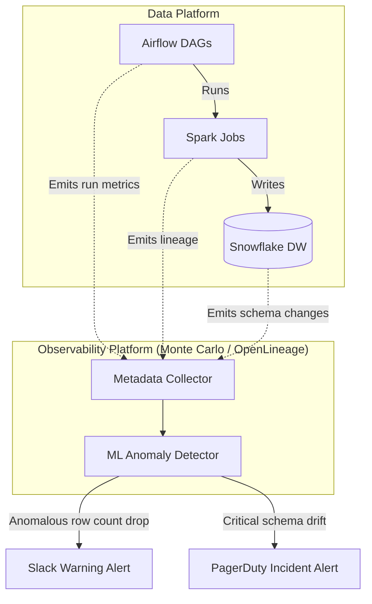

# Module 8.5: Data Observability

Welcome to **Data Observability**. Writing unit tests and validation checks is only the first step. In enterprise environments running thousands of concurrent pipelines, you must monitor the health of the entire data platform. Data Observability provides real-time visibility into the health, freshness, volume, schemas, and lineage of your datasets.

---

## 1. Detailed Theory

### The Five Pillars of Data Observability
To monitor data systems in real-time, you must track these five pillars:
1. **Freshness**: Is the data up-to-date? Observability tools track pipeline run times and metadata timestamps to detect updates.
2. **Volume**: Is the dataset size within expected limits? A sudden drop in row counts (e.g., from 10,000 to 10 rows) indicates an ingestion failure.
3. **Schema**: Have column names or types changed? Observability tools capture schema drift and alert developers before downstream tables break.
4. **Lineage**: Visualizing data flows. Lineage maps allow developers to run impact analyses to see how table modifications affect downstream BI dashboards.
5. **Distribution (Data Health)**: Tracking statistical properties (mean, null percentages, variance). If null percentages spike, it indicates data quality issues.

### Enterprise Observability Tools
- **Monte Carlo**: The industry standard for data observability. It integrates with Snowflake, BigQuery, and Airflow, using machine learning to detect anomalies automatically without manual configurations.
- **OpenLineage / OpenTelemetry**: Open-source frameworks that capture lineage and run metadata from Spark and Airflow.

---

## 2. Architecture Diagram: Centralized Data Observability Stack



---

## 3. Production Use Cases

1. **Data Observability Platform**: A credit card processing pipeline. You deploy Monte Carlo to monitor Snowflake tables. An ML model learns the historical row volume (e.g., ~10,000 rows loaded daily). If a batch load contains only 200 rows due to a source API block, Monte Carlo triggers a Slack alert immediately.

---

## 4. Real Company Examples

- **Vimeo**: Integrates Monte Carlo to monitor data freshness and volume across their Snowflake data lakes, reducing data downtime by 90%.

---

## 5. Coding Examples

### Emitting Pipeline Metadata via OpenLineage (Python API)

This script shows how to log pipeline executions programmatically to an OpenLineage observability endpoint.

```python
import requests
import uuid
from datetime import datetime

# 1. Configure OpenLineage Endpoint
OPENLINEAGE_URL = "http://localhost:8080/api/v1/lineage"
run_id = str(uuid.uuid4())

# 2. Define OpenLineage Event (Run Metadata and Lineage)
lineage_event = {
    "eventType": "START",
    "eventTime": datetime.utcnow().isoformat() + "Z",
    "run": {
        "runId": run_id
    },
    "job": {
        "namespace": "enterprise-etl-jobs",
        "name": "customer-sales-ingest"
    },
    "inputs": [
        {
            "namespace": "s3://raw-landing-bucket",
            "name": "sales/year=2023/month=10/"
        }
    ],
    "outputs": [
        {
            "namespace": "snowflake://production-dw",
            "name": "gold.fact_sales"
        }
    ],
    "producer": "https://github.com/enterprise/etl-repository"
}

# 3. Post Event to Observability Server
try:
    response = requests.post(OPENLINEAGE_URL, json=lineage_event)
    if response.status_code == 200:
        print("Successfully logged pipeline metadata to OpenLineage!")
    else:
        print(f"Failed to log metadata: {response.text}")
except Exception as e:
    print(f"Connection failed: {e}")
```

---

## 6. Hands-on Labs

**Lab: Anomaly Investigation**
**Objective**: Troubleshoot alerts.
**Instructions**:
Your observability dashboard triggers a volume anomaly warning: "Table `fact_sales` row count dropped by 80% compared to historical average."
Write down the steps you would take to investigate the root cause, starting from checking Airflow logs to inspecting S3 source files.

---

## 7. Assignments

**Assignment: Machine Learning Anomaly Detection**
Explain how machine learning-based data observability platforms (like Monte Carlo) detect **statistical anomalies** in data distribution (e.g., standard deviation of values) without requiring developers to write manual SQL validation rules.

---

## 8. Interview Questions

1. **What are the five pillars of Data Observability?**
   *Answer Hint: Freshness (timeliness), Volume (row counts), Schema (structure consistency), Lineage (data path tracking), and Distribution (data health statistics).*
2. **How does OpenLineage capture data lineage?**
   *Answer Hint: OpenLineage acts as an instrumentation framework. It integrates directly into execution engines (like Spark or dbt) and scheduler tasks (like Airflow operators) to capture metadata (inputs read, outputs written) during runtime, generating lineage graphs automatically.*

---

## 9. Best Practices (FDE Standards)

- **Monitor Volume Spikes**: Set up volume checks to track row counts on all ingestion tasks, as sudden drops or spikes indicate pipeline errors.
- **Track Column Lineage**: Configure catalogs to map column-level lineage (not just table-level) to trace calculations down to individual fields.

---

## 10. Common Mistakes

- **Relying Only on Test Checks**: Believing that writing unit tests prevents all errors, ignoring anomalies (like database configuration locks) that occur during execution.
- **Swallowing Logs**: Running pipeline jobs without sending execution metrics to a central logging server, leaving the team blind to resource utilization issues.
