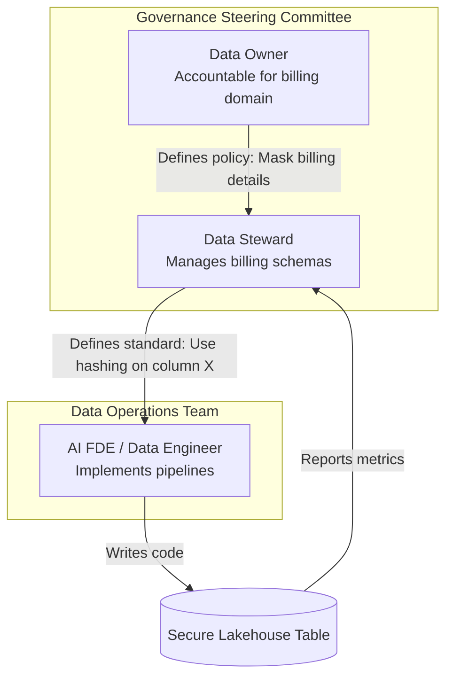

# Module 8.6: Data Governance Fundamentals

Welcome to **Data Governance Fundamentals**. Running data pipelines without standard rules, ownership assignments, or compliance controls leads to chaos. Data Governance is the operational framework of roles, responsibilities, standards, and processes that ensure data is managed as a secure and reliable enterprise asset.

---

## 1. Detailed Theory

### Core Governance Concepts
- **Data Ownership**: Assigning accountability for specific datasets to business leaders (Data Owners) who approve access permissions and define data retention periods.
- **Data Stewardship**: The operational management of data. Data Stewards verify schema definitions, coordinate validation rules, and resolve daily quality alerts.
- **Data Policies**: Documented rules governing data handling (e.g., "All patient data must be deleted 7 years after their last clinic visit").
- **Data Standards**: Naming conventions and type definitions (e.g., standardizing country columns to ISO-3166-1 alpha-2 codes across all tables).
- **Data Lifecycle Management**: Controlling data from ingestion, through active usage, to archival and destruction.

### Governance Framework
A governance framework establishes compliance controls (e.g., ensuring GDPR 'Right to be Forgotten' delete requests are propagated to all downstream databases automatically) and defines steering committees to review metric formulas.

---

## 2. Architecture Diagram: Data Governance Responsibility Model



---

## 3. Production Use Cases

1. **Enterprise Governance Program**: Establishing domain-level data governance. A bank appoints the Head of Lending as the **Data Owner** for loans data. They work with a Data Steward to register schemas in a catalog, define validation rules, and ensure GDPR delete queries are executed on S3 daily, with audit trails logged.

---

## 4. Real Company Examples

- **Aetna / Health Insurance Providers**: Maintain strict internal steering committees to govern medical record schemas, ensuring HIPAA compliance across all processing layers.

---

## 5. Coding Examples

### Implementing Data Lifecycle Archival Policy in SQL

This query runs a daily cleanup routine, archiving records older than a set retention window to cold storage and deleting them from active databases.

```sql
-- 1. Archive historical transactions older than 7 years to an archive database
INSERT INTO archive_db.sales_history_archive
SELECT * 
FROM production_db.sales_history
WHERE transaction_date < DATEADD(year, -7, CURRENT_DATE());

-- 2. Delete the archived rows from the active query database
DELETE FROM production_db.sales_history
WHERE transaction_date < DATEADD(year, -7, CURRENT_DATE());
```

---

## 6. Hands-on Labs

**Lab: Policy Design**
**Objective**: Build a retention schedule.
**Instructions**:
Draft a short table-level **Data Retention Policy** for an e-commerce platform. Specify the retention duration (e.g., 30 days, 1 year, 7 years) and actions (Archive, Anonymize, Delete) for:
1. Customer website clickstream logs.
2. Financial tax receipts.
3. User checkout shopping carts (abandoned).
4. Customer payment credit card tokens.

---

## 7. Assignments

**Assignment: Stewardship Workflow**
Define the operational step-by-step workflow that occurs when a data quality alert triggers: "Null values in `customer_id` exceeded 5% on table `fact_sales`." Map out the responsibilities of the **On-Call Data Engineer**, the **Data Steward**, and the **Data Owner** in resolving the issue.

---

## 8. Interview Questions

1. **What is the difference between a Data Owner and a Data Steward?**
   *Answer Hint: A Data Owner is a business leader accountable for a domain's data (defines policies, approves access, owns budget). A Data Steward is an operational role responsible for implementing those policies, validating metadata, and resolving quality issues day-to-day.*
2. **How does Data Governance support GDPR compliance?**
   *Answer Hint: Governance establishes policies for data lifecycle management (like retention limits), maps where personal data is stored using metadata catalogs, and coordinates the automation of user deletion requests ('Right to be Forgotten') across all downstream systems.*

---

## 9. Best Practices (FDE Standards)

- **Assign Owners at Table Creation**: Never allow a new dataset or table to be created in production without registering a designated business owner in the catalog.
- **Implement automated auditing**: Log all database schema alterations and permission changes to a secure, read-only audit ledger for compliance reviews.

---

## 10. Common Mistakes

- **Treating Governance as a Static Document**: Writing a 200-page governance PDF policy on Confluence that is ignored by developers. Governance must be implemented programmatically in CI/CD pipeline code.
- **Failing to automate deletions**: Relying on manual deletion sweeps to comply with GDPR, resulting in missed columns and compliance breaches.
