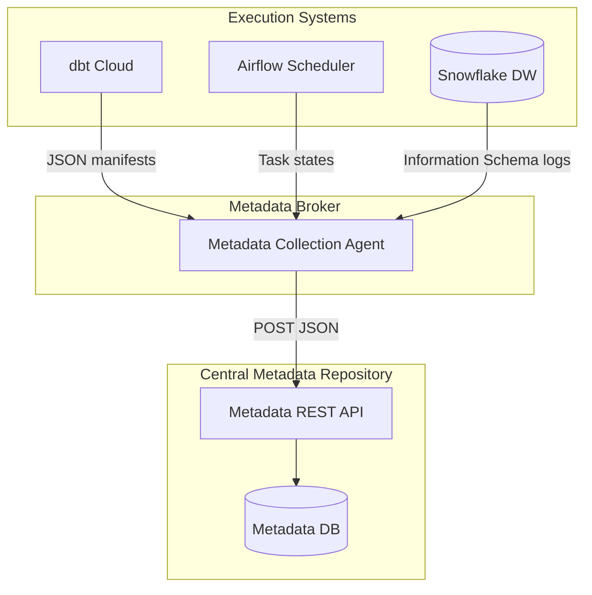

# Module 8.7: Metadata Management

Welcome to **Metadata Management**. In large-scale data platforms, managing the data itself is only half the battle. You must manage the data *about* the data—**Metadata**. Without proper metadata systems, developers cannot search schemas, track pipeline runs, or confirm metric calculations.

---

## 1. Detailed Theory

### Types of Metadata
An enterprise data platform registers and tracks metadata on three distinct layers:
1. **Technical Metadata**:
   - Describes the physical structure of data systems.
   - Includes: database table schemas, column names, data types, indexes, primary keys, and partitioning paths.
2. **Business Metadata**:
   - Provides context to technical assets using business terms.
   - Includes: definitions of terms (e.g., what constitutes a "monthly active user"), KPIs formulas, data classification tags (e.g., PII), and ownership declarations.
3. **Operational Metadata**:
   - Logs details about execution runs.
   - Includes: pipeline execution statuses, start/end timestamps, row write counts, execution durations, and error stack traces.

---

## 2. Architecture Diagram: Metadata Ingestion Pipeline



---

## 3. Production Use Cases

1. **Metadata Management Platform**: An ingestion pipeline that parses dbt `manifest.json` files and Airflow execution logs. It aggregates technical schemas, business definitions, and operational run metrics, pushing them to a centralized catalog to provide a unified metadata view for the platform engineering team.

---

## 4. Real Company Examples

- **Netflix (Metacat)**: Developed **Metacat**, a metadata service designed to provide a unified catalog across different data storage engines (S3, Redshift, Hive) in their petabyte-scale data platform.

---

## 5. Coding Examples

### Extracting Technical and Operational Metadata (Python)

This script parses a mock dbt schema artifact to log metadata details.

```python
import json

# Simulating a dbt catalog schema output
catalog_json = """
{
  "tables": {
    "fact_sales": {
      "metadata": {
        "schema": "gold",
        "name": "fact_sales",
        "type": "table",
        "owner": "sales_stewards"
      },
      "columns": {
        "sales_key": {"type": "integer", "index": 1},
        "revenue": {"type": "decimal", "index": 2}
      }
    }
  }
}
"""

def extract_metadata(payload):
    data = json.loads(payload)
    tables = data.get("tables", {})
    
    for table_id, details in tables.items():
        meta = details.get("metadata", {})
        cols = details.get("columns", {})
        
        # Log Technical Metadata
        print(f"Technical Meta: Table={meta['schema']}.{meta['name']} | Columns={[c for c in cols.keys()]}")
        # Log Business/Ownership Metadata
        print(f"Business Meta: Owner={meta['owner']}")

if __name__ == "__main__":
    extract_metadata(catalog_json)
```

---

## 6. Hands-on Labs

**Lab: Information Schema Queries**
**Objective**: Query technical metadata.
**Instructions**:
Write the SQL query to list all table names, column names, and data types within a database schema named `analytics`, querying the database's internal `INFORMATION_SCHEMA.COLUMNS` view.

---

## 7. Assignments

**Assignment: Operational Metadata Sizing**
Your pipeline executes 100,000 tasks daily. If you log every task execution's technical details, input row counts, and output row counts, your operational database will grow rapidly.
Design a table schema for an **Operational Metadata Store** that tracks pipeline runs while minimizing storage size. Decide which metrics are aggregated and which are stored in clear-text columns.

---

## 8. Interview Questions

1. **What is the difference between technical metadata and operational metadata?**
   *Answer Hint: Technical metadata describes the database structures (schemas, tables, column types). Operational metadata describes the execution history of pipelines (run statuses, durations, execution times, row counts).*
2. **Why is business metadata important for BI analysts?**
   *Answer Hint: Business metadata provides context. It ensures that when an analyst queries a column called 'revenue,' they know the exact business definition (e.g., 'gross sales excluding VAT') and calculations used to populate it, preventing dashboard errors.*

---

## 9. Best Practices (FDE Standards)

- **Automate Collection**: Never manually edit schema definitions in spreadsheets. Metadata should be updated automatically in real-time during compilation and run times.
- **Maintain Schema Version History**: Track changes to schemas over time to identify which dbt run or database alteration changed a column's type.

---

## 10. Common Mistakes

- **Treating Metadata as Static**: Manually updating database wikis that quickly become out-of-date as database columns evolve.
- **Ignoring Operational Failure Logs**: Logging job completions but discarding detailed operational error stack traces, making troubleshooting pipeline failures difficult.
