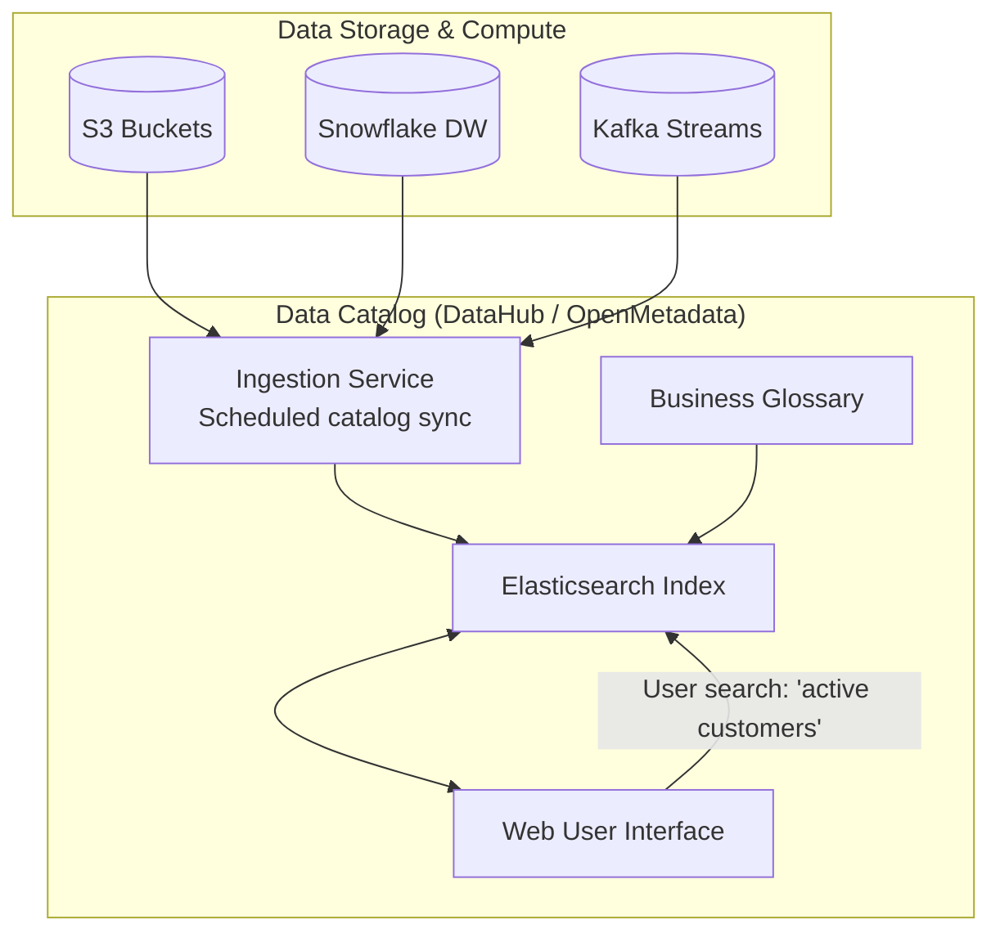

# Module 8.8: Data Catalog

Welcome to the **Data Catalog**. An enterprise data platform hosts thousands of tables. Without a central search engine, data scientists and AI agents waste hours asking, "Where is the customer churn table?" or "What does this column mean?" In this module, you will learn how to deploy and configure Data Catalogs to enable discovery, establish business glossaries, and manage dataset ownership.

---

## 1. Detailed Theory

### Core Catalog Concepts
- **Dataset Discovery**: The ability to search and find data assets across the enterprise (S3, Snowflake, Kafka) using simple keyword tags.
- **Business Glossary**: A centralized registry of business terms and calculations (e.g., defining "Churned Customer") linked directly to physical database tables.
- **Metadata Search**: Search engines that index columns, tags, descriptions, and lineage to answer complex search requests.

### Data Catalog Tools
- **DataHub**: A metadata platform built by LinkedIn. Uses pull-based metadata ingestion from dbt, Snowflake, Spark, and Airflow.
- **OpenMetadata**: A user-friendly, catalog platform that features automated schema profiling and direct Slack alerting.
- **Apache Atlas**: Open-source framework deeply integrated with Hadoop/Spark systems.

---

## 2. Architecture Diagram: Enterprise Data Catalog Topology



---

## 3. Production Use Cases

1. **Enterprise Data Catalog**: Setting up an automated metadata catalog on Kubernetes using DataHub. The system runs scheduled ingestion routines daily, scanning Snowflake tables, pulling dbt descriptions, generating business glossary terms, and providing a searchable UI for data analysts.

---

## 4. Real Company Examples

- **LinkedIn**: Created and open-sourced **DataHub** to help thousands of employees search for tables, trace lineage, and track ownership across their massive multi-tenant database clusters.

---

## 5. Coding Examples

### Defining a dbt Schema with Business Glossary Tags (YAML)

This dbt configuration defines column descriptions and assigns business tags that are ingested by the Data Catalog.

```yaml
# models/marts/schema.yml
version: 2

models:
  - name: fact_sales
    description: "Contains all historical transaction line items."
    meta:
      owner: "sales_analytics_team"
      business_domain: "finance"
    columns:
      - name: revenue
        description: "Gross revenue generated from the sale, excluding tax."
        meta:
          glossary_term: "Gross_Revenue" # Links to central Glossary
```

---

## 6. Hands-on Labs

**Lab: Registering a Glossary Term**
**Objective**: Build a business glossary model.
**Instructions**:
Write the JSON structure for a DataHub Business Glossary Term named `Active_User`. Include definitions, owner fields, and classification rules (e.g., "Must have logged in within the last 30 days").

---

## 7. Assignments

**Assignment: Catalog Tool Evaluation**
Write a technical note comparing **OpenMetadata** and **Collibra**. Under what scenarios would you choose an open-source, code-centric catalog (OpenMetadata) over a commercial, enterprise-oriented tool (Collibra)? Focus on deployment complexity, pricing, and developer control.

---

## 8. Interview Questions

1. **What is a Business Glossary in a Data Catalog?**
   *Answer Hint: A business glossary is a centralized, standardized registry of business terms and calculations (like 'net margin' or 'churn rate') defined in plain language, which are then linked to physical database columns to ensure consistent metrics across the enterprise.*
2. **Why is search capabilities critical for a Data Catalog?**
   *Answer Hint: Search allows data scientists and analysts to discover existing tables across disparate storage engines (S3, Redshift, BigQuery) without having to ask the engineering team, preventing redundant work and data duplication.*

---

## 9. Best Practices (FDE Standards)

- **Automate Ingestion via CI/CD**: Integrate catalog synchronization directly into your dbt and Spark deployment pipelines to ensure the catalog is updated on code merge.
- **Link Lineage to Catalog**: Ensure your catalog displays lineage charts so users can trace data columns back to their raw sources directly in the UI.

---

## 10. Common Mistakes

- **Manual Catalog Maintenance**: Creating wiki pages for schemas that become out-of-date within weeks, leading to confusion.
- **Cataloging everything**: Adding raw, temporary, or scratch database tables to the public search index, cluttering results. Filter out development folders.
