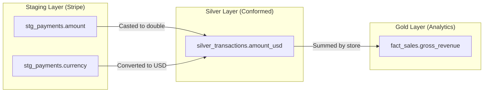

# Module 8.9: Data Lineage

Welcome to **Data Lineage**. Data pipelines are complex. If a metric on a dashboard is incorrect, you must trace the calculation back through all intermediate database tables and staging zones to the raw source database. This visual mapping of data flows is **Data Lineage**. In this module, you will learn lineage types, capture methods, and how to execute impact analyses.

---

## 1. Detailed Theory

### Lineage Types
An enterprise platform maps data flows on multiple layers:
1. **Table Lineage**: Maps relationships between physical tables (e.g., showing that `fact_sales` is built from `stg_orders` and `stg_products`).
2. **Column Lineage**: The most detailed level. Maps how individual fields are calculated (e.g., showing that the gold column `tax_amount` is derived by multiplying the silver column `amount` by a tax rate constant).
3. **Pipeline Lineage**: Maps the operational tasks (Airflow DAGs, Spark jobs) that move the data.
4. **Business Lineage**: High-level mapping designed for non-technical users, showing how domains relate.

### Core Use Cases
- **Impact Analysis**: Evaluating the downstream impact of a change before applying it (e.g., checking which dashboards will break if you drop a staging database column).
- **Root Cause Analysis**: Tracing a data error back to its source system (e.g., identifying that a spike in null revenue values was caused by a configuration change in the source Stripe API).
- **Compliance Audits**: Verifying to financial or security regulators exactly how reports were calculated.

---

## 2. Architecture Diagram: Column-Level Lineage Path



---

## 3. Production Use Cases

1. **Data Lineage Tracking System**: Deploying a central OpenLineage engine. During nightly dbt runs, the pipeline sends manifest schema details to the engine, creating table and column-level lineage charts. If a business analyst reports a dashboard calculation error, developers trace the lineage chart back to source staging files, locating the exact transformation node that introduced the bug.

---

## 4. Real Company Examples

- **Netflix / Spotify**: Rely on automated column-level lineage maps to track data movements across thousands of daily Spark pipelines, auditing compliance and managing system changes.

---

## 5. Coding Examples

### Defining Column-Level Lineage in dbt (SQL Models)

dbt compiles column lineage automatically using database reference macros.

```sql
-- models/marts/fact_sales.sql
-- dbt parses the ref() macros to construct the lineage graph automatically
SELECT 
    MD5(o.order_id) AS sales_key,
    o.order_id,
    c.customer_key,
    -- Column Lineage: gross_revenue is derived from silver transaction values
    o.quantity * p.price_usd AS gross_revenue,
    o.order_date
FROM {{ ref('stg_orders') }} o
JOIN {{ ref('dim_customer') }} c ON o.customer_id = c.natural_id
JOIN {{ ref('dim_product') }} p ON o.product_id = p.sku;
```

---

## 6. Hands-on Labs

**Lab: Impact Analysis Simulation**
**Objective**: Trace downstream dependencies.
**Instructions**:
Look at the dbt model code in Section 5.
Write down which tables and columns will be affected (broken) if a developer deletes the `price_usd` column from the staging table `dim_product`.

---

## 7. Assignments

**Assignment: Table vs. Column Lineage**
Write a short comparison analyzing the differences in execution cost and business value between **Table-Level Lineage** and **Column-Level Lineage**. Why is column-level lineage much harder to implement in custom Python/Spark scripts?

---

## 8. Interview Questions

1. **What is Data Lineage and what is its primary use case?**
   *Answer Hint: Data Lineage is the visual mapping of data flows from source to destination. Its primary use cases are: Root Cause Analysis (tracing errors back to the source), Impact Analysis (checking what will break before changing a column), and Compliance Audits.*
2. **How does dbt generate lineage graphs?**
   *Answer Hint: dbt generates lineage graphs dynamically by parsing the `ref()` and `source()` macros inside SQL models, establishing dependencies, and writing them to the `manifest.json` file during compilation.*

---

## 9. Best Practices (FDE Standards)

- **Always Use ref() Macros**: Never hardcode physical database table names (e.g., `FROM production.dim_user`) in dbt model files, as this bypasses the compiler's lineage generation engine.
- **Automate Lineage Collection**: Configure OpenLineage or DataHub listeners to capture lineage automatically from Spark and Airflow runs in real-time.

---

## 10. Common Mistakes

- **Broken Lineage Chains**: Writing custom Python scripts that pull data from S3, run calculations, and write outputs without reporting metadata to the catalog, creating "black boxes" in the lineage graph.
- **Ignoring Impact Analysis**: Changing staging columns without checking downstream dependencies, breaking production dashboards.
