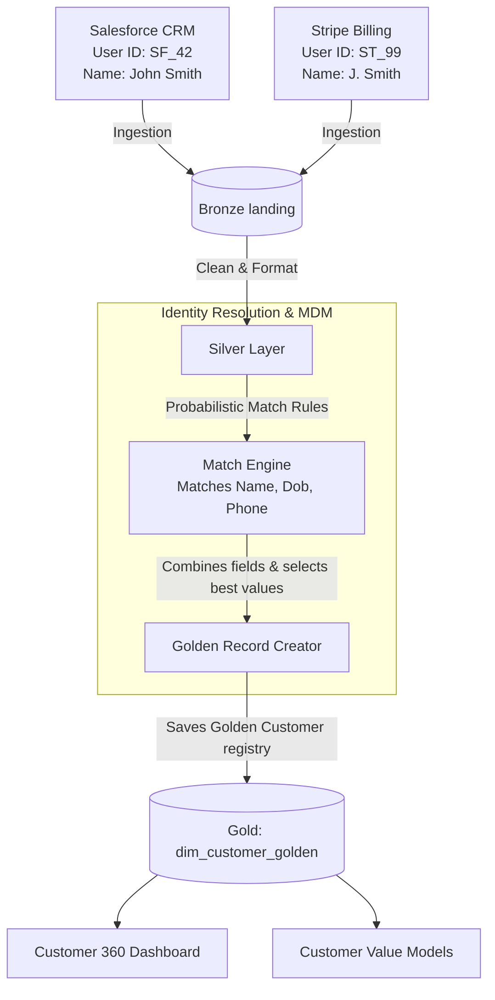

# Module 8.10: Master Data Management (MDM)

Welcome to **Master Data Management (MDM)**. In large-scale enterprise environments, customer and product data is often scattered across multiple transactional systems (Salesforce CRM, Stripe billing, support tickets). Each database contains duplicate, conflicting, or partial records. MDM is the practice of deduplicating, validating, and merging these records to create a single, conformed **Golden Record** for each entity, establishing a unified Customer 360 platform.

---

## 1. Detailed Theory

### Core MDM Concepts
- **Golden Record (Single Source of Truth)**: A single, canonical record representing a unique real-world entity (customer, product, store), created by merging verified attributes from multiple source databases.
- **Data Deduplication**: Identifying and removing duplicate records within a single database.
- **Identity Resolution**: The process of linking matching records across separate databases that might not share a clean common identifier (e.g., matching a Stripe user record with a Salesforce lead using names, phone numbers, or addresses).
- **Match Rules**:
  - **Deterministic Matching**: Exact field comparison joins (e.g., `WHERE c1.email = c2.email`).
  - **Probabilistic Matching**: Fuzzy logic matches based on similarity scores (e.g., using Jaro-Winkler or Levenshtein distance metrics to match "Jon Smith" with "John Smith").

---

## 2. Architecture Diagram: Master Data Ingestion and Golden Record Flow



---

## 3. Production Use Cases

1. **Enterprise Customer 360 Platform**: Merging customer data across marketing lists, sales pipelines, and billing systems. You design a PySpark job that runs exact joins on emails, followed by fuzzy joins on name/address strings. The pipeline resolves duplicates, assigns a new `global_customer_id` UUID to each matched group, and generates a Golden Record table.

---

## 4. Real Company Examples

- **Capital One**: Employs master customer registries to aggregate checked accounts, loans, and credit card profiles, creating unified user contexts for customer service agents.

---

## 5. Coding Examples

### PySpark Identity Resolution (Exact and Fuzzy Matches)

```python
from pyspark.sql import SparkSession
import pyspark.sql.functions as F

spark = SparkSession.builder.appName("MasterDataManagement").getOrCreate()

# 1. Load CRM and Billing records
crm_df = spark.read.parquet("s3://lakehouse/processed/crm_users/")
billing_df = spark.read.parquet("s3://lakehouse/processed/billing_users/")

# Normalize name strings
clean_crm = crm_df.select(
    F.col("id").alias("crm_id"),
    F.lower(F.trim(F.col("email"))).alias("crm_email"),
    F.lower(F.trim(F.col("name"))).alias("crm_name")
)

clean_billing = billing_df.select(
    F.col("id").alias("billing_id"),
    F.lower(F.trim(F.col("email"))).alias("billing_email"),
    F.lower(F.trim(F.col("name"))).alias("billing_name")
)

# 2. Match Rule: Deterministic join on email
matched_registry = clean_crm.join(
    clean_billing,
    clean_crm.crm_email == clean_billing.billing_email,
    how="inner"
).select(
    "crm_id",
    "billing_id",
    # Select the crm name as the golden name string
    F.col("crm_name").alias("golden_name"),
    F.col("crm_email").alias("golden_email")
).withColumn("global_customer_id", F.expr("uuid()"))

# 3. Write Golden Customer Registry
matched_registry.write.format("delta").mode("overwrite").save("s3://lakehouse/gold/dim_customer_golden/")
```

---

## 6. Hands-on Labs

**Lab: Fuzzy Logic Match Rules**
**Objective**: Build a similarity check.
**Instructions**:
Write a python function that takes two name strings and calculates their **Levenshtein Distance** (or uses the `fuzzywuzzy` library). Return a boolean `True` if the similarity score exceeds `85%`.

---

## 7. Assignments

**Assignment: Survivorship Rule Design**
When merging duplicate records to create a Golden Record, you must define **Survivorship Rules** (deciding which source value to keep if they conflict, e.g., CRM email vs. Stripe email).
Write a short technical memo defining survivorship rules based on:
1. Data source trust ranking (e.g., trust Stripe for billing info, Salesforce for contact info).
2. Data freshness (keep the most recently updated value).

---

## 8. Interview Questions

1. **What is a Golden Record in Master Data Management?**
   *Answer Hint: A Golden Record is a single, canonical, conformed record representing a unique business entity (like a customer or product) created by merging verified, deduplicated attributes from multiple separate source systems.*
2. **What is the difference between deterministic and probabilistic matching?**
   *Answer Hint: Deterministic matching uses exact field joins (e.g., matching on exact email strings). Probabilistic matching uses fuzzy logic (like string similarity distances) to match records that contain minor spelling variations, typos, or formats (e.g., matching 'Jon Smith' with 'John Smith').*

---

## 9. Best Practices (FDE Standards)

- **Standardize inputs before matching**: Always lowercase emails, strip spaces, and normalize phone numbers and addresses before executing match rules.
- **Track Source Keys**: Always maintain a mapping table linking the `global_customer_id` back to every individual source system key (`crm_id`, `billing_id`) for lineage auditing.

---

## 10. Common Mistakes

- **Swallowing survivorship conflicts**: Overwriting customer addresses without logic, resulting in active mailing addresses being replaced by obsolete shipping values.
- **Over-matching fuzzy rules**: Setting string similarity thresholds too low (e.g., 60%), resulting in completely separate customers being merged into a single golden record.
