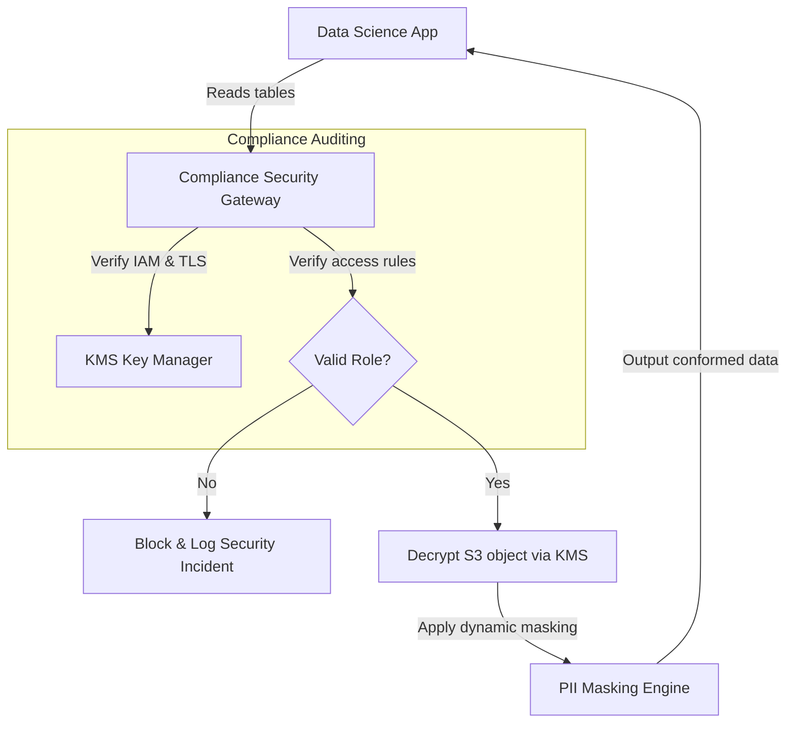

# Module 8.11: Security & Compliance

Welcome to **Security & Compliance**. A data platform stores an organization's history, making it a high-security target. In this module, you will learn how to enforce security controls (RBAC, ABAC, RLS, CLS, masking) and implement data policies that satisfy regulatory compliance frameworks like GDPR, HIPAA, SOC2, and PCI-DSS.

---

## 1. Detailed Theory

### Security Access Controls
- **RBAC (Role-Based Access Control)**: Restricting database privileges based on predefined roles (e.g., `ANALYST`, `DATA_ENGINEER`).
- **ABAC (Attribute-Based Access Control)**: Granting permissions dynamically based on properties of the user, the resource, or environment variables (e.g., "Allow user to read file X only if they belong to department Y and their system security clearance is 'Confidential'").
- **Column-Level Security (CLS) & Row-Level Security (RLS)**: Redacting columns or filtering query rows dynamically based on roles.
- **Dynamic Data Masking**: Masking sensitive fields (hashing emails, hiding credit cards) on-the-fly.

### Compliance Frameworks
- **GDPR**: General Data Protection Regulation. Enforces privacy rules: the 'Right to be Forgotten' (requiring automated deletion of customer records across all S3 files and databases) and strict consent tracking.
- **HIPAA**: Regulates access to protected health information (PHI), requiring encryption at rest/transit and audit trails.
- **SOC2**: Verifies platform controls on security, availability, processing integrity, and privacy.
- **PCI-DSS**: Enforces strict cardholder data security (PCI data must never be logged in cleartext).

---

## 2. Architecture Diagram: Compliance Enforcement Gateway



---

## 3. Production Use Cases

1. **Secure Data Governance Platform**: An enterprise healthcare platform. You configure KMS keys to encrypt the storage buckets, establish AWS Lake Formation to enforce ABAC policies (doctors can only read patient records matching their clinic ID), and build an automated script to purge customer IDs from S3 to comply with GDPR delete requests.

---

## 4. Real Company Examples

- **Capital One**: Implements automated encryption key rotation and strict data classification checks at every staging boundary to guarantee compliance with banking regulations.

---

## 5. Coding Examples

### Implementing Dynamic Data Masking and Row Filters in SQL (Snowflake)

```sql
-- 1. Create a Dynamic Masking Policy for SSNs
CREATE OR REPLACE MASKING POLICY ssn_mask AS (val string) 
  RETURNS string ->
  CASE
    -- If the user has the compliance auditor role, show cleartext
    WHEN CURRENT_ROLE() IN ('COMPLIANCE_AUDITOR_ROLE') THEN val
    -- Otherwise, mask the first 5 digits
    ELSE 'XXX-XX-' || RIGHT(val, 4)
  END;

-- 2. Apply Masking Policy to a table column
ALTER TABLE core.dim_patient_profiles 
ALTER COLUMN ssn SET MASKING POLICY ssn_mask;

-- 3. Row Access Policy: Filter patients by clinic assignment
CREATE OR REPLACE ROW ACCESS POLICY patient_clinic_filter AS (clinic_id string) 
  RETURNS boolean ->
  CURRENT_ROLE() = 'GLOBAL_ADMIN_ROLE' 
  OR clinic_id = CURRENT_ROLE(); -- Assumes roles map to clinic IDs
```

---

## 6. Hands-on Labs

**Lab: GDPR Deletion Automation**
**Objective**: Build a purge query.
**Instructions**:
Write the SQL MERGE or DELETE query to purge a customer's record (`customer_id = 'C_99'`) from a transactional database and explain how you would trigger this query on downstream Delta/Parquet tables in an S3 Data Lake to ensure compliance.

---

## 7. Assignments

**Assignment: RBAC vs. ABAC Evaluation**
Write a technical note comparing **Role-Based Access Control (RBAC)** and **Attribute-Based Access Control (ABAC)**. Under what scenario is ABAC required (e.g., multi-tenant systems where permission rules depend on dynamic tenant IDs)?

---

## 8. Interview Questions

1. **What is GDPR's 'Right to be Forgotten' and how does it impact a Data Lake?**
   *Answer Hint: GDPR requires organizations to delete all personal data for a customer upon request. In a data lake containing historical Parquet/Delta files on S3, this requires running SQL DELETE or MERGE commands to rewrite the data files containing the customer's ID and executing VACUUM to delete historical files.*
2. **Explain the difference between Symmetric and Asymmetric encryption.**
   *Answer Hint: Symmetric encryption uses a single shared key to both encrypt and decrypt data (faster, used for data at rest). Asymmetric encryption uses a public key to encrypt and a separate private key to decrypt (used for secure key exchanges over networks).*

---

## 9. Best Practices (FDE Standards)

- **Default to Encryption**: Enforce server-side encryption with Customer Managed Keys (SSE-KMS) on all S3 buckets and databases.
- **Run Regular Access Audits**: Audit database user privileges and active roles monthly to detect permission creep.

---

## 10. Common Mistakes

- **Storing plaintext credentials in Git**: Checking DB password variables into repository code. Use AWS Secrets Manager or Vault.
- **Ignoring log security**: Masking PII in database tables but printing raw customer records to application log files, violating compliance.
