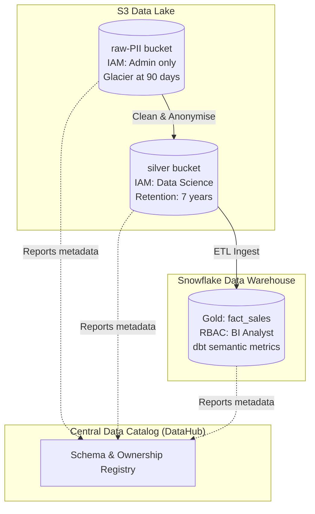

# Module 8.12: Governance for Data Lakes & Warehouses

Welcome to **Governance for Data Lakes & Warehouses**. Storing files on S3 (Data Lakes) and structured tables in Snowflake (Data Warehouses) requires different governance strategies. In this module, you will learn how to design data classification and lifecycle rules for lakes, standardize schemas and business metrics for warehouses, and coordinate access controls.

---

## 1. Detailed Theory

### Data Lake Governance
Data Lakes store unstructured and raw formats, making them highly vulnerable to security gaps:
- **Data Classification**: Categorizing raw files on S3/GCS based on sensitivity (e.g., placing cleartext log files in `s3://raw-confidential/` and public marketing files in `s3://raw-public/`).
- **Data Retention (Lifecycle Policies)**: Moving historical files automatically to cheaper storage tiers (Glacier) or purging them after a retention limit.
- **Access Controls**: Managing permissions at the bucket and folder level using IAM roles.

### Data Warehouse Governance
Data Warehouses store highly structured, conformed data:
- **Metric Standardization**: Enforcing a central semantic layer (using tools like dbt) to define business formulas (like MRR or churn) in code.
- **Business Definitions**: Assigning definitions to all tables and columns in a central Data Catalog.
- **Data Ownership**: Assigning stewardship roles to specific business teams for every warehouse schema.

---

## 2. Architecture Diagram: Unified Lake & Warehouse Governance Model



---

## 3. Production Use Cases

1. **Enterprise Lakehouse Governance**: A centralized platform where raw transaction JSON files are loaded into S3. You configure lifecycle policies to delete logs after 90 days, enforce dbt schema tests inside the data warehouse to validate types, and register all tables in DataHub with assigned stewards to ensure complete observability.

---

## 4. Real Company Examples

- **Walmart**: Standardizes metrics across hundreds of store sales databases by enforcing a centralized semantic layer inside their cloud databases, ensuring that all BI reports compile consistent metrics.

---

## 5. Coding Examples

### Configuring S3 Lifecycle Rules (Terraform IaC)

This configuration defines the storage lifecycle of a data lake bucket, moving raw logs to cold storage and purging them after a set period.

```hcl
# Terraform configuration for S3 bucket lifecycle rules
resource "aws_s3_bucket_lifecycle_configuration" "lake_lifecycle" {
  bucket = aws_s3_bucket.datalake_raw.id

  rule {
    id     = "archive-and-purge-raw-logs"
    status = "Enabled"

    filter {
      prefix = "raw/server-logs/"
    }

    # 1. Transition files to Glacier (Cold Storage) after 90 days
    transition {
      days          = 90
      storage_class = "GLACIER"
    }

    # 2. Permanently delete files after 7 years (2555 days)
    expiration {
      days = 2555
    }
  }
}
```

---

## 6. Hands-on Labs

**Lab: Metric Definition Standards**
**Objective**: Build a metric standard.
**Instructions**:
Write the dbt YAML configuration to define a metric called `gross_margin` calculated as: `(revenue - cost) / revenue`. Link the metric to a gold model table `fact_financial_summary`.

---

## 7. Assignments

**Assignment: Storage Tiers & Cost Optimization**
Analyze the storage cost differences and latency trade-offs between **S3 Standard**, **S3 Standard-IA (Infrequent Access)**, and **S3 Glacier**.
Draft a lifecycle plan showing how a data platform should transition server logs through these tiers over a 5-year retention window.

---

## 8. Interview Questions

1. **How does Data Lake governance differ from Data Warehouse governance?**
   *Answer Hint: Data Lake governance focuses on file-level classification, S3 bucket folder access policies, and storage cost optimization (lifecycle tiers). Data Warehouse governance focuses on table schema structures, metric definitions inside semantic layers, and column/row access permissions.*
2. **What does an S3 lifecycle policy do?**
   *Answer Hint: An S3 lifecycle policy is a set of rules that automates the transition of objects to cheaper storage classes (like Glacier) or schedules their permanent deletion after a specified period of time, reducing storage costs.*

---

## 9. Best Practices (FDE Standards)

- **Standardize Business Metrics**: Define key business calculation metrics (KPIs) inside your dbt semantic model, never allow BI tools to calculate them on-the-fly.
- **Enforce Storage Lifecycles**: Always set expiration rules on raw temporary directories to prevent storage cost build-ups.

---

## 10. Common Mistakes

- **Keeping Raw Data on Standard Tier Forever**: Letting terabytes of raw logs reside on high-tier S3 Standard storage indefinitely, leading to high storage costs.
- **Duplicate Metrics Definitions**: Allowing different teams to calculate the same metric (e.g., 'active users') using conflicting SQL formulas, leading to inconsistent reports.
