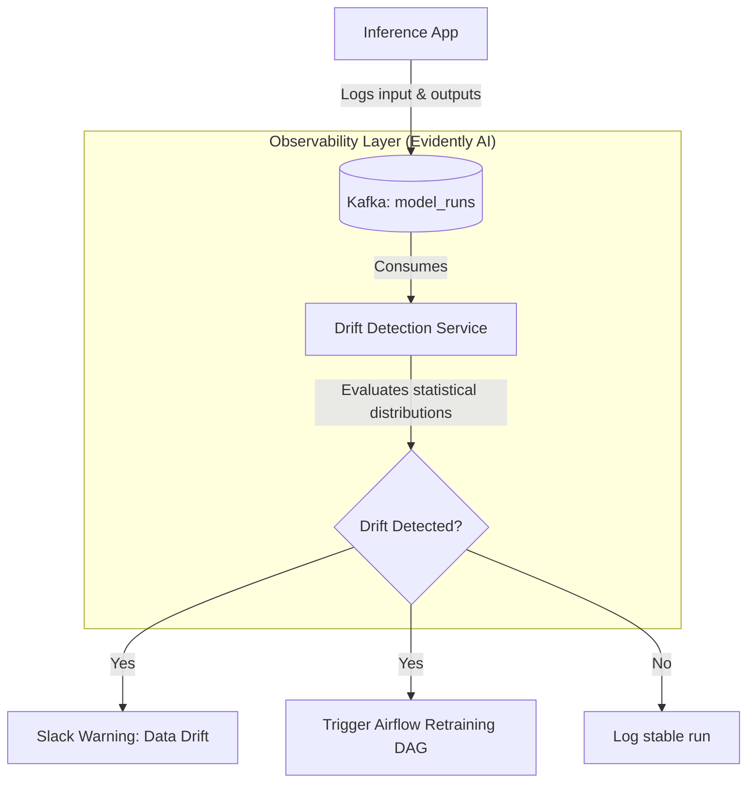

# Module 8.13: Data Quality for AI/ML

Welcome to **Data Quality for AI/ML**. Training machine learning models requires more than checking if a database column contains null values. You must validate feature distributions, monitor incoming data streams for statistical drift (covariate shift), ensure label consistency, and establish feature store ownership. In this module, you will learn how to connect your pipeline to monitoring tools like **Evidently AI** and **Feast**.

---

## 1. Detailed Theory

### Training Data Quality
Machine learning models are sensitive to data distributions:
- **Feature Validation**: Ensuring the range and type of input features match what the model was trained on (e.g., checking that values are not negative or empty).
- **Label Validation**: Verifying that target training labels (e.g., classification categories) are consistent and clean.
- **Drift Detection (Data & Concept Drift)**:
  - **Data Drift**: The statistical properties of the input features change over time (e.g., average customer purchase sizes shifting).
  - **Concept Drift**: The relationship between features and target labels changes (e.g., past user buying patterns no longer predicting future purchases due to market shifts).

### Feature Store Governance
- **Feast Registry**: Features must be cataloged and versioned. The Feast registry serves as the metadata store, documenting feature descriptions, ownership, and definitions to prevent training-serving skew.

---

## 2. Architecture Diagram: MLOps Quality & Drift Monitoring Flow



---

## 3. Production Use Cases

1. **MLOps Governance Platform**: A credit scoring model API. Every time the model scores a user, the input features are logged to a Kafka topic. An **Evidently AI** worker consumes the stream, runs statistical tests (Kolmogorov-Smirnov test) comparing today's features against the training baseline, and triggers an automated retraining job if drift is detected.

---

## 4. Real Company Examples

- **Uber (Michelangelo)**: Monitors all model execution features globally, tracking feature values and comparing them against baseline training metrics automatically.

---

## 5. Coding Examples

### Statistical Data Drift Detection using Evidently AI (Python)

```python
import pandas as pd
from evidently.report import Report
from evidently.metric_preset import DataDriftPreset

# 1. Load Reference (Training) and Current (Production) datasets
# Simulating a model feature: monthly transaction amounts
training_data = pd.DataFrame({"spend": [10, 15, 20, 25, 30, 35, 40, 45, 50, 55]})
production_data = pd.DataFrame({"spend": [80, 85, 90, 95, 100, 110, 120, 130, 140, 150]}) # Shifted distribution

# 2. Configure Evidently Data Drift Report
drift_report = Report(metrics=[
    DataDriftPreset()
])

# 3. Calculate Drift
drift_report.run(reference_data=training_data, current_data=production_data)

# 4. Save Report Output (HTML or JSON)
drift_report.save_html("data_drift_report.html")

# Programmatically evaluate drift
report_dict = drift_report.as_dict()
dataset_drift = report_dict["metrics"][0]["result"]["dataset_drift"]
print(f"Dataset Data Drift Detected: {dataset_drift}")
```

---

## 6. Hands-on Labs

**Lab: Identifying Feature Quality Checks**
**Objective**: Build feature constraints.
**Instructions**:
For each of the following machine learning models, write the data quality checks (using Great Expectations rules) you would implement on incoming features:
1. Churn Prediction (features: `monthly_usage_minutes`, `days_active`, `email`).
2. Credit Scoring (features: `annual_income`, `credit_score`, `has_defaulted`).

---

## 7. Assignments

**Assignment: Data Leakage Prevention**
Define the concept of **Data Leakage** in machine learning feature engineering.
Write a paragraph explaining how a Feature Store like Feast utilizes **Point-in-Time Correct Joins** (As-Of Joins) to prevent target leakage during training data extraction.

---

## 8. Interview Questions

1. **What is the difference between Data Drift and Concept Drift?**
   *Answer Hint: Data Drift is when the statistical properties of the input features change over time (e.g., customers getting older). Concept Drift is when the relationship between features and target labels changes (e.g., a specific spending pattern no longer predicting churn due to a competitor's pricing change).*
2. **How does evidently AI detect data drift?**
   *Answer Hint: Evidently AI calculates statistical tests (like the Kolmogorov-Smirnov test for numerical features or Chi-Square test for categorical features) comparing the distribution of current production data against a reference training dataset, identifying if distributions are significantly different.*

---

## 9. Best Practices (FDE Standards)

- **Log Inference Payloads**: Always log model inputs and outputs asynchronously to a database to enable retrospective data drift analyses.
- **Enforce Feast Registries**: Maintain a version-controlled repository of feature definitions to ensure training and serving code calculate features identically.

---

## 10. Common Mistakes

- **Assuming Static Distributions**: Training a model and leaving it running for years without checking for drift, resulting in silent prediction accuracy degradation.
- **Ignoring Label Quality**: Training models on dirty, unvalidated labels (e.g., records containing human typographical errors), leading to poor validation metrics.
