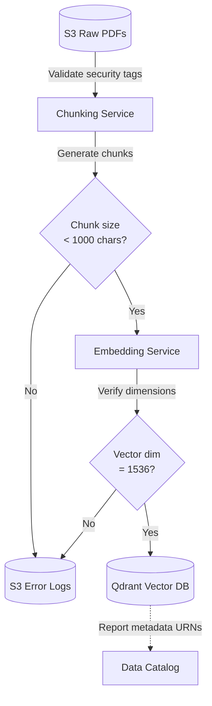

# Module 8.14: Data Governance for LLMOps

Welcome to **Data Governance for LLMOps**. Generative AI models introduce unique governance challenges: validating unstructured document sources, chunk configurations, high-dimensional vector embeddings, tracking prompt versions, and monitoring hallucination rates. In this module, you will learn how to design governance standards for enterprise AI systems.

---

## 1. Detailed Theory

### RAG Data Governance
Building a Retrieval-Augmented Generation (RAG) system requires validation at every stage:
- **Document Validation**: Verifying raw source files (PDFs) contain clean text and have correct security tags (RBAC) before processing.
- **Chunk Validation**: Ensuring text segments are not empty and fall within optimal size limits (e.g., 500-1000 characters).
- **Metadata Validation**: Attaching and verifying source file URLs, page numbers, and confidentiality levels to prevent data leakage during retrieval.
- **Embedding Validation**: Confirming high-dimensional vectors match the correct dimensional configurations (e.g., 1536 dimensions for OpenAI).

### AI & Prompt Governance
LLM prompts are critical code assets:
- **Prompt Versioning**: Treating prompts as code, tracking changes in Git, and logging which prompt version was used for each customer response.
- **Evaluation Tracking**: Logging metrics like faithfulness, answer relevance, and context recall (calculated via tools like Ragas) to evaluate performance over time.
- **Hallucination Monitoring**: Setting up automated checks to flag outputs containing facts not present in the retrieved source context.

---

## 2. Architecture Diagram: RAG Quality & Compliance Guardrails



---

## 3. Production Use Cases

1. **Enterprise AI Governance Platform**: A corporate customer support RAG chatbot. When documents are modified, they are validated, chunked, and embedded. The pipeline attaches security tags (`sec_level = 'finance'`) to the vector metadata. The chatbot's retrieval logic pre-filters vectors based on the user's role, ensuring that a basic customer service agent cannot query confidential executive financial manuals.

---

## 4. Real Company Examples

- **Palantir (AIP)**: Enforces strict row and tag-level security boundaries across enterprise LLM agent communications, ensuring compliance with privacy rules.

---

## 5. Coding Examples

### Validating Document Chunks and Metadata in Python

```python
import uuid
import pydantic
from typing import Dict, List

# 1. Define strict schema for document chunks using Pydantic
class ChunkSchema(pydantic.BaseModel):
    chunk_id: str
    document_name: str
    chunk_index: int
    text_content: str
    security_group: str
    metadata: Dict[str, str]

    @pydantic.validator('text_content')
    def validate_text_length(cls, v):
        if len(v) < 50 or len(v) > 2000:
            raise ValueError('Chunk character length must be between 50 and 2000.')
        return v

# 2. Run Validation on incoming chunks
raw_chunk = {
    "chunk_id": str(uuid.uuid4()),
    "document_name": "annual_report_2023.pdf",
    "chunk_index": 1,
    "text_content": "Enterprise AI systems require strict data quality checkpoints to protect financial metrics...",
    "security_group": "executive",
    "metadata": {"page": "5", "author": "FDE Team"}
}

try:
    validated_chunk = ChunkSchema(**raw_chunk)
    print("Chunk passed validation! Ready to embed.")
    print(validated_chunk.json())
except pydantic.ValidationError as e:
    print(f"Validation failed: {e}")
```

---

## 6. Hands-on Labs

**Lab: Evaluating RAG Output**
**Objective**: Calculate evaluation metrics.
**Instructions**:
Given an LLM generated answer, the user prompt, and the retrieved source text:
Write down the conceptual logic to calculate **Faithfulness** (relevance to source text). How does the system detect if the LLM hallucinated facts that are not present in the retrieved source text?

---

## 7. Assignments

**Assignment: Prompt Injection Protection**
Write a design proposal for a safety gate in an AI chatbot.
Detail:
1. Detecting prompt injection patterns in the user input.
2. Logging flagged requests to a security audit table.
3. Automatically blocking inputs that exceed safety thresholds before they reach the LLM API.

---

## 8. Interview Questions

1. **Why is metadata validation critical in RAG pipelines?**
   *Answer Hint: RAG pipelines retrieve document segments to answer questions. If the metadata does not contain strict security classification tags (RBAC), the search query might retrieve confidential source documents and leak them to unauthorized users in the final LLM answer.*
2. **What is Hallucination Monitoring in LLMOps?**
   *Answer Hint: The practice of evaluating LLM outputs against the retrieved source documents to verify that the generated answer is faithful to the context and does not contain fabricated facts. This is monitored programmatically using evaluation frameworks like Ragas or TruLens.*

---

## 9. Best Practices (FDE Standards)

- **Use Pre-filtering for Security**: Always perform metadata pre-filtering on the vector database level to restrict search results based on the user's role before executing the similarity search.
- **Log Prompt Versions**: Always save the prompt template ID and model version configuration along with user conversation logs to enable audit trails.

---

## 10. Common Mistakes

- **Hard-indexing Plaintext Prompts**: Storing sensitive prompt inputs containing PII in unencrypted files, violating GDPR privacy rules.
- **Upgrading Models without Re-embedding**: Changing the embedding model version without updating existing vector index configurations, resulting in search errors.
