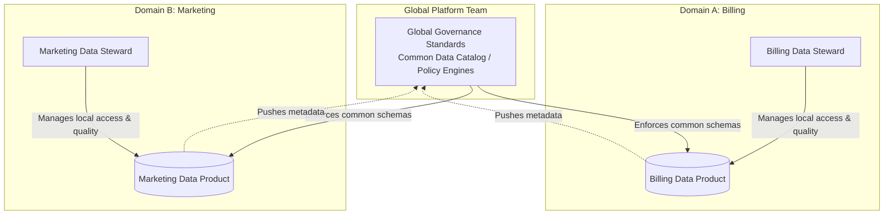

# Module 8.15: Production Data Governance

Welcome to the final module of the Data Quality & Governance curriculum: **Production Data Governance**. As a Forward Deployed Engineer, you will design governance architectures that scale across multiple business domains, enforce compliance rules dynamically, and monitor governance KPIs across a Data Mesh platform.

---

## 1. Detailed Theory

### Scalability: Data Mesh Governance
In massive enterprise platforms, centralized governance creates bottlenecks.
- **Federated Computational Governance**: Moving to a **Data Mesh** model where each business domain (Billing, Marketing, Support) is responsible for governing its own data products (schemas, quality rules, and owners).
- The central governance team provides the automated platform tools (catalogs, policy runners) and sets global interoperability standards, but domain stewards define and enforce local rules.

### Policy Enforcement & Audit Trails
- **Automated Policy Enforcement**: Setting up validation engines that block deployments if tables lack owners, description metadata, or quality checks.
- **Audit Trails**: Storing read/write audit logs for all sensitive databases in an immutable, append-only security log for compliance reviews.

### Monitoring Governance KPIs
- **Quality Scorecards**: Calculating and displaying monthly data health metrics (e.g., completeness scores, SLA breach counts) across domains.

---

## 2. Architecture Diagram: Federated Data Mesh Governance Model



---

## 3. Production Use Cases

1. **Enterprise Data Platform Governance**: An enterprise software company implements a federated governance model. The central engineering team deploys DataHub on Kubernetes. The billing team writes dbt models and owns their staging configurations. The marketing team does the same for clickstreams. CI/CD checks block PRs from merging if new tables lack designated owner tags or description schemas.

---

## 4. Real Company Examples

- **Intuit**: Relies on a decentralized Data Mesh architecture, assigning data product ownership and governance responsibilities directly to individual business units.

---

## 5. Coding Examples

### Enforcing Metadata Tag Checks in CI/CD (Python Lint Script)

This script runs during GitHub Actions checks, failing the build if a developer creates a dbt model that lacks a registered owner metadata tag.

```python
import json
import sys

def check_metadata_tags(manifest_path):
    with open(manifest_path, 'r') as f:
        manifest = json.load(f)
        
    nodes = manifest.get("nodes", {})
    failed = False
    
    # 1. Scan compiled dbt models
    for node_name, node_data in nodes.items():
        if node_data.get("resource_type") == "model":
            model_name = node_data.get("name")
            meta = node_data.get("meta", {})
            
            # 2. Assert 'owner' tag exists in metadata config
            if "owner" not in meta:
                print(f"ERROR: Model '{model_name}' is missing the 'owner' metadata tag!")
                failed = True
                
    if failed:
        sys.exit(1) # Fail the CI/CD pipeline build
    else:
        print("All models passed metadata tag checks.")

if __name__ == "__main__":
    check_metadata_tags("manifest.json")
```

---

## 6. Hands-on Labs

**Lab: Building a Quality Scorecard**
**Objective**: Model governance KPI tracking.
**Instructions**:
Write the SQL query to calculate a monthly **Data Quality Scorecard** metric for a table, defined as:
`Quality_Score = (passed_tests_count / total_tests_count) * 100`.
Query from an execution table `test_logs` containing columns `test_name`, `status` ('passed' or 'failed'), and `execution_date`.

---

## 7. Assignments

**Assignment: Data Mesh Governance Design**
Write a design proposal for implementing federated governance across three domains: Finance, Risk, and Sales.
Detail:
1. Domain-specific ownership boundaries.
2. The role of the central platform engineering team.
3. How global interoperability standards (like shared surrogate keys) are enforced across domains.

---

## 8. Interview Questions

1. **What is Federated Computational Governance in a Data Mesh?**
   *Answer Hint: A governance model where individual business domains own and manage their own data products (defining schemas, quality checks, and access), while a centralized platform team provides the automated tooling (catalogs, pipelines, IAM templates) and sets global interoperability standards.*
2. **Why is it important to block CI/CD pipeline builds on metadata tag violations?**
   *Answer Hint: If tag checks are not automated in CI/CD, developers will deploy tables without registering owners or definitions. Over time, the data warehouse becomes undocumented and unmanageable (data swamp). Enforcing rules in CI/CD ensures 100% catalog coverage.*

---

## 9. Best Practices (FDE Standards)

- **Automate Policy Checks**: Build metadata checks (asserting owners, tests, and descriptions) directly into your CI/CD linter steps.
- **Enforce Domain Ownership**: Organize table schemas and S3 paths by business domains to simplify security and lifecycle management.

---

## 10. Common Mistakes

- **Centralizing schema approvals**: Forcing a single central database team to review every schema change, stalling development. Decentralize approvals to domain stewards.
- **Failing to track KPIs**: Running data quality checks but neglecting to monitor overall quality trends, leading to silent platform decay.
