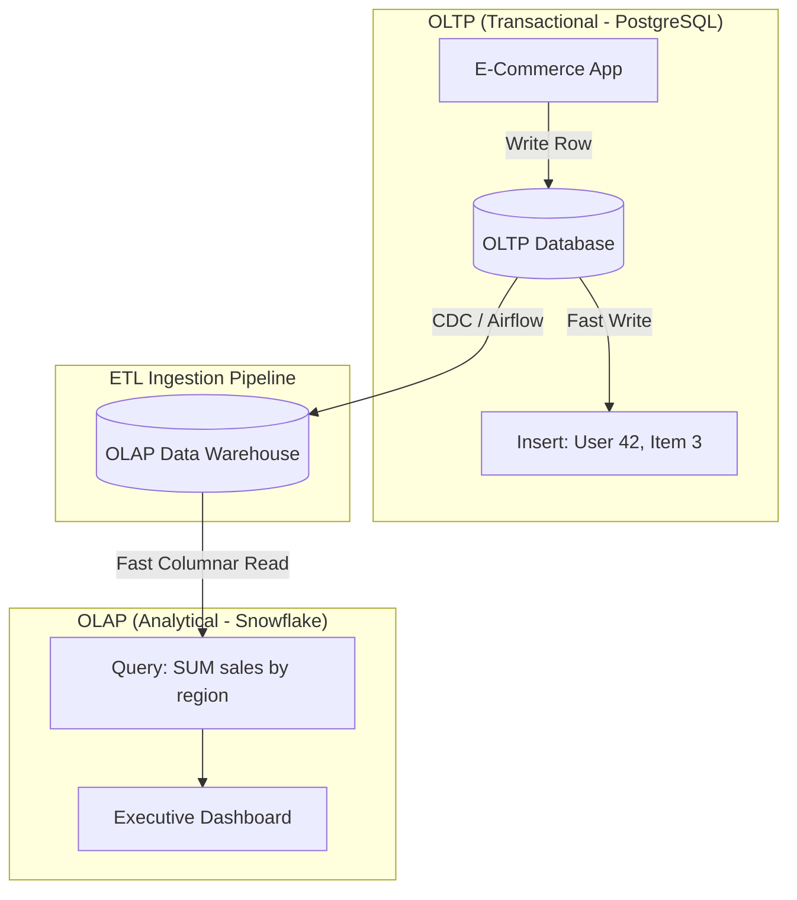

# Module 7.1: Data Warehouse Fundamentals

Welcome to **Data Warehouse Fundamentals**. As an AI Forward Deployed Engineer (FDE), you will continuously extract historical training data, calculate business performance metrics, and serve analytical summaries to executive dashboards. To do this at scale, you must understand **Data Warehouses**. A Data Warehouse is a system optimized for analytical queries (OLAP) rather than transactional processing (OLTP).

---

## 1. Detailed Theory

### What is a Data Warehouse?
A Data Warehouse is a centralized repository that aggregates data from multiple operational systems. It is optimized for reading, analyzing, and running complex queries across millions of historical records.

### OLTP vs. OLAP
- **OLTP (Online Transaction Processing)**: Transactional databases designed for fast, row-by-row writes (e.g., PostgreSQL running behind a mobile checkout app). Focuses on sub-millisecond writes, current state, and normalized schemas (3NF) to prevent anomalies.
- **OLAP (Online Analytical Processing)**: Analytical databases designed for fast column-level aggregations (e.g., Snowflake, BigQuery). Focuses on query speeds, historical trends, and denormalized schemas (Star/Snowflake).

### Characteristics of Data Warehouse Data
William Inmon, the father of data warehousing, defined the four core characteristics:
1. **Subject-Oriented**: Organized around key business subjects (e.g., Customer, Product, Sales) rather than transactional app functions.
2. **Integrated**: Consolidates data from multiple separate sources, standardizing naming, data types, and keys.
3. **Time-Variant**: Stores historical changes over time, not just the current state.
4. **Non-Volatile**: Data is read-only. Once loaded, it is never updated or deleted by normal users, ensuring historical auditing stability.

---

## 2. Architecture Diagram: OLTP vs. OLAP Database Layout



---

## 3. Production Use Cases

1. **Executive BI Dashboard Support**: Providing sub-second SQL queries for Looker/Tableau dashboards displaying sales performance, customer churn metrics, and quarterly KPI monitoring.
2. **AI Model Training Ingestion**: Querying historical data warehouse tables to aggregate customer spend behavior over 5 years to train churn prediction models.

---

## 4. Real Company Examples

- **Snowflake / Google Cloud**: Offer serverless, cloud-native data warehouses widely adopted by enterprises to run analytical queries over petabytes of data without managing database servers.

---

## 5. Coding Examples

### Analytical SQL Query (OLAP) vs. Application SQL Query (OLTP)

```sql
-- OLTP Query: Fast row lookup by primary key (run by web app)
SELECT user_name, email 
FROM users 
WHERE user_id = 42;

-- OLAP Query: Scanning millions of rows to aggregate metrics (run in Warehouse)
SELECT 
    DATE_TRUNC('month', transaction_date) AS sales_month,
    product_category,
    SUM(sale_amount) AS total_revenue,
    COUNT(DISTINCT customer_id) AS active_customers
FROM gold_sales_facts
GROUP BY 1, 2
ORDER BY 1 DESC, 3 DESC;
```

---

## 6. Hands-on Labs

**Lab: OLTP and OLAP Comparison**
**Objective**: Differentiate query execution paths.
**Instructions**:
Write down which database type (OLTP or OLAP) is optimal for:
1. Updating a user's password.
2. Generating a monthly revenue report by product category.
3. Checking out a shopping cart.
4. Auditing credit card transactions over 3 years.

---

## 7. Assignments

**Assignment: The Non-Volatile Rule**
Explain how the **Non-Volatile** characteristic of a Data Warehouse protects the reproducibility of machine learning models. What happens to a data scientist's training runs if historical warehouse records are updated or deleted?

---

## 8. Interview Questions

1. **What is the difference between OLTP and OLAP?**
   *Answer Hint: OLTP systems are optimized for fast, transactional row-level writes (high concurrency, normalized 3NF schemas). OLAP systems are optimized for fast analytical query aggregations over millions of rows (columnar storage, denormalized schemas).*
2. **What does "Subject-Oriented" mean in a Data Warehouse?**
   *Answer Hint: It means the data is structured and grouped around key business entities (like Customer, Product, or Sale) rather than structured around application processes (like user sign-up page state or checkout steps).*

---

## 9. Best Practices (FDE Standards)

- **Use Columnar Warehouses for Analytics**: Never run analytical summaries (using `SUM`, `AVG`, `GROUP BY`) directly on production OLTP application databases, as this will lock tables and crash the live app.
- **Enforce Read-Only Access**: Grant only read permissions to analytical users and BI tools on production warehouse schemas to preserve non-volatility.

---

## 10. Common Mistakes

- **Duplicating OLTP normalized schemas**: Blindly replicating a highly normalized 3NF app schema into a Data Warehouse, requiring analysts to write queries with 20 JOINs.
- **Ignoring non-volatile inserts**: Writing ETL scripts that execute `UPDATE` statements on historical records instead of appending new version records.
