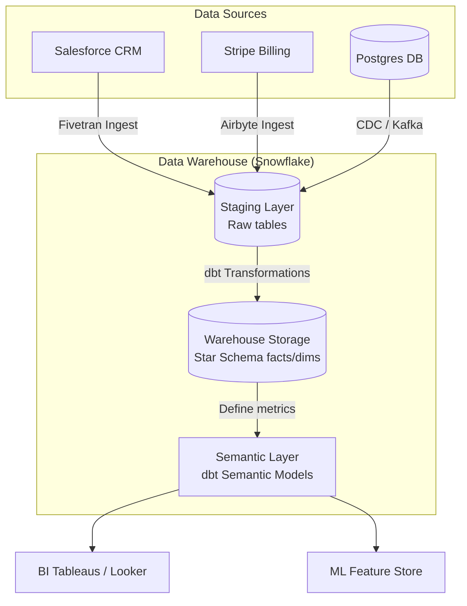

# Module 7.2: Data Warehouse Architecture

Welcome to **Data Warehouse Architecture**. Designing a production-grade data warehouse involves structuring the pipeline components that ingest data from source systems, process it through staging zones, load it into warehouse storage, and serve it via semantic layers.

---

## 1. Detailed Theory

### Core Architectural Layers
A modern Data Warehouse consists of five distinct layers:
1. **Data Ingestion Layer**: The connectors (like Fivetran, Airbyte, or Kafka Connect) that extract data from SaaS APIs, databases, or events and land it in storage.
2. **ETL/ELT Layer**: The transformation pipelines (like dbt or Spark) that clean, validate, and structure the landed data.
3. **Data Warehouse Storage**: The database engine optimized for OLAP queries (e.g., Snowflake, Redshift, BigQuery).
4. **Semantic Layer**: A virtualization layer that defines metric calculations (e.g., defining `net_revenue = gross_revenue - discounts` in one place) so all BI tools query consistent definitions.
5. **BI / Analytics Layer**: The user-facing dashboard tools (e.g., Tableau, Looker, PowerBI) that read the semantic tables.

---

## 2. Architecture Diagram: Enterprise Data Warehouse Layout



---

## 3. Production Use Cases

1. **Enterprise Reporting Platform**: A SaaS platform ingests Salesforce customer data and Stripe payments. Fivetran lands the records in a Snowflake staging database. A dbt pipeline runs every night, structures the tables into a Star Schema, applies semantic metrics (e.g., Monthly Recurring Revenue), and refreshes BI reporting dashboards.

---

## 4. Real Company Examples

- **Fivetran / dbt Labs**: Created the modern ELT stack. Fivetran automates ingestion to staging, and dbt structures tables and metadata schemas inside the warehouse database.

---

## 5. Coding Examples

### Declaring a Semantic Metric in dbt (YAML Configuration)

The semantic layer ensures metrics are defined once in code. This dbt configuration defines a `revenue` metric.

```yaml
# models/semantic/metrics.yml
version: 2

metrics:
  - name: monthly_recurring_revenue
    description: "Sum of monthly recurring revenue from active subscriptions."
    type: simple
    type_params:
      measure: subscription_revenue
    filter: |
      subscription_status = 'active'
      
semantic_models:
  - name: subscription_facts
    model: ref('fact_subscriptions')
    defaults:
      agg_time_dimension: subscription_date
    measures:
      - name: subscription_revenue
        agg: sum
        expr: amount
    dimensions:
      - name: subscription_date
        type: time
        type_params:
          time_granularity: day
```

---

## 6. Hands-on Labs

**Lab: Identifying Architectural Bottlenecks**
**Objective**: Troubleshoot query lag.
**Instructions**:
A business analyst complains that their Tableau dashboard takes 5 minutes to load.
Map out the architectural layers (Ingestion -> ETL -> Storage -> Semantic -> BI) and identify where you would check to diagnose the performance bottleneck.

---

## 7. Assignments

**Assignment: ETL vs. ELT in Warehousing**
Write a technical proposal defending the use of **ELT** (loading raw data to staging first, then transforming inside the warehouse via dbt SQL) over **ETL** (transforming data on a separate Spark cluster before loading) for a cloud data platform. Focus on compute efficiency, developer access, and cost.

---

## 8. Interview Questions

1. **What is a Semantic Layer in Data Warehousing?**
   *Answer Hint: A semantic layer is a metadata layer that sits between the warehouse storage and the BI tools. It defines standard metric formulas (like 'Gross Margin') and business logic in one place, ensuring that different dashboard tools report identical numbers.*
2. **What does the Staging Layer do in a Data Warehouse?**
   *Answer Hint: The Staging Layer is the landing area for raw data. It stores copies of source tables with minimal transformations, isolating the core analytical warehouse tables from changes or failures in ingestion processes.*

---

## 9. Best Practices (FDE Standards)

- **Define Metrics in Code**: Never allow different BI analysts to write their own SQL formulas for key metrics (like revenue). Define metrics in a central semantic model (dbt) to ensure consistency.
- **Isolate Environments**: Maintain separate Staging (`STG`), Development (`DEV`), and Production (`PROD`) databases in the warehouse to prevent development queries from impacting production reports.

---

## 10. Common Mistakes

- **Joining Staging Tables Directly**: Letting BI tools query raw staging tables, resulting in unoptimized queries and incorrect dashboards.
- **Hardcoding schema definitions in BI**: Building metric formulas directly in Tableau calculated fields rather than in the warehouse SQL or semantic layer, making logic changes hard to manage.
