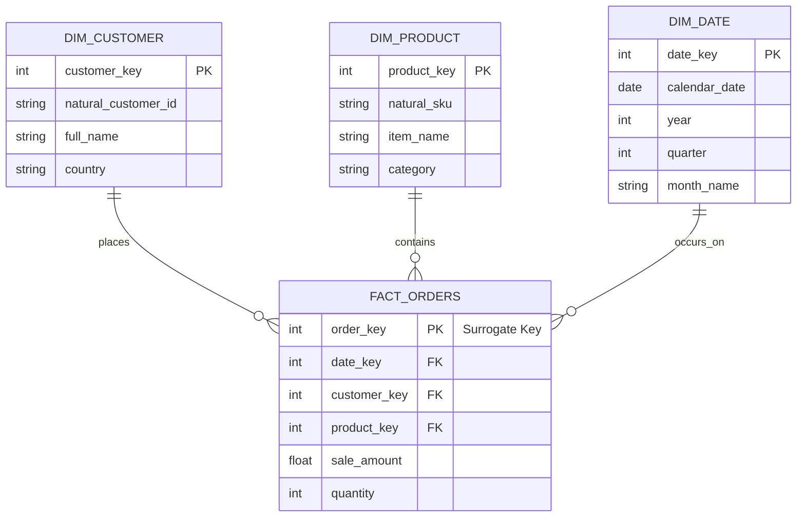

# Module 7.3: Dimensional Modeling

Welcome to **Dimensional Modeling**. The way you structure tables inside a Data Warehouse is fundamentally different from a transactional database. Dimensional modeling (popularized by Ralph Kimball) structures data into **Fact Tables** and **Dimension Tables** to optimize query performance and make the database intuitive for business analysts.

---

## 1. Detailed Theory

### Fact Tables
Fact tables contain the quantitative metrics, measurements, or facts of a business event. They typically contain numeric values (e.g., price, quantity) and foreign keys linking to dimension tables.
- **Transaction Fact Tables**: Records a fact for a single event (e.g., a specific checkout transaction). The most granular and common type.
- **Periodic Snapshot Fact Tables**: Records facts representing a state at a regular interval (e.g., monthly account balance snapshots).
- **Accumulating Snapshot Fact Tables**: Records progress through a defined workflow with multiple dates (e.g., tracking an order from placement, to shipment, to delivery).

### Dimension Tables
Dimension tables contain the descriptive context (attributes) surrounding a business process. They answer the "who, what, where, when, why" of a transaction (e.g., Customer, Product, Location, Time).

### Natural Keys vs. Surrogate Keys
- **Natural Keys**: The identifier generated by the source operational system (e.g., a `customer_uuid` from a Stripe database).
- **Surrogate Keys**: A database-internally generated primary key (usually an auto-incrementing integer or a MD5/SHA256 hash of natural keys) created specifically for the warehouse tables.
  - **Why use Surrogate Keys?** Natural keys can change, have different types across systems, or duplicate when merging entities. Surrogate keys decouple the warehouse from source changes and allow for Slowly Changing Dimensions (SCD).

---

## 2. Architecture Diagram: Dimensional Schema Relationship



---

## 3. Production Use Cases

1. **Retail Analytics Warehouse**: Designing the data model for a major supermarket chain. You build a `fact_sales` table with a granular definition (row per item sold). You link it to `dim_stores`, `dim_products`, and `dim_date` tables using hash-based surrogate keys to enable fast regional revenue reports.

---

## 4. Real Company Examples

- **Walmart**: Organizes their supply chain and inventory databases using massive dimensional schemas, allowing analysts to run sub-second calculations on seasonal sales trends.

---

## 5. Coding Examples

### Creating a Dimensional Schema in SQL (DDL)

```sql
-- 1. Create Customer Dimension (with Surrogate Key)
CREATE TABLE dim_customer (
    customer_key INT IDENTITY(1,1) PRIMARY KEY, -- Auto-incrementing Surrogate Key
    customer_id VARCHAR(50) NOT NULL,            -- Source Natural Key
    full_name VARCHAR(255) NOT NULL,
    country VARCHAR(100),
    created_at TIMESTAMP
);

-- 2. Create Product Dimension
CREATE TABLE dim_product (
    product_key INT IDENTITY(1,1) PRIMARY KEY,
    sku VARCHAR(50) NOT NULL,
    product_name VARCHAR(255) NOT NULL,
    category VARCHAR(100)
);

-- 3. Create Transaction Fact Table (referencing Dimension Surrogate Keys)
CREATE TABLE fact_sales (
    sales_key INT IDENTITY(1,1) PRIMARY KEY,
    date_key INT NOT NULL,
    customer_key INT REFERENCES dim_customer(customer_key),
    product_key INT REFERENCES dim_product(product_key),
    quantity INT DEFAULT 1,
    revenue DECIMAL(10, 2) NOT NULL
);
```

---

## 6. Hands-on Labs

**Lab: Identifying Fact Types**
**Objective**: Differentiate fact table structures.
**Instructions**:
Classify the following tables as either **Transaction**, **Periodic Snapshot**, or **Accumulating Snapshot** facts:
1. A table recording daily ending store inventory levels.
2. A table tracking user ticket lifecycles: `ticket_created_date`, `assigned_date`, `resolved_date`, `closed_date`.
3. A table recording every individual credit card swipe.

---

## 7. Assignments

**Assignment: Surrogate Key Justification**
You are deployed to a client whose database administrator argues that creating surrogate keys is redundant. They want to use the production Stripe `user_id` string as the primary key in the `dim_user` table.
Write a paragraph explaining how **Slowly Changing Dimensions (SCD Type 2)** breaks if you use natural keys as primary keys.

---

## 8. Interview Questions

1. **What is a Surrogate Key and why do we use it in Dimensional Modeling?**
   *Answer Hint: A surrogate key is an internally generated primary key (usually an integer or a hash) for a warehouse table. We use it to isolate the warehouse from changes in source systems (where natural keys can be renamed, reused, or have different datatypes) and to support history tracking (SCD Type 2).*
2. **Explain the difference between a Fact table and a Dimension table.**
   *Answer Hint: Fact tables contain the quantitative measurements and metrics of a business process (e.g., sale amount, clicks) and foreign keys. Dimension tables contain the descriptive attributes and context surrounding the event (e.g., customer name, product SKU).*

---

## 9. Best Practices (FDE Standards)

- **Use surrogate keys for all dimensions**: Never use operational source IDs as primary keys in dimension tables.
- **Define Fact Granularity (Grain) Explicitly**: Before creating a fact table, define exactly what a single row represents (e.g., "one row represents one line item on a receipt"). Never mix grains in a single fact table.

---

## 10. Common Mistakes

- **Putting descriptive text in Fact tables**: Storing columns like `customer_email` or `product_description` inside the fact table, which bloats storage size and slows down scans. Store these in dimension tables.
- **Null Foreign Keys**: Allowing null values in fact table foreign key columns, which causes query joins to drop records. Use a default surrogate key referencing a dummy row (e.g., `customer_key = -1` for "Unknown Customer").
