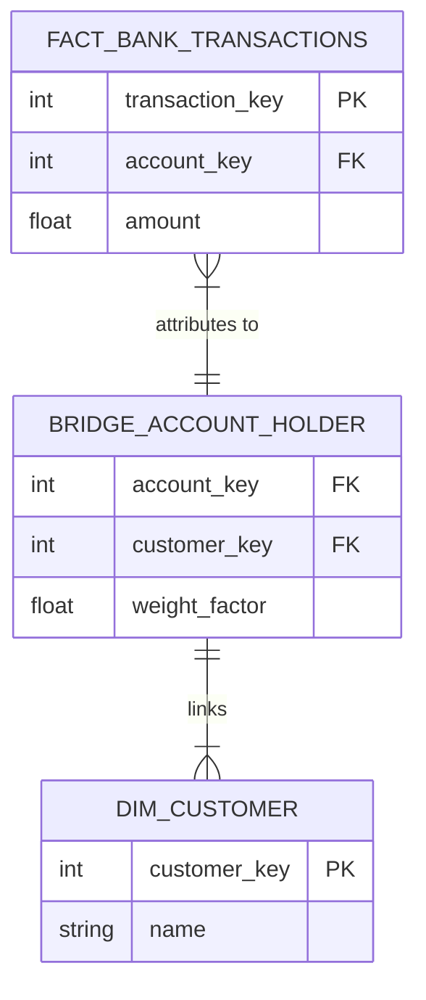

# Module 7.7: Advanced Warehouse Modeling

Welcome to **Advanced Warehouse Modeling**. Standard dimensional modeling using basic fact and dimension tables covers 80% of data scenarios. But in complex enterprise environments, you will encounter many-to-many relationships, events without metrics, and attributes that change daily. In this module, you will learn to design advanced dimensional entities like Bridge Tables, Factless Facts, Junk Dimensions, and Role-Playing Dimensions.

---

## 1. Detailed Theory

### Advanced Dimension Types
- **Junk Dimensions**: A single dimension table that groups multiple low-cardinality flags and indicators (e.g., `is_active`, `payment_method`, `shipping_status`) to prevent creating 10 separate tiny dimension tables and bloating the fact table with foreign keys.
- **Degenerate Dimensions**: A dimension key that is stored directly in the fact table without a corresponding dimension table (e.g., `invoice_number` or `transaction_id`). Useful for grouping receipt items together.
- **Role-Playing Dimensions**: A single dimension table that is referenced multiple times by different foreign keys in a single fact table (e.g., `fact_orders` has `order_date_key`, `shipping_date_key`, and `delivery_date_key` all pointing to the same `dim_date` table).
- **Mini Dimensions**: Splitting a group of frequently changing attributes (e.g., age, income bracket, credit score) from a main dimension (like Customer) into a separate lookup table to prevent excessive SCD Type 2 row expansion.

### Advanced Relationships
- **Factless Fact Tables**: A fact table that contains no numeric measurements (metrics), only foreign keys representing the occurrence of a relationship or event (e.g., tracking student attendance: `student_key`, `class_key`, `date_key`).
- **Bridge Tables**: A mapping table placed between a fact and a dimension to resolve **Many-to-Many** relationships (e.g., a bank account having multiple customer owners, or an order containing multiple promotions).

---

## 2. Architecture Diagram: Bridge Table (Many-to-Many Relationship)



---

## 3. Production Use Cases

1. **Customer 360 Platform**: Modeling a bank's account registry. Since an account can be owned by multiple customers (husband and wife), you implement a **Bridge Table** between the `fact_balances` and `dim_customer` tables to distribute balance metrics correctly using weight factors (e.g., 50% split).

---

## 4. Real Company Examples

- **Retail Banks (e.g., Capital One)**: Extensively use Bridge Tables and Mini Dimensions to track user credit rating tier movements without creating millions of redundant rows.

---

## 5. Coding Examples

### Querying a Many-to-Many Relationship via Bridge Table

```sql
SELECT 
    c.name AS customer_name,
    SUM(f.amount * b.weight_factor) AS allocated_balance
FROM fact_bank_transactions f
JOIN bridge_account_holder b ON f.account_key = b.account_key
JOIN dim_customer c ON b.customer_key = c.customer_key
GROUP BY c.name
ORDER BY allocated_balance DESC;
```

---

## 6. Hands-on Labs

**Lab: Identifying Schema Attributes**
**Objective**: Classify complex dimensions.
**Instructions**:
Classify the following scenarios into the correct advanced modeling pattern (**Junk Dimension**, **Degenerate Dimension**, **Role-Playing Dimension**, or **Factless Fact**):
1. Storing `order_number` in `fact_sales` to allow grouping line items.
2. A single `dim_date` table used for both `order_date` and `ship_date` columns.
3. A table tracking which employees were assigned to which project tasks on a given day (no metrics).
4. Grouping 5 different Yes/No transaction flags into a single dimension.

---

## 7. Assignments

**Assignment: Mini Dimension Justification**
You have a `dim_customer` table. Customer demographics (e.g., age, marital status, salary bracket) change frequently, and you have 10 million customers.
Write a paragraph explaining why keeping these columns inside an **SCD Type 2** `dim_customer` table will lead to database storage explosion, and how extracting them into a **Mini Dimension** solves the problem.

---

## 8. Interview Questions

1. **What is a Role-Playing Dimension?**
   *Answer Hint: A single physical dimension table that is joined multiple times in a query to different foreign keys of a fact table (e.g., joining a dim_date table twice to resolve both 'order_date' and 'ship_date'). In SQL, this is done by aliasing the dimension table multiple times.*
2. **What is a Junk Dimension?**
   *Answer Hint: A single dimension table that aggregates multiple low-cardinality flags and indicators (like status flags or binary indicators) to avoid creating multiple separate dimension tables and overloading the fact table with foreign keys.*

---

## 9. Best Practices (FDE Standards)

- **Use Bridge Tables with Weight Factors**: When building bridge tables to resolve many-to-many relationships, always include a `weight_factor` column (values between 0.0 and 1.0) to ensure that aggregations do not double-count metrics.
- **Isolate Flags into Junk Dimensions**: If a table has multiple status flags, group them into a single Junk Dimension table.

---

## 10. Common Mistakes

- **Double-Counting in Bridge Tables**: Joining a fact table through a bridge table without using a weight factor, causing queries to multiply revenue when an account has multiple owners.
- **Creating Separate Date Tables**: Creating separate physical tables for `dim_order_date` and `dim_ship_date` instead of creating one `dim_date` table and referencing it using SQL table aliases (Role-Playing).
