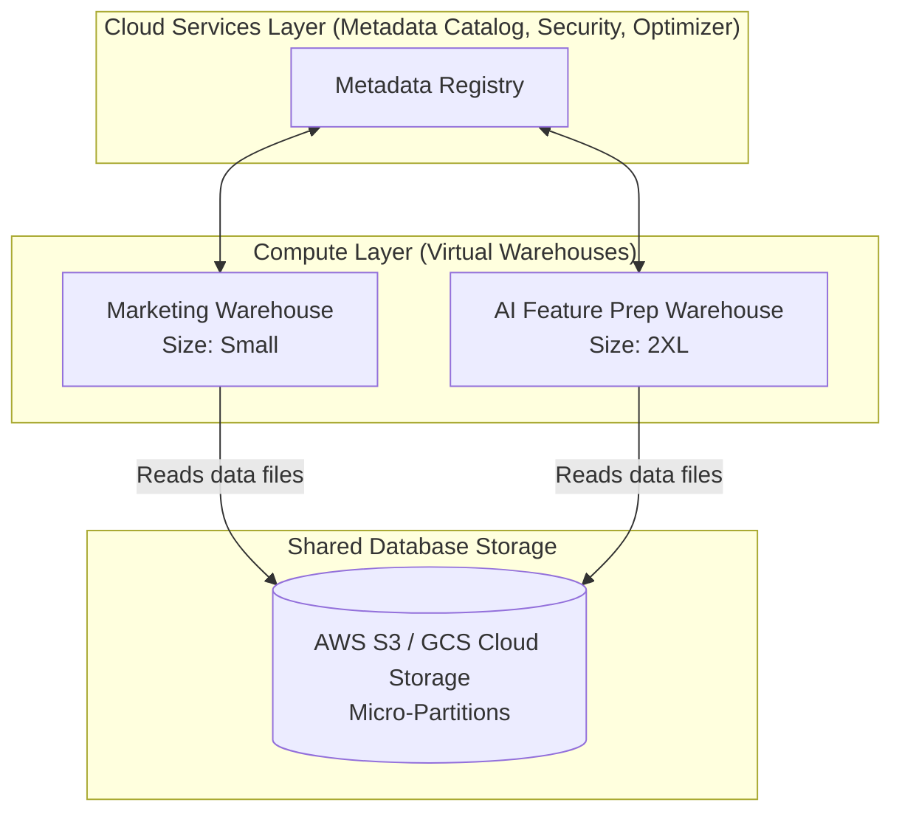

# Module 7.8: Modern Cloud Data Warehouses

Welcome to **Modern Cloud Data Warehouses**. In production enterprise platforms, you will rarely host physical database servers. You will rely on serverless or managed cloud-native engines: **Snowflake**, **Amazon Redshift**, **Google BigQuery**, or **Azure Synapse**. In this module, you will learn the internal architectures and key features of these platforms.

---

## 1. Detailed Theory

### Snowflake Architecture
Snowflake features a multi-cluster, shared-data architecture that separates compute (Virtual Warehouses) from storage.
- **Virtual Warehouses**: Compute clusters. You can spin up multiple independent warehouses of varying sizes (S to 4XL) to query the same underlying database. Marketing queries never impact Finance queries.
- **Micro-Partitions**: Snowflake automatically partitions tables into immutable, compressed micro-partitions (50MB - 500MB).
- **Zero-Copy Cloning**: Replicating a table or schema instantly without duplicating the underlying storage files, utilizing metadata pointers.

### Amazon Redshift
A columnar, clustered database designed for high performance.
- **Distribution Keys (Dist Keys)**: Controls how rows are distributed across node slices (e.g., `KEY` hashes a column to group related rows on the same node, `ALL` duplicates the table, `AUTO` lets Redshift decide).
- **Sort Keys**: Controls the physical sorting of data on disk (e.g., compound or interleaved keys), enabling fast partition skipping.

### Google BigQuery
A fully serverless, highly scalable analytical database.
- **Compute (Slots)**: BigQuery allocates processing power (slots) dynamically to run queries.
- **Partitioning & Clustering**: Partitioning groups tables by date or integer columns. Clustering physically sorts data within partitions.

---

## 2. Architecture Diagram: Snowflake Architecture (Decoupled Compute/Storage)



---

## 3. Production Use Cases

1. **Cloud Analytics Platform**: Hosting a multi-department reporting platform on Snowflake. The data engineering team uses a `2XL` virtual warehouse to run heavy dbt nightly transforms. During the day, they shut down the `2XL` and BI analysts use independent `Medium` warehouses, ensuring zero resource contention and low costs.

---

## 4. Real Company Examples

- **Sainsbury's**: Manages their retail supply chain reports by querying Snowflake virtual warehouses, keeping compute separated by business units.

---

## 5. Coding Examples

### Optimizing BigQuery Ingest and Queries (SQL)

```sql
-- 1. Create a Partitioned and Clustered Table in BigQuery
CREATE TABLE enterprise_analytics.customer_events (
    event_id STRING,
    user_id STRING,
    event_type STRING,
    event_time TIMESTAMP,
    revenue FLOAT64
)
PARTITION BY DATE(event_time) -- Partitions data by day
CLUSTER BY event_type, user_id; -- Physically clusters data inside partition

-- 2. Querying the Optimized Table (BigQuery skips scanning unrelated partitions/clusters)
SELECT 
    event_type, 
    SUM(revenue) AS total_revenue
FROM enterprise_analytics.customer_events
WHERE DATE(event_time) = '2023-10-15' -- Partition Filter (limits bytes scanned)
  AND event_type = 'checkout'          -- Cluster Filter
GROUP BY 1;
```

---

## 6. Hands-on Labs

**Lab: Zero-Copy Cloning in Snowflake**
**Objective**: Clone a database.
**Instructions**:
Write the SQL command in Snowflake to create a clone of the `production_db` named `development_db` for testing. Explain how this command executes instantly and why it incurs zero storage cost initially.

---

## 7. Assignments

**Assignment: Redshift Distribution Key Strategy**
You are designing a schema on Amazon Redshift. You have a massive `fact_sales` table (10 billion rows) and a small `dim_product` table (5,000 rows).
Define:
1. The optimal Distribution Style (`KEY`, `ALL`, or `EVEN`) for both tables.
2. The columns you would use as the join keys.
Explain how your design prevents network shuffling during query execution.

---

## 8. Interview Questions

1. **Explain Snowflake's Virtual Warehouse concept.**
   *Answer Hint: Virtual Warehouses are independent compute clusters (CPU/RAM) that run query executions. Because compute is decoupled from storage, you can scale warehouses up or down dynamically, spin up separate warehouses for different teams, and shut them down when idle without impacting the underlying data.*
2. **What is the difference between Partitioning and Clustering in Google BigQuery?**
   *Answer Hint: Partitioning splits a table logically into independent segments based on a column (usually date). Clustering physically sorts the data rows within each partition based on specified columns, enabling faster queries when filtering on those columns.*

---

## 9. Best Practices (FDE Standards)

- **Always Use Partition Filters**: When querying partitioned tables in BigQuery or Athena, always include the partition column in the `WHERE` clause to avoid scanning the entire database and incurring high billing costs.
- **Enable Auto-Suspend**: Always configure Snowflake Virtual Warehouses to auto-suspend after a short period of inactivity (e.g., 60 seconds) to avoid wasting compute budget.

---

## 10. Common Mistakes

- **Selecting All Columns (`SELECT *`)**: Running `SELECT *` on massive columnar databases (BigQuery/Redshift) for simple data inspections, forcing the engine to scan every column on disk and causing high costs.
- **Mismatched Distribution Keys**: Setting conflicting distribution keys on joined tables in Amazon Redshift, forcing the engine to shuffle massive tables across nodes.
