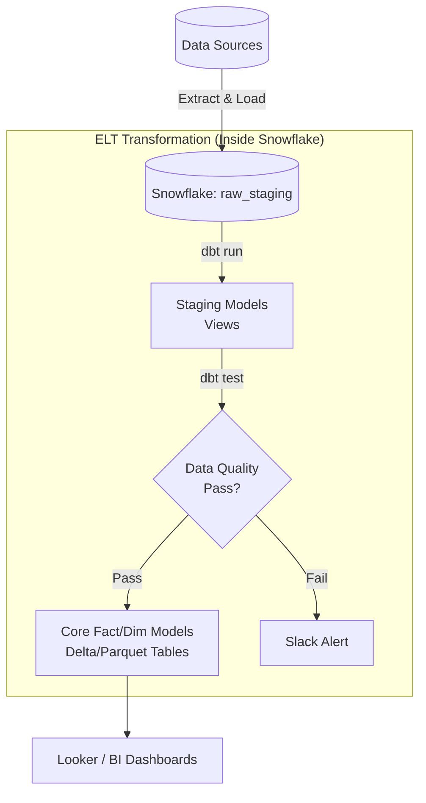

# Module 7.9: ETL & ELT for Warehouses

Welcome to **ETL & ELT for Warehouses**. Landing data in a staging bucket is only the first step. To load data into structured data warehouse tables, you must build robust, idempotent, and validated processing pipelines. In this module, you will learn how to design ingestion flows using tools like **Airflow**, **dbt**, **Spark**, and **Kafka**.

---

## 1. Detailed Theory

### Processing Paradigms
- **ETL (Extract, Transform, Load)**: Data is transformed on a separate processing cluster (e.g., PySpark) before being loaded into the warehouse database.
- **ELT (Extract, Load, Transform)**: Raw data is loaded directly into the staging layer of the warehouse, and transformations are run inside the warehouse database using SQL (e.g., via **dbt**). ELT is the modern standard for cloud warehouses since it leverages the warehouse's decoupled, scalable compute power.

### Pipeline Components
1. **Incremental Loading**: Rather than running a full reload of a table daily, pipelines use timestamp limits (`WHERE updated_at > last_run_timestamp`) to process only new or changed rows.
2. **Change Data Capture (CDC)**: Continuous logging of transaction logs (PostgreSQL WAL) streamed through Kafka and loaded into staging tables.
3. **Data Quality & Validation**: Running automated checks (e.g., checking for null values in primary keys or negative values in revenue columns) before committing data to production tables.

---

## 2. Architecture Diagram: ELT Ingestion Flow with dbt



---

## 3. Production Use Cases

1. **Enterprise ETL Platform**: An e-commerce platform syncs billing and order records. Airflow orchestrates the pipeline: extracting JSON outputs from Stripe, landing them in S3, launching a Spark job to convert to Parquet, loading them into Snowflake staging tables, and triggering dbt to update the analytical Gold layer.

---

## 4. Real Company Examples

- **dbt Labs**: Created the industry-standard tool for executing ELT SQL transformations inside cloud data warehouses, incorporating version control and schema validations.

---

## 5. Coding Examples

### Defining a dbt Model with Schema Validation (SQL + YAML)

```sql
-- models/marts/fact_orders.sql
-- This model references cleaned staging tables to populate the gold fact table
{{ config(materialized='incremental', unique_key='order_key') }}

WITH stg_orders AS (
    SELECT * FROM {{ ref('stg_sales_orders') }}
)

SELECT 
    MD5(order_id || '_' || customer_id) AS order_key, -- Surrogate Key
    order_id,
    customer_key,
    product_key,
    order_amount,
    order_date
FROM stg_orders


    -- Only load rows newer than the max date currently in the table
    WHERE order_date > (SELECT MAX(order_date) FROM {{ this }})

```

```yaml
# models/marts/schema.yml
# YAML schema file defining data quality tests
version: 2

models:
  - name: fact_orders
    columns:
      - name: order_key
        tests:
          - unique
          - not_null
      - name: order_amount
        tests:
          - not_null
```

---

## 6. Hands-on Labs

**Lab: Manual Incremental Run**
**Objective**: Build incremental logic.
**Instructions**:
Write a SQL query that select records from a staging table `stg_payments` to load into a target table `fact_payments`, using a timestamp tracking variable `{{ last_run_timestamp }}` to ensure the run is incremental.

---

## 7. Assignments

**Assignment: Test Failures in Production**
Describe the architectural process you would design to handle a **dbt test failure** (e.g., a null primary key test fails) during a nightly production run.
Should you:
1. Halt the run and roll back the entire transaction?
2. Write the corrupt rows to a staging table and proceed with the healthy rows?
Provide a justification for your chosen strategy.

---

## 8. Interview Questions

1. **What is the difference between dbt run and dbt test?**
   *Answer Hint: 'dbt run' executes the SQL transformation models, compiling them into tables or views inside the database. 'dbt test' runs schema and data quality validations (like checking for nulls or duplicates) against the created tables, failing if constraints are violated.*
2. **What does the `is_incremental()` macro do in dbt?**
   *Answer Hint: It compiles conditional SQL code that runs only during incremental runs (not during full refreshes). It typically adds a filter (like 'WHERE date > MAX(date)') to only append rows generated since the last execution, saving compute costs.*

---

## 9. Best Practices (FDE Standards)

- **Always Write Tests**: Never deploy a dbt model to production without adding basic validation tests (`unique`, `not_null`) on primary key columns.
- **Ensure Idempotency**: Design all incremental models using merge keys to prevent duplicate records if a job runs multiple times for the same day.

---

## 10. Common Mistakes

- **Running Full Refreshes Daily**: Failing to configure incremental configurations on tables containing billions of rows, resulting in massive computing bills.
- **Skipping Schema Tests**: Assuming that operational source databases never send corrupt or duplicate records.
