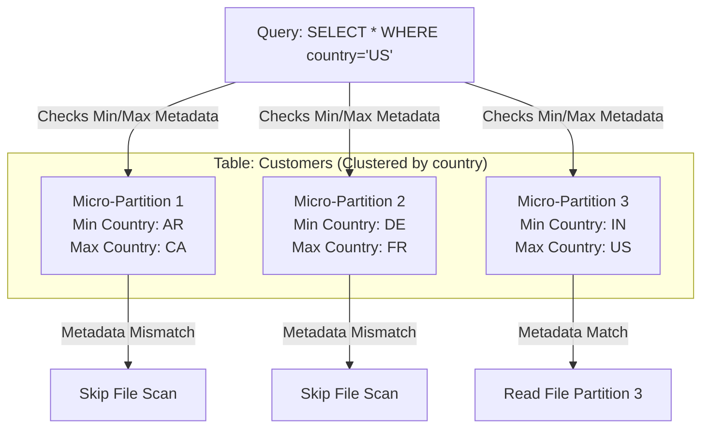

# Module 7.10: Query Optimization

Welcome to **Query Optimization**. In enterprise data warehouses, a single unoptimized query can scan petabytes of data, causing long load times and costing thousands of dollars in cloud bills. In this module, you will learn how to analyze execution plans, utilize indexes, partitioning, and clustering keys, and configure materialized views to maximize query performance.

---

## 1. Detailed Theory

### Query Execution Optimization
Modern cloud data warehouses do not use traditional relational indexes (like B-trees). They optimize queries through data layouts and compiler plans:
- **Partitioning**: Dividing a table logically into segments based on a column (usually a date). The engine skips scanning partitions that do not match the query filter (Partition Pruning).
- **Clustering (Sorting)**: Sorting data rows within partitions based on specific keys. This allows the engine to skip scanning file blocks (Micro-Partition Pruning) when executing filters.
- **Materialized Views**: Storing the pre-computed results of a query on disk. Unlike standard views (which run the underlying query every time), materialized views refresh automatically in the background and return results in milliseconds.
- **Query Plans & Cost-Based Optimization (CBO)**: The database compiler analyzes table statistics (row counts, distributions) to choose the most efficient physical path (e.g., deciding whether to perform a Hash Join vs. a Broadcast Join).

---

## 2. Architecture Diagram: Micro-Partition Skipping (Snowflake Style)



---

## 3. Production Use Cases

1. **High-Performance Analytics Platform**: An enterprise dashboard queries a 50TB transaction table daily. To optimize performance, you partition the table by `transaction_date` and cluster it by `store_id`. You create a materialized view for the hourly regional aggregations, reducing query execution times from 3 minutes to 0.4 seconds.

---

## 4. Real Company Examples

- **Snowflake / BigQuery**: Charge users directly based on the compute time or bytes scanned. Optimizing query partitioning and clustering keys directly correlates with reducing monthly cloud bills.

---

## 5. Coding Examples

### Creating Materialized Views and Analyzing Query Plans

```sql
-- 1. Create a Materialized View for daily aggregated sales
CREATE MATERIALIZED VIEW mv_daily_sales_summary AS
SELECT 
    date_key,
    store_key,
    SUM(revenue) AS daily_revenue,
    COUNT(sales_key) AS transaction_count
FROM fact_sales
GROUP BY date_key, store_key;

-- 2. Querying the Materialized View (blazing fast sub-second read)
SELECT * FROM mv_daily_sales_summary WHERE store_key = 105;

-- 3. Analyzing the Query Plan (Checking for file scans and shuffles)
EXPLAIN
SELECT 
    p.category, 
    SUM(f.revenue)
FROM fact_sales f
JOIN dim_product p ON f.product_key = p.product_key
WHERE f.date_key = 20231015 -- Partition Pruning filter
GROUP BY 1;
```

---

## 6. Hands-on Labs

**Lab: Explain Plan Interpretation**
**Objective**: Parse database execution plans.
**Instructions**:
Run the `EXPLAIN` command on a complex join query in your cloud database (Snowflake, Athena, or BigQuery).
Identify the following components in the output plan:
1. Where table scans occur.
2. Where data partitioning pruning is applied.
3. Where join shuffles occur.

---

## 7. Assignments

**Assignment: Materialized View Refresh Overhead**
Materialized views speed up queries by caching results on disk, but they add write costs because the database must recalculate the cache whenever base tables update.
Write a paragraph explaining the trade-offs of using Materialized Views on a **high-volume streaming table** (updates every 5 seconds) vs. a **daily batch-loaded table** (updates once a day).

---

## 8. Interview Questions

1. **How does partition pruning improve query performance in a data warehouse?**
   *Answer Hint: Partition pruning allows the query engine to inspect the table's directory metadata first. If the query filters on the partition column (e.g., date), the engine skips scanning folders that don't match the criteria, reducing S3/GCS read operations.*
2. **What is a Cost-Based Optimizer (CBO)?**
   *Answer Hint: The CBO is a database compiler component that analyzes table statistics (cardinality, size) to evaluate different physical query execution paths and select the plan that minimizes CPU, memory, and network usage.*

---

## 9. Best Practices (FDE Standards)

- **Always Filter on Partition Keys**: Ensure all analytical queries written by users or BI tools contain filters on partition columns in their `WHERE` clauses.
- **Cluster on Join/Filter Columns**: Choose clustering keys based on the columns most frequently used in joins or high-cardinality filters (e.g., `customer_id`).

---

## 10. Common Mistakes

- **Selecting Unused Columns**: Writing queries with `SELECT *` in columnar databases, forcing the engine to read every column from storage and increasing billing costs.
- **Over-Partitioning**: Partitioning a table on a high-cardinality column (like `order_id` or timestamp), resulting in millions of tiny partitions and stalling the metadata engine.
