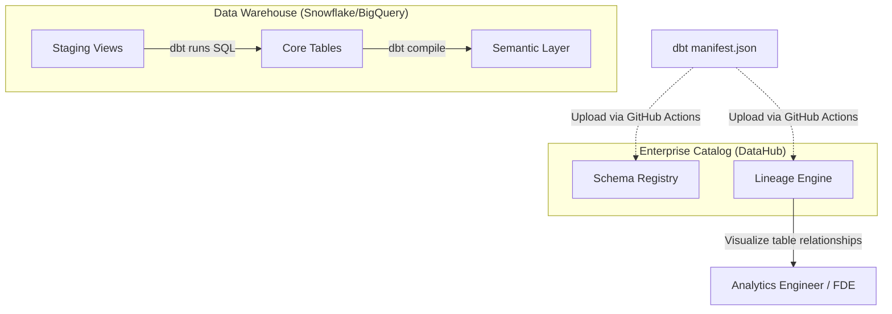

# Module 7.11: Data Governance

Welcome to **Data Governance in Warehouses**. As a Data Warehouse scales to support hundreds of tables and schemas, keeping track of data origin (Lineage), data owners, and quality metrics is critical. Without structure, a Data Warehouse degenerates into an unmanageable catalog of obsolete tables. In this module, you will learn how to implement data governance using modern catalogs like **DataHub** and **OpenMetadata**.

---

## 1. Detailed Theory

### Core Governance Concepts
- **Data Catalog**: A searchable metadata registry indexing all database schemas, table descriptions, column descriptions, and owner tags.
- **Metadata Management**: Tracking schema changes (Schema Drift) over time to ensure downstream dependencies don't break.
- **Data Lineage**: Map showing how tables are related (e.g., tracing a Gold fact table back to its staging sources).
- **Data Quality & Contracts**: Enforcing SLAs and schema constraints at database boundaries to protect production tables from corrupted values.
- **Data Stewardship**: Defining specific business roles responsible for managing and verifying the quality of specific datasets (data ownership).

---

## 2. Architecture Diagram: Governance Integration Flow



---

## 3. Production Use Cases

1. **Enterprise Governance Platform**: Configuring your dbt CI/CD pipeline to automatically parse the `manifest.json` file generated after each build and upload it to DataHub. This generates up-to-date lineage maps, table descriptions, and owner tags automatically.

---

## 4. Real Company Examples

- **LinkedIn**: Built and open-sourced **DataHub** to handle metadata cataloging and lineage tracking across their massive multi-tenant database clusters.

---

## 5. Coding Examples

### Parsing dbt Manifest for Catalog Lineage (Python Concept)

dbt generates a `manifest.json` file describing all model dependencies. This script shows how pipelines extract lineage relationships programmatically.

```python
import json

def parse_lineage(manifest_path):
    with open(manifest_path, 'r') as f:
        manifest = json.load(f)
        
    nodes = manifest.get("nodes", {})
    
    # 1. Loop through all compiled dbt models
    for node_name, node_data in nodes.items():
        if node_data.get("resource_type") == "model":
            model_name = node_data.get("name")
            depends_on = node_data.get("depends_on", {}).get("nodes", [])
            
            # 2. Extract dependencies (Lineage)
            sources = [dep.split(".")[-1] for dep in depends_on]
            print(f"Model: {model_name} depends on sources: {sources}")

if __name__ == "__main__":
    parse_lineage("manifest.json")
    # Output Example: Model: fact_orders depends on sources: ['stg_sales_orders', 'stg_products']
```

---

## 6. Hands-on Labs

**Lab: Catalog Search**
**Objective**: Interact with metadata catalogs.
**Instructions**:
Write the step-by-step instructions to configure **OpenMetadata** to ingest schemas and table metadata from a Snowflake database instance, setting the ingestion schedule to run daily at midnight.

---

## 7. Assignments

**Assignment: Lineage Impact Analysis**
You plan to rename a column in the staging table `stg_users` from `user_age` to `age`.
Describe how you would utilize a **Data Lineage** graph inside DataHub to perform an Impact Analysis, identifying which downstream Gold tables, semantic models, and BI dashboards will break if you apply this change.

---

## 8. Interview Questions

1. **Why is automated data lineage critical in data warehousing?**
   *Answer Hint: Lineage shows the exact flow of data. If a dashboard shows a wrong metric, lineage allows you to trace back through all SQL transformation steps to the raw source database, identifying where the error was introduced. It also helps assess the impact of schema changes before they are deployed.*
2. **What is the purpose of a Metadata Catalog?**
   *Answer Hint: A catalog acts as a search engine for an enterprise's data assets. It helps analysts and developers discover tables, understand column meanings via descriptions, track who owns the dataset, and check data quality statuses in one place.*

---

## 9. Best Practices (FDE Standards)

- **Automate Catalog Ingestion**: Never manually maintain table descriptions in wikis or documents. Integrate catalog syncs directly into your CI/CD pipelines (e.g., using dbt and DataHub APIs).
- **Assign Stewards**: Ensure every database table registered in your catalog has an assigned owner or team responsible for resolving data alerts.

---

## 10. Common Mistakes

- **Swallowing Schema Drift Alerts**: Ignoring alerts when columns are added or deleted in source systems, leading to downstream pipeline crashes in production.
- **Unlabeled PII**: Failing to tag columns containing sensitive customer details (PII) in the catalog, violating regulatory compliance.
