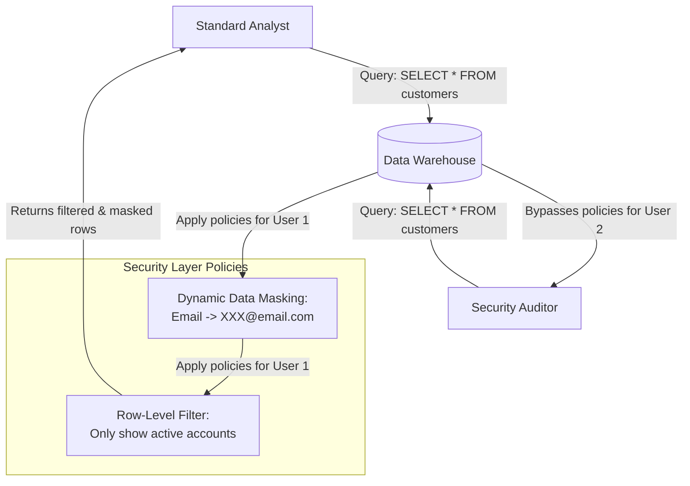

# Module 7.12: Security

Welcome to **Data Warehouse Security**. Data Warehouses hold the entire history of an enterprise, making them high-security targets. As an FDE, you must secure this data using Role-Based Access Control (RBAC), Column-Level Security (CLS), Row-Level Security (RLS), and Data Masking to ensure compliance with laws like GDPR and HIPAA.

---

## 1. Detailed Theory

### Identity & Access Management (RBAC)
- **RBAC**: Restricting access to schemas, tables, and views based on database roles (e.g., `ANALYST_ROLE`, `DATA_ENGINEER_ROLE`, `ACCOUNTING_ROLE`).
- **Mutual TLS & SAML SSO**: Enforcing Single Sign-On (SSO) and multi-factor authentication (MFA) for all database clients.

### Fine-Grained Access Control
- **Column-Level Security (CLS)**: Restricting access to specific columns containing sensitive data (e.g., only the HR role can see the `salary` column in the `employees` table).
- **Row-Level Security (RLS)**: Filtering query results dynamically based on user attributes (e.g., a sales rep from the 'West' region can only see rows where `region = 'West'`).
- **Dynamic Data Masking**: Masking sensitive data values in query results (e.g., replacing credit card numbers with `XXXX-XXXX-XXXX-1234`) dynamically based on the user's role.

---

## 2. Architecture Diagram: Fine-Grained Security Enforcement in Warehouse



---

## 3. Production Use Cases

1. **Secure Enterprise Warehouse**: A medical platform hosts client records in Snowflake. They implement Dynamic Data Masking on the `social_security_number` column. When queried by the Billing team, the numbers are masked. When queried by the compliance auditor role, the full numbers are decrypted. They configure Row-Level Security to restrict doctors to viewing only patients within their assigned clinics.

---

## 4. Real Company Examples

- **Capital One**: Uses AWS Lake Formation and Snowflake RBAC policies to secure financial ledgers, ensuring compliance with banking regulatory frameworks.

---

## 5. Coding Examples

### Implementing Dynamic Data Masking and Row Filter in SQL (Snowflake)

```sql
-- 1. Create a Masking Policy for emails
CREATE OR REPLACE MASKING POLICY email_mask AS (val string) 
  RETURNS string ->
  CASE
    -- If the current user has the AUDITOR role, show the real email
    WHEN CURRENT_ROLE() IN ('AUDITOR_ROLE') THEN val
    -- Otherwise, mask the email domain
    ELSE REGEXP_REPLACE(val, '(?<=.).(?=.*@)', 'X')
  END;

-- 2. Apply the Masking Policy to a column
ALTER TABLE core.dim_customer 
ALTER COLUMN email SET MASKING POLICY email_mask;

-- 3. Create a Row Access Policy for Regional Reps
CREATE OR REPLACE ROW ACCESS POLICY regional_filter AS (sales_region string) 
  RETURNS boolean ->
  CURRENT_ROLE() = 'GLOBAL_ADMIN_ROLE' 
  OR sales_region = CURRENT_ROLE(); -- Assumes roles are named after regions
```

---

## 6. Hands-on Labs

**Lab: RBAC Hierarchy Creation**
**Objective**: Build database roles.
**Instructions**:
Write the SQL statements in Snowflake or Postgres to:
1. Create two roles: `DATA_ENGINEER` and `BI_ANALYST`.
2. Grant read/write permissions on the `raw` schema to `DATA_ENGINEER`.
3. Grant read-only permissions on the `analytics` schema to `BI_ANALYST`.
4. Establish a role hierarchy where `DATA_ENGINEER` inherits the privileges of `BI_ANALYST`.

---

## 7. Assignments

**Assignment: Column-Level Security vs. Views**
A developer proposes creating 10 different SQL views to restrict column access for 10 different departments instead of using Column-Level Security.
Write a paragraph explaining the maintenance overhead of managing 10 separate views when database schemas change, and how Column-Level Security simplifies access control.

---

## 8. Interview Questions

1. **What is Dynamic Data Masking?**
   *Answer Hint: A security feature that masks sensitive data values on-the-fly in query results based on the role of the user running the query, without altering the actual data stored on disk.*
2. **How does Row-Level Security differ from Column-Level Security?**
   *Answer Hint: Row-Level Security limits which rows (records) are returned in a query based on filters (e.g., filtering sales by region). Column-Level Security restricts access to specific vertical columns (e.g., hiding the SSN column entirely) regardless of the row count.*

---

## 9. Best Practices (FDE Standards)

- **Default to Masking**: Mask all PII columns (emails, phone numbers, addresses) at the core database level, granting clear-text access only to specialized compliance roles.
- **Enforce MFA**: Require Multi-Factor Authentication (MFA) and Single Sign-On (SSO) for all data warehouse users.

---

## 10. Common Mistakes

- **Hardcoding Passwords in BI Tools**: Saving database passwords in cleartext inside BI tool configuration files, bypassing database access logs.
- **Granting ACCOUNTADMIN to Applications**: Connecting ETL or BI applications using administrative database accounts (like `root` or `ACCOUNTADMIN`), violating the principle of least privilege.
