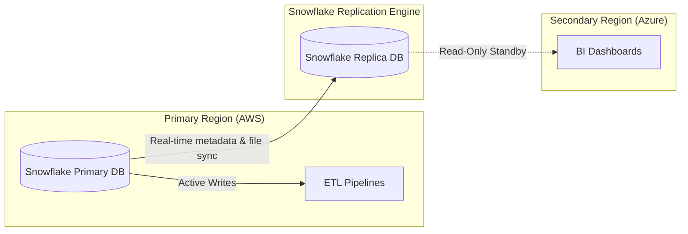

# Module 7.13: Production Data Warehouses

Welcome to **Production Data Warehouses**. Running an enterprise-scale warehouse involves managing resource scaling, ensuring reliability through backups and replication, and monitoring both query performance and compute costs to prevent billing spikes.

---

## 1. Detailed Theory

### Scalability & Workload Management
Cloud data warehouses handle massive concurrent queries by isolating resources:
- **Compute Isolation**: Spin up separate virtual compute clusters (e.g., Snowflake Virtual Warehouses) for different workloads (Ingestion vs. BI). This prevents a heavy ETL job from slowing down executive dashboards.
- **Auto-Scaling**: Configuring compute resources to scale out (add clusters) during peak BI dashboard usage hours, and scale in during low-traffic periods.

### Reliability & Disaster Recovery
- **Time Travel & Fail-safe**: Databases like Snowflake retain historical state for up to 90 days. If a table is accidentally dropped, it can be restored instantly using a simple SQL command. Fail-safe provides additional days of storage managed by the provider for disaster recovery.
- **Database Replication**: Replicating schemas in real-time to a backup cloud provider or region (e.g., replicating Snowflake on AWS to Snowflake on Azure) for high availability.

### Observability & Cost Monitoring
- **Query Monitoring**: Identifying slow-running queries and optimizing execution paths.
- **Cost Monitoring**: Tracking credits or dollars consumed by virtual warehouses and setting hard budgets to suspend compute if thresholds are exceeded.

---

## 2. Architecture Diagram: High Availability and Replication Flow



---

## 3. Production Use Cases

1. **Multi-Tenant Analytics Platform**: An enterprise software provider hosts dashboards for 100 clients. To prevent resource contention, they configure auto-scaling warehouses that scale from 1 to 5 clusters as traffic peaks, and isolate data query routing to prevent cross-tenant access.

---

## 4. Real Company Examples

- **Sainsbury's**: Monitors their cloud database compute usage hourly, setting hard query time limits and automated warehouse suspensions to manage costs.

---

## 5. Coding Examples

### Query Monitoring and Restoring Dropped Tables (SQL)

```sql
-- 1. Querying Information Schema to identify slow queries
SELECT 
    query_id,
    query_text,
    user_name,
    warehouse_name,
    execution_time / 1000 AS execution_seconds,
    bytes_scanned
FROM snowflake.account_usage.query_history
WHERE execution_time > 60000 -- Queries taking longer than 60 seconds
ORDER BY execution_time DESC
LIMIT 10;

-- 2. Recovering from an accident: Undrop a table using Time Travel
DROP TABLE analytics.gold_sales;

-- Restore table instantly using metadata history
UNDROP TABLE analytics.gold_sales;
```

---

## 6. Hands-on Labs

**Lab: Cost Monitoring Alert Setup**
**Objective**: Build resource monitor constraints.
**Instructions**:
Write the SQL statements in Snowflake to create a Resource Monitor named `bi_warehouse_monitor` that triggers a warning email at 80% credit consumption and automatically suspends the `BI_WAREHOUSE` at 100% credit consumption.

---

## 7. Assignments

**Assignment: Multi-Region Failover Plan**
Design a disaster recovery failover plan for a Snowflake database. Detail:
1. Replicating schemas between AWS and Azure.
2. The DNS routing changes required to failover BI tools.
3. How to verify that data is consistent after failover.

---

## 8. Interview Questions

1. **What is Zero-Copy Cloning in Snowflake?**
   *Answer Hint: Zero-copy cloning duplicates a table or database schema instantly by copying only the metadata pointers without duplicating the physical storage files, incurring no additional storage costs until the cloned data is modified.*
2. **How does Snowflake's decoupled compute and storage architecture optimize costs?**
   *Answer Hint: Because compute (Virtual Warehouses) is separate from storage, you only pay for storage for the size of your database, and pay for compute only when virtual warehouses are actively running, enabling you to suspend compute when idle.*

---

## 9. Best Practices (FDE Standards)

- **Set Auto-Suspend Limits**: Always configure Virtual Warehouses with a short auto-suspend limit (e.g., 60 seconds) to prevent paying for idle servers.
- **Monitor Compute Spikes**: Implement automated Slack alerts for queries that run longer than 30 minutes.

---

## 10. Common Mistakes

- **Forgetting Query Timeouts**: Letting unoptimized queries run for hours without timeout limits, consuming massive compute credits.
- **Sharing Warehouses across Ingestion and BI**: Running both ETL writes and BI reads on the same virtual warehouse, causing dashboards to stall during data loading.
