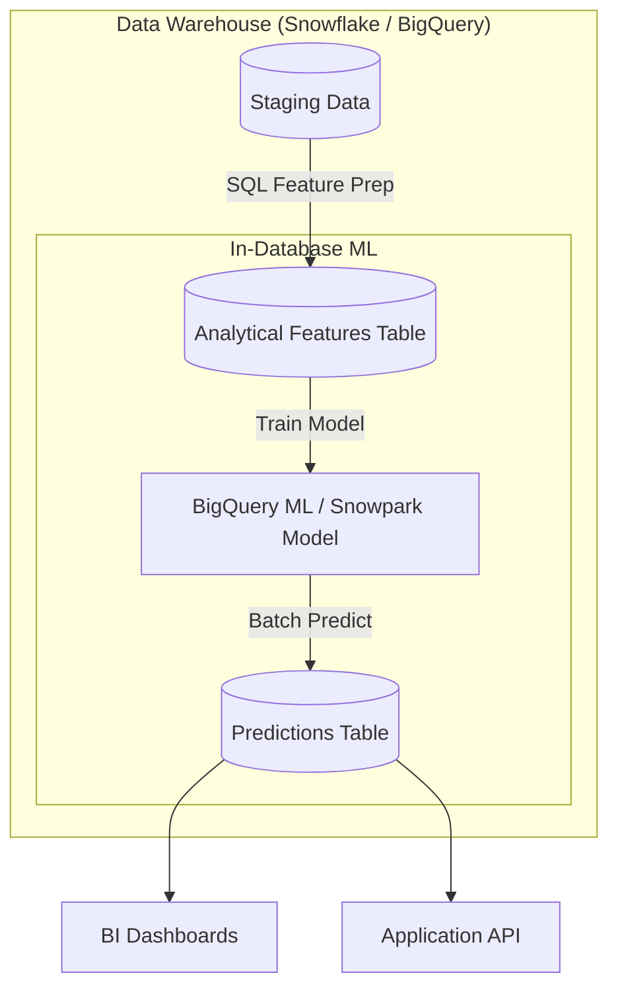

# Module 7.14: Data Warehouses for AI/ML

Welcome to **Data Warehouses for AI/ML**. Modern cloud warehouses do not just support BI reports. They serve as the analytical foundation for Machine Learning pipelines: hosting offline feature stores, compiling training datasets via SQL, and running model inference directly inside the database.

---

## 1. Detailed Theory

### Feature Engineering inside the Warehouse
- **SQL-Based Features**: Compiling model features (e.g., `avg_order_value_30d`) using SQL transformations inside the warehouse rather than pulling raw files to Spark. This is faster and utilizes the warehouse's optimized query planner.
- **Analytical Feature Stores**: Warehouses serve as the offline storage backend for Feature Stores (like Feast). The feature store queries the warehouse tables to build historical, point-of-time correct datasets for model training.

### In-Database ML Execution
- **Snowflake Snowpark / BigQuery ML**: Allow data scientists to write Python/Scala code or SQL queries to train and execute machine learning models directly inside the warehouse compute environment. This eliminates the security risk of exporting sensitive data to external servers.

---

## 2. Architecture Diagram: In-Database Model Serving



---

## 3. Production Use Cases

1. **ML Analytics Platform**: A marketing team wants to predict customer churn. Instead of spinning up external Spark and Python servers, they write a SQL query using BigQuery ML to train a logistic regression model directly on the warehouse tables, outputting churn predictions to a Gold layer dashboard.

---

## 4. Real Company Examples

- **Capital One**: Utilizes Snowflake's Snowpark integration to run Python machine learning features directly against financial ledger tables, keeping computations compliant.

---

## 5. Coding Examples

### Training and Querying a Model in SQL (Google BigQuery ML)

```sql
-- 1. Train a Churn Prediction Model inside BigQuery
CREATE OR REPLACE MODEL `enterprise_warehouse.churn_prediction_model`
OPTIONS(
  model_type='logistic_reg',
  input_label_cols=['churned']
) AS
SELECT 
    churned,
    total_spend_30d,
    transaction_count_30d,
    customer_age
FROM `enterprise_warehouse.gold_customer_features`;

-- 2. Run Batch Inference inside the Data Warehouse using SQL
SELECT 
    customer_id,
    predicted_churned,
    predicted_churned_probs[OFFSET(0)].prob AS probability_active
FROM ML.PREDICT(
    MODEL `enterprise_warehouse.churn_prediction_model`,
    (
        SELECT customer_id, total_spend_30d, transaction_count_30d, customer_age 
        FROM `enterprise_warehouse.gold_customer_features`
    )
);
```

---

## 6. Hands-on Labs

**Lab: SQL Feature Engineering**
**Objective**: Build analytical features.
**Instructions**:
Write the SQL query to calculate the following features from a transaction table:
1. Total customer spend over the last 90 days.
2. The number of unique stores visited.
3. The average days between purchases (using lead/lag window functions).

---

## 7. Assignments

**Assignment: In-Database vs. External Compute**
Write a short technical note comparing the cost, security, and performance of training an ML model **in-database** (using BigQuery ML/Snowpark) vs. exporting the warehouse data to an **external PySpark cluster** on AWS EMR.

---

## 8. Interview Questions

1. **What is BigQuery ML?**
   *Answer Hint: A Google Cloud database feature that allows data scientists to build, train, and execute machine learning models directly inside Google BigQuery using standard SQL queries, eliminating the need to move data.*
2. **Why is it beneficial to run feature engineering inside the Data Warehouse?**
   *Answer Hint: Data Warehouses are highly optimized for aggregations and joins. Running feature generation inside the database using SQL takes advantage of the warehouse's compute engine and eliminates the latency and security risks of transferring datasets over the network.*

---

## 9. Best Practices (FDE Standards)

- **Keep Computation Local**: Whenever possible, run feature engineering steps in the warehouse using SQL or Snowpark rather than exporting files.
- **Log Model Metrics**: Track and save all model training parameters and evaluation metrics generated inside the warehouse to a metadata tracking table for audit purposes.

---

## 10. Common Mistakes

- **Exporting Raw Data for Simple Models**: Transferring gigabytes of data to local laptops or external VM instances to run simple linear regressions that could be executed in-database.
- **Ignoring Model Versioning in SQL**: Overwriting existing BigQuery ML models without saving previous versions, making predictions hard to audit.
