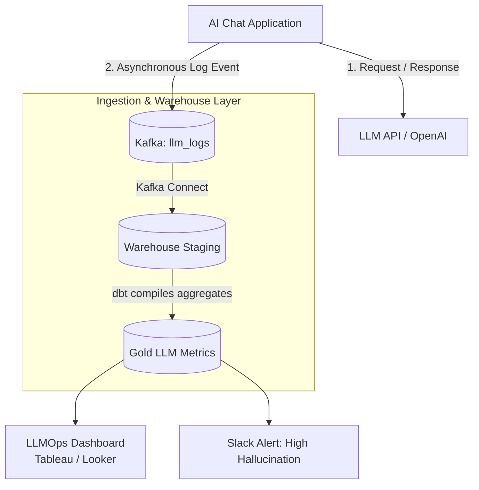

# Module 7.15: Data Warehouses for LLMOps

Welcome to **Data Warehouses for LLMOps**. Moving Generative AI models into production requires continuous performance evaluation. How accurate are the RAG retrievals? What is the user interaction latency? Are agents hallucinating? Data Warehouses serve as the centralized registry that ingests and analyzes LLM transaction logs, prompt histories, vector searches, and evaluation metrics.

---

## 1. Detailed Theory

### Generative AI Observability
To manage LLMs in production, you must log and analyze every API execution:
- **Prompt Analytics**: Tracking which prompts are used, their token counts, and input templates.
- **RAG Analytics**: Saving the exact list of S3 documents retrieved during vector search to evaluate if they match the final user answer.
- **Agent Analytics**: Logging the sequence of steps, tool calls, and execution times taken by autonomous agents.
- **Interaction Logs**: Tracking user ratings (thumbs up/down) to map customer satisfaction metrics.

### Key LLMOps Metrics
Data Warehouses compile these logs to calculate critical performance metrics:
- **Retrieval Accuracy (Precision/Recall)**: Evaluating if the retrieved documents contained the correct information.
- **Hallucination Rate**: Measuring if the LLM output contains statements not present in the retrieved documents.
- **Latency & Cost**: Tracking generation time and API token cost per request.

---

## 2. Architecture Diagram: LLMOps Observability Stack



---

## 3. Production Use Cases

1. **Enterprise AI Analytics Platform**: An enterprise customer service chatbot logs all conversations. The input prompts, retrieved S3 document paths, generated answers, token counts, and user feedback ratings are streamed to Snowflake. A nightly dbt pipeline compiles these logs to calculate average hallucination rates and costs per agent, generating alerting reports for the engineering team.

---

## 4. Real Company Examples

- **Scale AI / TruLens**: Integrate with enterprise data warehouses to store evaluation logs and run drift analysis on model metrics over time.

---

## 5. Coding Examples

### Compiling LLM Hallucination and Cost Metrics (SQL)

```sql
-- Querying LLM execution logs to calculate monthly costs and latency trends
SELECT 
    DATE_TRUNC('day', request_time) AS execution_date,
    model_name,
    COUNT(request_id) AS total_requests,
    AVG(latency_ms) / 1000 AS avg_latency_seconds,
    -- Calculate OpenAI pricing model costs based on token counts
    SUM(prompt_tokens * 0.0000015 + completion_tokens * 0.000002) AS total_cost_usd,
    -- Calculate percentage of runs that received negative user feedback
    (COUNT(CASE WHEN user_feedback = 'thumbs_down' THEN 1 END) * 100.0) / COUNT(request_id) AS user_dissatisfaction_rate
FROM gold_llm_interaction_logs
GROUP BY 1, 2
ORDER BY 1 DESC;
```

---

## 6. Hands-on Labs

**Lab: Logging Prompt Latency**
**Objective**: Build a logging schema.
**Instructions**:
Write the SQL table DDL schema to store LLM execution metrics. Include columns for: `request_id`, `prompt_template_id`, `input_tokens`, `output_tokens`, `latency_ms`, `user_feedback`, and a variant/JSON column to hold the raw prompt inputs.

---

## 7. Assignments

**Assignment: RAG Evaluation Metric Design**
Design the database metrics and SQL queries to evaluate **RAG Retrieval Quality** (faithfulness and relevance).
Explain:
1. What inputs must be saved in the database (e.g., prompt, generated answer, retrieved source text).
2. How you would query these logs to detect if the LLM generated an answer without using any information from the retrieved source texts (Hallucination).

---

## 8. Interview Questions

1. **Why do we log LLM prompt transactions to a Data Warehouse instead of a standard application database?**
   *Answer Hint: LLM logs contain large unstructured text payloads (prompts, answers, context files) and grow rapidly. Storing and analyzing these logs requires executing complex text-search queries and aggregations (calculating averages, ratios) over millions of historical rows, which would overload OLTP databases but is easily handled by OLAP warehouses.*
2. **How do you calculate the token cost of a model run in SQL?**
   *Answer Hint: By logging the prompt_tokens and completion_tokens counts for each request, and applying a mathematical formula in SQL based on the model provider's pricing parameters (e.g., cost per 1 million tokens).*

---

## 9. Best Practices (FDE Standards)

- **Asynchronous Logging**: Never write logs to the warehouse synchronously from the application server. Publish logs to a messaging queue (Kafka) to prevent slowing down the user chat interface.
- **Anonymize PII in Prompts**: Enforce data classification and masking policies to remove patient names or credit card numbers from logged prompts before they are saved in the warehouse.

---

## 10. Common Mistakes

- **Storing raw text without keys**: Logging prompt outputs without attaching metadata keys (like `user_id` or `session_id`), making it impossible to reconstruct user conversation threads.
- **Ignoring API Token Usage**: Failing to log token counts, leaving the engineering team blind to which users or prompts are consuming the majority of the LLM budget.
