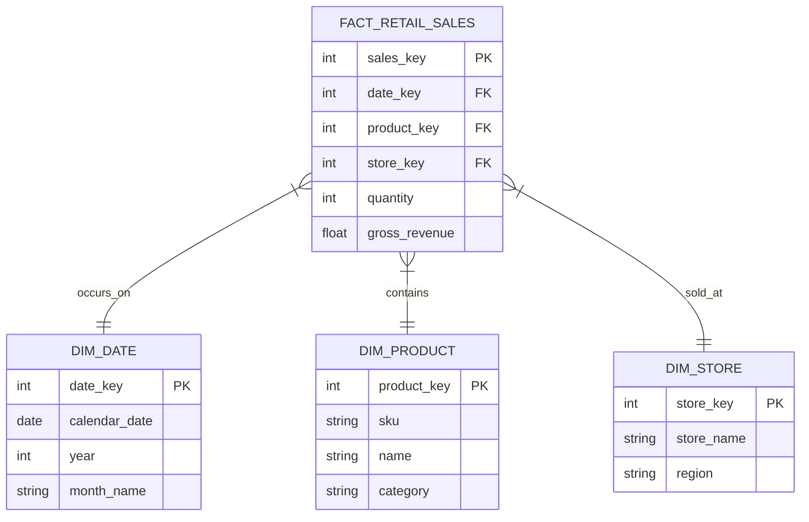

# Module 7.16: Enterprise Architectures

Welcome to the final module of the Data Warehouses curriculum: **Enterprise Architectures**. As a Forward Deployed Engineer, you will design the storage layout, dimensional modeling schemas, and performance architectures for massive corporate data warehouses. In this module, you will learn the design patterns for Customer 360, Banking, Insurance, and Retail platforms.

---

## 1. Detailed Theory

### Customer 360 Warehouse
A centralized schema that compiles all customer interactions (billing history, click events, customer support logs) to build a conformed profile registry.
- **Identity Resolution**: Enforcing unified dimensions (`dim_customer`) where surrogate keys link disparate Stripe and Salesforce customer keys together.

### Banking Warehouse (Transactions & Risk)
- Uses strict access controls (KMS keys, data masking) and dimensional structures (Star Schema) to store transaction facts, calculate regional balances, and evaluate risk features.

### Insurance Warehouse (Claims & Policies)
- Models claims event logs into fact tables to calculate risk ratios and underwriting performance metrics.

### Retail Warehouse (Inventory & Sales)
- Aggregates daily transaction line items to track product inventory and calculate demand forecasting metrics.

---

## 2. Architecture Diagram: Enterprise Retail Warehouse Layout



---

## 3. Production Use Cases

1. **Banking Risk Auditing**: Financial records are loaded into a secure Snowflake warehouse. You configure data masking policies on customer emails and SSNs, and implement Row-Level Security so regional compliance managers can only view transaction rows matching their assigned branches.
2. **Retail Demand Forecasting**: A global supermarket chain schedules a dbt pipeline to compile daily transaction facts. The aggregated metrics (moving sales averages) are outputted to a Gold table to feed inventory forecasting models.

---

## 4. Real Company Examples

- **Capital One**: Structures their entire data catalog and security layers around cloud warehouses to isolate customer financial domains while enabling machine learning models.
- **Walmart**: Ingests point-of-sale receipt data from thousands of stores into a central warehouse to calculate regional demand metrics.

---

## 5. Coding Examples

### Customer 360 Identity Aggregation (SQL/dbt mart)

```sql
-- models/marts/dim_customer_360.sql
-- This model resolves customer identities and compiles lifetime metrics
SELECT 
    r.global_customer_id,
    c.full_name,
    c.country,
    -- Aggregate Billing metric
    COALESCE(SUM(s.sale_amount), 0) AS lifetime_spend,
    COUNT(DISTINCT s.sales_key) AS lifetime_purchases
FROM {{ ref('customer_identity_registry') }} r
JOIN {{ ref('dim_customer') }} c ON r.crm_id = c.customer_id
LEFT JOIN {{ ref('fact_sales') }} s ON r.billing_id = s.customer_id
GROUP BY 1, 2, 3;
```

---

## 6. Hands-on Labs

**Lab: Identity Resolution Mapping**
**Objective**: Build a mapping view.
**Instructions**:
Given the `customer_identity_registry` table generated in the coding example above, write the SQL query to resolve a client's transaction billing record to their CRM account.

---

## 7. Assignments

**Assignment: Banking Compliance Design**
Design the architecture and security layout for a banking data warehouse.
Detail:
1. Database encryption configurations.
2. Role-Based Access Control (RBAC) schemas.
3. Data masking policies for customer personally identifiable information (PII).
Explain how the design meets regulatory auditing requirements (e.g., SOC2).

---

## 8. Interview Questions

1. **What is Identity Resolution in a Customer 360 platform?**
   *Answer Hint: The process of matching and linking customer records from different systems (e.g., CRM, billing, web logs) into a single, canonical profile representing a unique individual, using deterministic rules or probabilistic matching.*
2. **Why is a Star Schema preferred for Customer 360 data warehouses?**
   *Answer Hint: A Star Schema organizes data into flat, denormalized dimensions (like dim_customer) connected to fact tables. This structure minimizes the number of joins required to aggregate customer features, resulting in fast query execution.*

---

## 9. Best Practices (FDE Standards)

- **Standardize joining fields**: Before matching records, clean and normalize all joining columns (e.g., lowercasing email strings, trimming whitespace).
- **Run Incremental Registry Updates**: Do not recalculate the entire registry daily. Build pipelines that only process *newly modified* records and merge them into the master matching database.

---

## 10. Common Mistakes

- **Incorrect Fuzzy Joins**: Setting fuzzy matching thresholds too low (e.g., matching "John Smith" with "John Smythe" without validating address/phone data), resulting in data pollution.
- **Forgetting soft-delete updates**: Failing to update the matching registry when a customer deletes their billing account, resulting in orphaned records in downstream reporting dashboards.
