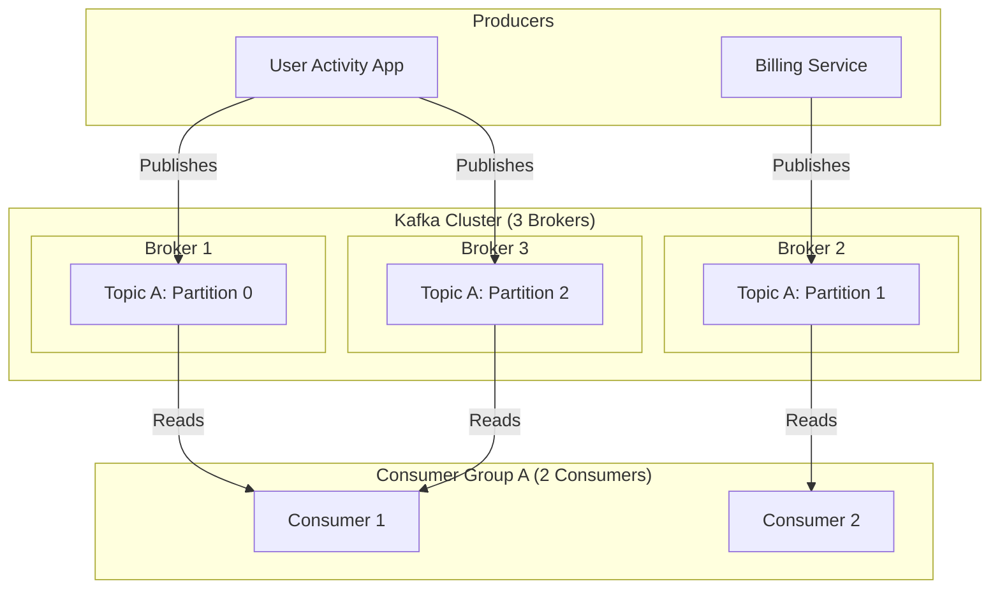

# Module 5.1: Kafka Fundamentals

Welcome to **Kafka Fundamentals**. As an AI Forward Deployed Engineer (FDE), processing data in static nightly batches is often insufficient. Real-world platforms require real-time responsiveness: reacting to user clicks, transactions, or system logs immediately. Apache Kafka is the industry-standard event streaming platform designed to handle high-throughput, low-latency, real-time message streams.

---

## 1. Detailed Theory

### Event-Driven Architecture
Unlike request-response models (where System A calls System B's API directly), an event-driven architecture decouples systems. When an "event" occurs (e.g., a customer adds an item to a cart), the source system publishes the event to a central log. Any downstream system that cares about this event can subscribe to and read it independently.

### Messaging Systems & Publish-Subscribe
- **Publish-Subscribe (Pub-Sub)**: Producers publish messages to a topic without knowing who will consume them. Consumers subscribe to topics they are interested in, allowing for 1-to-many communication.
- **Queueing vs. Publish-Subscribe**: Standard queues (like RabbitMQ) delete a message once a single consumer reads it. Kafka is an append-only distributed log; messages are persisted and can be read by multiple different consumer groups repeatedly.

### Kafka Architecture Components
- **Brokers**: The physical or virtual servers that make up a Kafka cluster.
- **Topics**: A category or feed name to which messages are published. Analogous to a database table.
- **Partitions**: Topics are split into multiple partitions distributed across brokers. Partitions are the unit of scalability and parallelism in Kafka.
- **Producers**: Applications that publish events to Kafka topics.
- **Consumers**: Applications that subscribe to and read events from topics.
- **Consumer Groups**: A group of consumers that cooperate to read a topic in parallel. Each partition is consumed by only one member of the group.
- **Offsets**: A unique sequential integer assigned to each message within a partition. It represents the logical read position of a consumer.

---

## 2. Architecture Diagram: Kafka Cluster Topology



---

## 3. Production Use Cases

1. **User Activity Tracking**: Streaming millions of website clicks and pageviews per second to a Kafka topic. A data warehouse consumer reads the stream to store historical logs, while a real-time recommendation engine reads the same topic to update the user's home screen.
2. **AI Agent Communication Bus**: Structuring a messaging pipeline where multiple autonomous AI agents broadcast actions and read state changes via partitioned Kafka topics.

---

## 4. Real Company Examples

- **LinkedIn**: The original creator of Apache Kafka, built to handle hundreds of billions of daily events (feed updates, connection tracking, pageviews) across their platform.
- **Netflix**: Uses Kafka as the central data backbone to ingest all telemetry and playback quality events from millions of concurrent streams globally.

---

## 5. Coding Examples

### Conceptual Messaging Workflow (Python Pseudocode)

```python
# Producer publishes to a Topic
producer.send(topic='user_activity', key='user_42', value='clicked_checkout')

# Consumer Group reads from Topic
# Consumer 1 in the group reads Partition 0
for message in consumer.subscribe(topics=['user_activity']):
    print(f"Received from Partition {message.partition} (Offset {message.offset}): {message.value}")
```

---

## 6. Hands-on Labs

**Lab: Identifying Components**
**Objective**: Interpret Kafka topology.
**Instructions**:
Write down the relationship between:
1. Brokers and Topics.
2. Topics and Partitions.
3. Partitions and Consumer Groups.
Explain what happens to the partitions of a topic if you scale a consumer group from 2 consumers to 4 consumers when the topic has only 3 partitions.

---

## 7. Assignments

**Assignment: Kafka vs. Traditional Queueing**
Write a short comparison analyzing the differences between **Apache Kafka** and a traditional messaging queue like **RabbitMQ**. Focus on message persistence, scaling capability, and consumption model (push vs. pull).

---

## 8. Interview Questions

1. **How does Kafka achieve high scalability and horizontal throughput?**
   *Answer Hint: Through partitioning. A single topic can be split into hundreds of partitions across multiple brokers. This allows different brokers to receive writes in parallel, and different consumers in a group to read from different partitions simultaneously.*
2. **What is a Consumer Group offset?**
   *Answer Hint: An offset is a sequential integer representing the consumer group's progress through a partition. It is stored in a special internal Kafka topic (`__consumer_offsets`), allowing consumers to resume reading from the correct position if they crash or restart.*

---

## 9. Best Practices (FDE Standards)

- **One Partition, One Consumer**: Ensure your topic has at least as many partitions as the maximum number of parallel consumers you plan to run. If you have 3 partitions and 4 consumers in a group, the 4th consumer will sit completely idle.
- **Use Keys for Message Routing**: Always provide a key (e.g., `user_id`) when publishing events if message order is important. Kafka guarantees order only within a single partition, and keys ensure all events for a specific user route to the same partition.

---

## 10. Common Mistakes

- **Creating Monolithic Topics**: Putting completely unrelated events (e.g., `user_logins` and `billing_transactions`) into a single topic. Use distinct topics for different event schemas.
- **Setting Partition Count Too Low**: Creating a production topic with 1 partition, which locks you into single-thread consumer performance and prevents cluster scaling.
