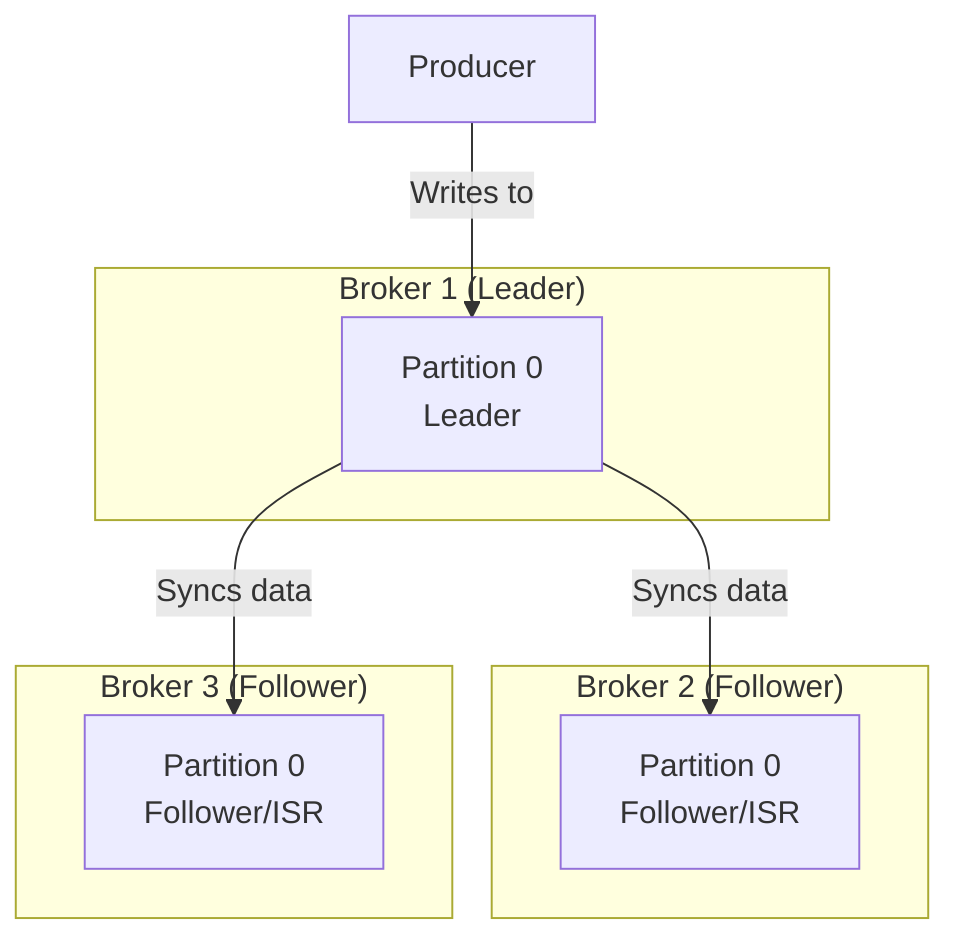

# Module 5.2: Core Kafka Concepts

Welcome to **Core Kafka Concepts**. Once you understand the basics, you must learn how Kafka handles data replication, manages message retention, and guarantees message ordering across a distributed cluster. These core parameters determine the reliability and performance of your enterprise streaming platform.

---

## 1. Detailed Theory

### Replication Factor & ISR
Kafka is a distributed, fault-tolerant system. It protects against server crashes by replicating partitions across multiple brokers.
- **Replication Factor**: The number of copies of a partition stored across the cluster (the production standard is `3`).
- **Leader Replica**: For each partition, one broker is chosen as the Leader. All read and write requests go through the Leader.
- **Follower Replicas**: The remaining replica brokers. They pull data from the Leader to stay synchronized.
- **ISR (In-Sync Replicas)**: The set of follower replicas that are actively caught up with the Leader. If the Leader crashes, only an ISR member can be promoted to the new Leader.

### Message Retention Strategies
Kafka does not keep messages forever by default. It manages storage using two retention strategies:
1. **Time-based Retention**: Deleting log segments older than a set time window (default is 7 days).
2. **Size-based Retention**: Deleting the oldest log segments once a partition directory reaches a set size limit (e.g., 50GB).
3. **Log Compaction**: Instead of deleting historical events, Kafka discards older records with duplicate keys, keeping only the latest value for each key. Excellent for state restoration (like restoring customer profile records).

### Message Ordering Guarantees
Kafka guarantees **strict message ordering only within a single partition**. If you write message A and then B to Partition 0, they will always be read in that order. However, if message A goes to Partition 0 and B goes to Partition 1, there is no global order guarantee.

---

## 2. Architecture Diagram: Partition Replication (Replication Factor = 3)



---

## 3. Production Use Cases

1. **User Activity Event Streaming**: A topic is created with `partitions = 6`, `replication_factor = 3`, and a time-based retention of `24 hours` to process massive, volatile click streams without exhausting storage space.
2. **Order Processing System**: An e-commerce orders topic is configured with `log.cleanup.policy = compact` (Log Compaction) so that the system always has access to the latest status of each `order_id` key for recovery purposes.

---

## 4. Real Company Examples

- **Uber**: Relies on high replication factors for geospatial ride requests, ensuring a broker crash in the middle of a trip does not drop telemetry data or cause matching failures.

---

## 5. Coding Examples

### Creating and Configuring Topics (CLI Commands)

```bash
# 1. Create a partitioned, replicated Topic
kafka-topics.sh --bootstrap-server localhost:9092 --create \
    --topic customer-orders \
    --partitions 6 \
    --replication-factor 3

# 2. Altering config: Enabling Log Compaction on an existing topic
kafka-configs.sh --bootstrap-server localhost:9092 --alter \
    --entity-type topics \
    --entity-name customer-orders \
    --add-config cleanup.policy=compact

# 3. Inspecting topic details (Checking leaders and ISRs)
kafka-topics.sh --bootstrap-server localhost:9092 --describe \
    --topic customer-orders
```

---

## 6. Hands-on Labs

**Lab: Log Compaction Verification**
**Objective**: Understand compaction state.
**Instructions**:
Given a compacted topic where a producer publishes the following key-value sequence over time:
1. `(Key: "user_1", Value: "state_A")`
2. `(Key: "user_2", Value: "state_B")`
3. `(Key: "user_1", Value: "state_C")`
Write down the final state of the topic partitions after log compaction completes. Which keys and values remain?

---

## 7. Assignments

**Assignment: Partition Strategy & Ordering**
Explain how you would design a partitioning key strategy for a banking pipeline processing `transfers` (money transfers) to ensure that transactions for a specific `account_id` are always processed in strict chronological order, even if the topic has 10 partitions.

---

## 8. Interview Questions

1. **What is an In-Sync Replica (ISR) in Kafka?**
   *Answer Hint: An ISR is a follower replica broker that is currently caught up with the leader broker's log. If a leader fails, Kafka only promotes a follower that is currently in the ISR list to ensure no data loss.*
2. **Why does Kafka only guarantee ordering within a partition and not across the whole topic?**
   *Answer Hint: Global ordering across multiple partitions would require distributed locking and coordination across multiple brokers, completely destroying Kafka's throughput and performance. Restricting ordering to partitions allows brokers to process writes independently at scale.*

---

## 9. Best Practices (FDE Standards)

- **Default to Replication Factor = 3**: Never use a replication factor of 1 in production, as a single broker disk failure will result in permanent data loss.
- **Do Not Change Partition Counts Downward**: You can increase the number of partitions on a topic, but you cannot decrease them. Decreasing partitions is not supported and requires recreating the topic.

---

## 10. Common Mistakes

- **Incorrect Key Hashing**: Increasing partition counts on a topic that relies on message keys for ordering. When partition count changes, Kafka's hashing algorithm routes keys to different partitions, breaking the historical ordering of existing key streams.
- **Compaction without Keys**: Configuring log compaction on a topic where events are sent without keys. Compaction requires keys to determine duplicates; without them, compaction fails to release storage.
