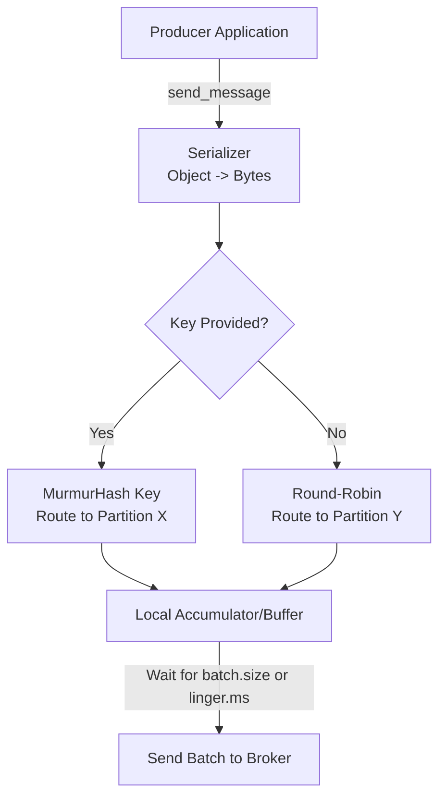

# Module 5.3: Kafka Producers

Welcome to **Kafka Producers**. Producers are the entry point of data into the Kafka ecosystem. Understanding how the Producer API serializes messages, batches writes, route keys to partitions, and configures delivery guarantees is critical for building high-performance, zero-data-loss streaming pipelines.

---

## 1. Detailed Theory

### Serialization and Routing
- **Message Serialization**: Kafka receives and stores events as raw byte arrays. The producer must convert objects (e.g., Python dicts) into bytes using a serializer (e.g., String, JSON, Avro, Protobuf).
- **Keys & Partitions**:
  - If a message is sent with no key, Kafka distributes messages evenly across partitions using a round-robin strategy.
  - If a key is provided, Kafka hashes the key (`MurmurHash2`) and uses it to route all messages with that key to the same partition.

### Performance Optimization
- **Batching**: The producer does not send messages one-by-one (network overhead). It buffers messages locally. Once the buffer reaches a size threshold (`batch.size`, e.g., 16KB) or a time threshold (`linger.ms`, e.g., 20ms), it sends them in a single batch.
- **Compression**: Compressing batches before sending (e.g., `gzip`, `snappy`, `zstd`) to reduce network transit and broker disk storage.

### Reliability & Delivery Guarantees
- **Acks (Acknowledgements)**: Configures how many replica brokers must receive the write before the producer considers it successful:
  - `acks=0`: Fire-and-forget. High throughput, maximum risk of data loss.
  - `acks=1`: The leader broker must write the message to disk (Default).
  - `acks=all` (or `-1`): The leader and all active ISR replicas must confirm the write. Zero data loss.
- **Idempotent Producers**: Enabling `enable.idempotence=true` attaches a unique sequence number to each message. If a write fails and the producer retries, the broker detects duplicates and discards them, preventing duplicate writes in the log.

---

## 2. Architecture Diagram: Producer Write Mechanics



---

## 3. Production Use Cases

1. **Customer Event Producer**: An e-commerce web application pushes user clicks to Kafka. It uses `acks=1`, `compression.type=snappy`, and a `linger.ms=20` configuration to maximize network throughput and compression.
2. **Financial Ledger Ingestion**: A payment processing service writes balance adjustments. It configures `acks=all`, `enable.idempotence=true`, and `retries=max` to guarantee that transaction metrics are never lost or duplicated.

---

## 4. Real Company Examples

- **Stripe**: Configures all financial event producers with `acks=all` and idempotent settings to ensure transactional reliability when moving money between systems.

---

## 5. Coding Examples

### Python PyKafka Producer with High-Throughput & Reliability

```python
from confluent_kafka import Producer
import json
import socket

# 1. Producer Configuration
conf = {
    'bootstrap.servers': "localhost:9092",
    'client.id': socket.gethostname(),
    
    # Reliability Settings
    'acks': 'all',                  # Ensure all replicas confirm the write
    'enable.idempotence': True,     # Prevent duplicate messages on retry
    'retries': 5,
    
    # Performance/Batching Settings
    'linger.ms': 20,                # Wait up to 20ms to fill a batch
    'batch.size': 32768,            # 32KB batch size
    'compression.type': 'snappy'    # Fast compression algorithm
}

# 2. Initialize Producer
producer = Producer(conf)

# Optional delivery callback to track success/failure
def acked(err, msg):
    if err is not None:
        print(f"Failed to deliver message: {err}")
    else:
        print(f"Message delivered to {msg.topic()} [{msg.partition()}] at offset {msg.offset()}")

# 3. Produce JSON Event with a Key
event_data = {"user_id": "user_101", "action": "checkout", "amount": 99.50}
key = "user_101"

producer.produce(
    topic='customer-events',
    key=key.encode('utf-8'),
    value=json.dumps(event_data).encode('utf-8'),
    callback=acked
)

# 4. Flush the local buffer to ensure messages are sent
producer.flush()
```

---

## 6. Hands-on Labs

**Lab: Batching Analysis**
**Objective**: Understand latency vs throughput trade-offs.
**Instructions**:
Explain the impact on latency and network request counts if you set `linger.ms = 200` compared to `linger.ms = 0` on a high-traffic producer pipeline.

---

## 7. Assignments

**Assignment: The Delivery Guarantee Dilemma**
You are designing an IoT sensor logging system. The sensors send temperature metrics every 5 seconds. If a sensor fails to send a single reading, it is not critical. However, battery consumption is highly limited. Propose the producer configurations (`acks`, `compression`, `retries`) that optimize for battery efficiency and throughput over strict consistency.

---

## 8. Interview Questions

1. **What does `acks=all` mean?**
   *Answer Hint: It means the producer will wait for a confirmation that the message was written by the partition leader AND all current In-Sync Replicas (ISR) brokers before marking the send as successful, guaranteeing zero data loss.*
2. **How does an Idempotent Producer work?**
   *Answer Hint: Enabling idempotence assigns a unique producer ID and monotonic sequence numbers to messages. If the broker receives a duplicate sequence number (due to a retry after a network timeout), it registers the write but discards the duplicate message, preventing duplicate logs.*

---

## 9. Best Practices (FDE Standards)

- **Always configure `linger.ms`**: The default is 0 (send immediately). Setting it to even 5-20ms allows Spark/Kafka client to batch requests, decreasing CPU load on brokers by up to 50%.
- **Handle Callback Failures**: Never write fire-and-forget producer code in production. Implement delivery callbacks to log and alert if write actions fail.

---

## 10. Common Mistakes

- **Blocking writes in loops**: Forgetting that `producer.produce()` is asynchronous. Calling `producer.flush()` after every single message destroys performance, turning a distributed pipeline into a slow, synchronous script. (Flush only at the end of a session/batch).
- **Hardcoding schema transformations**: Serializing JSON payloads manually in the producer code instead of using Schema Registries (e.g., Avro/Protobuf) which manage serialization contracts automatically.
