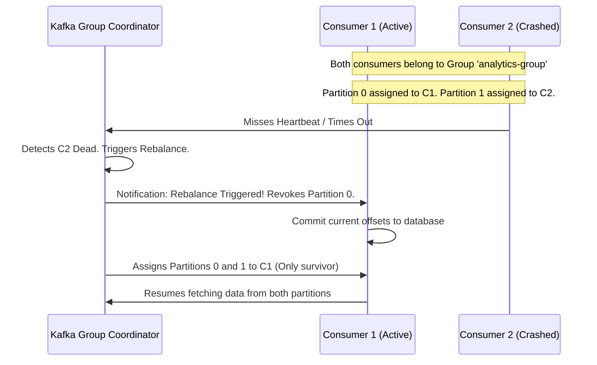

# Module 5.4: Kafka Consumers

Welcome to **Kafka Consumers**. While producers put data into Kafka, consumers extract it. In this module, you will learn how the Consumer API reads data, how consumer groups divide partitions to consume in parallel, how to manage offsets securely to prevent duplicate reads, and what happens when partitions rebalance.

---

## 1. Detailed Theory

### Consumer Groups & Parallel Consumption
Kafka scales consumption through **Consumer Groups**:
- Multiple instances of a consumer join a group (identified by `group.id`).
- Kafka automatically assigns each partition of a topic to exactly one consumer in the group.
- If you have 4 partitions and 2 consumers in a group, each consumer reads from 2 partitions.
- If you add 2 more consumers, Kafka triggers a **Rebalance**, assigning 1 partition to each consumer.

### Offset Management
Consumers track their progress in partitions by committing offsets. There are two offset commit strategies:
1. **Auto Commit (`enable.auto.commit = true`)**: The consumer library automatically commits the last processed offset at a set interval (default is 5 seconds). Easy, but carries a risk: if the app crashes halfway through processing a batch, those messages are lost or processed twice.
2. **Manual Commit (`enable.auto.commit = false`)**: The developer explicitly commits offsets in code *after* the messages are successfully processed and written to downstream storage.
   - **Commit Sync**: Blocks execution until the broker acknowledges the offset commit. Safe, but slow.
   - **Commit Async**: Sends the offset commit request and immediately continues processing. Faster, but hard to handle retries.

### Rebalancing
When a consumer joins or leaves the group (or crashes, failing to send heartbeats), Kafka reassigns partitions across active group members. During a rebalance, consumers temporarily stop reading data.

---

## 2. Architecture Diagram: Consumer Group Partition Rebalance



---

## 3. Production Use Cases

1. **Real-Time Notification System**: A topic contains `user_notifications` events. A consumer group with 3 instances reads from the topic. If one notification service container crashes on Kubernetes, Kafka automatically rebalances its partitions to the remaining 2 containers so notifications continue sending.
2. **Audit Ledger Syncing**: A database log synchronization pipeline. It disables auto-commit, manual-commits offsets synchronously only after checking that the database transaction succeeded, ensuring zero record drops.

---

## 4. Real Company Examples

- **Spotify**: Uses thousands of parallel consumer processes grouped by service types (e.g., ad serving, playback tracking, playlists) to read their core transaction streams.

---

## 5. Coding Examples

### PyKafka Consumer with Manual Sync Commit

```python
from confluent_kafka import Consumer, KafkaError, KafkaException
import sys

# 1. Consumer Configuration
conf = {
    'bootstrap.servers': "localhost:9092",
    'group.id': "notification-group",
    'auto.offset.reset': 'earliest',      # Start from beginning if no offset exists
    'enable.auto.commit': False            # Disable auto-commit for manual control
}

# 2. Initialize Consumer
consumer = Consumer(conf)

# 3. Subscribe to Topic
consumer.subscribe(['user-notifications'])

try:
    while True:
        # Poll for new messages (timeout 1.0 second)
        msg = consumer.poll(timeout=1.0)
        
        if msg is None: continue
        
        if msg.error():
            if msg.error().code() == KafkaError._PARTITION_EOF:
                # End of partition event (not a hard failure)
                continue
            else:
                raise KafkaException(msg.error())
        
        # 4. Process Message (Logical Work)
        payload = msg.value().decode('utf-8')
        print(f"Sending Notification for: {payload}")
        
        # 5. Commit Offset Synchronously after successful processing
        # This blocks until confirmed, guaranteeing At-Least-Once delivery.
        try:
            consumer.commit(message=msg, asynchronous=False)
        except KafkaException as e:
            print(f"Offset commit failed: {e}")
            
except KeyboardInterrupt:
    pass
finally:
    # 6. Close consumer to trigger immediate rebalance and release resources
    consumer.close()
```

---

## 6. Hands-on Labs

**Lab: Offsets and Auto-Commit**
**Objective**: Analyze data loss risk.
**Instructions**:
Write out a scenario where using **Auto Commit** (`enable.auto.commit = true`) leads to **Data Loss** (messages marked read but never processed) if the consumer application crashes. (Hint: Think about when the commit happens relative to database writes).

---

## 7. Assignments

**Assignment: Rebalance Storms**
In a production Kubernetes cluster, a sudden load spike causes 10 new instances of a consumer to spin up at the same time. This triggers 10 sequential partition rebalances in a short window.
Write a paragraph explaining the impact of "Rebalance Storms" on pipeline processing latency and broker resource utilization.

---

## 8. Interview Questions

1. **What is the difference between At-Least-Once and At-Most-Once delivery guarantees?**
   *Answer Hint: At-Least-Once commits offsets AFTER processing data. If the app crashes, it re-reads the last offset, resulting in duplicate processing but no data loss. At-Most-Once commits offsets BEFORE processing data. If the app crashes, those messages are skipped on restart, resulting in data loss but no duplicates.*
2. **What is a partition rebalance in Kafka?**
   *Answer Hint: A rebalance is the process where the Kafka group coordinator reassigns topic partition ownership across the members of a consumer group, triggered when consumers join/leave or fail heartbeats.*

---

## 9. Best Practices (FDE Standards)

- **Always Close Consumers**: Wrap your consumer loop in a `try...finally` block that calls `consumer.close()`. This immediately notifies the coordinator to trigger a rebalance, rather than waiting 45 seconds for a heartbeat timeout.
- **Keep processing loops fast**: Do not perform slow network calls inside the consumer polling loop. If a consumer takes too long to process a batch, the broker will assume the consumer is dead and eject it from the group.

---

## 10. Common Mistakes

- **Mismatching Partitions & Consumers**: Setting consumer instances to be greater than partition counts, resulting in paid cloud compute nodes sitting completely idle.
- **Ignoring Heartbeats**: Performing a 5-minute database write within the poll loop without tuning `max.poll.interval.ms`, causing Kafka to constantly eject the consumer and trigger rebalances.
