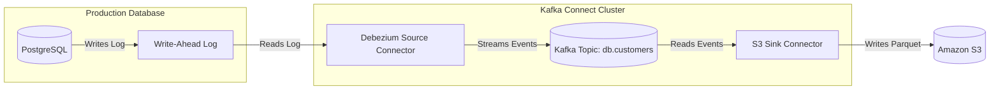

# Module 5.5: Kafka Connect

Welcome to **Kafka Connect**. Writing custom Python scripts to poll databases and write to Kafka (or poll Kafka and write to S3) is a waste of engineering time. Kafka Connect is a tool for scalably and reliably streaming data between Apache Kafka and external systems. It abstracts away the connection, scaling, and offset-management boilerplate using simple configuration files.

---

## 1. Detailed Theory

### Source vs. Sink Connectors
- **Source Connectors**: Pull data from external systems into Kafka topics (e.g., streaming rows from a Postgres table or files from an FTP server).
- **Sink Connectors**: Export data from Kafka topics into external systems (e.g., streaming events from a topic into AWS S3, Snowflake, or Elasticsearch).

### Change Data Capture (CDC) with Debezium
Change Data Capture (CDC) is the modern standard for database synchronization.
- Traditional JDBC source connectors run queries like `SELECT * FROM table WHERE updated_at > X` at intervals. This adds query load to production and fails to capture deletes.
- **Debezium**: A CDC source connector framework. It integrates directly with database transaction logs (e.g., PostgreSQL WAL). It reads the logs in real-time, streaming every `INSERT`, `UPDATE`, and `DELETE` operation as structured JSON events to Kafka without querying the database.

---

## 2. Architecture Diagram: CDC Pipeline (Debezium + S3 Sink)



---

## 3. Production Use Cases

1. **PostgreSQL → Kafka → S3 Pipeline**: A production transactional database is connected to a Debezium Source. All changes are streamed to a Kafka topic. An S3 Sink connector reads the topic and writes partitioned Parquet files to a data lake for analytics, completely decoupling analytics from the live application database.
2. **Elasticsearch Sync**: Automatically indexing e-commerce product table changes from a relational database into Elasticsearch in real-time to power search inputs.

---

## 4. Real Company Examples

- **Uber**: Uses Kafka Connect clusters to manage the ingestion of hundreds of internal relational databases into their centralized Hadoop data lake.
- **Airbnb**: Integrates Debezium CDC connectors to capture user profile changes and pipe them to real-time search indexing and personalization models.

---

## 5. Coding Examples

### Configuring an S3 Sink Connector (JSON Configuration)

To run a connector, you POST this configuration to the Kafka Connect REST API. No Java/Python code required!

```json
{
  "name": "s3-sink-connector",
  "config": {
    "connector.class": "io.confluent.connect.s3.S3SinkConnector",
    "tasks.max": "3",
    "topics": "db.customers",
    "s3.bucket.name": "enterprise-data-lake",
    "s3.region": "us-east-1",
    
    # Writing formats and paths
    "format.class": "io.confluent.connect.s3.format.parquet.ParquetFormat",
    "storage.class": "io.confluent.connect.s3.storage.S3Storage",
    "path.format": "'year'=YYYY/'month'=MM/'day'=dd",
    
    # Offset committing behavior
    "flush.size": "10000",                # Rotate files every 10,000 records
    "rotate.interval.ms": "600000",       # Or rotate files every 10 minutes
    
    "schema.generator.class": "io.confluent.connect.storage.hive.schema.DefaultSchemaGenerator"
  }
}
```

---

## 6. Hands-on Labs

**Lab: JDBC vs. CDC**
**Objective**: Identify structural differences.
**Instructions**:
Write a short comparison analyzing the differences in execution mechanism and capabilities between a **JDBC Source Connector** and a **Debezium CDC Connector** when a row is hard-deleted (`DELETE FROM users WHERE id = 1`) in a source Postgres database.

---

## 7. Assignments

**Assignment: Connector Sizing**
You are configuring a Kafka Connect cluster to sink logs from a high-throughput topic (100,000 events/second) that has 12 partitions.
Describe how you would configure `tasks.max` in the connector config file to ensure optimal parallelism, and explain the CPU relationship between tasks and partitions.

---

## 8. Interview Questions

1. **What is Kafka Connect and why use it?**
   *Answer Hint: It is a framework for connecting Kafka with external data sources and sinks. Use it because it is server-centric, scale-out capable, and eliminates custom integration code by using declarative JSON configurations.*
2. **How does Debezium capture database deletes?**
   *Answer Hint: Debezium reads the database's internal transaction log (like PostgreSQL's WAL). When a row is deleted, the log writes a delete event containing the deleted row's key. Debezium parses this and publishes it to Kafka as a delete event, whereas standard JDBC queries cannot find deleted records.*

---

## 9. Best Practices (FDE Standards)

- **Use Dynamic Schemas (Avro/Protobuf)**: Never run Kafka Connect pipelines without a Schema Registry. If a developer drops a database column, raw JSON sinks will break. Schemas protect against pipeline crashes.
- **Tune Flush and Rotation Parameters**: Avoid creating thousands of tiny files in S3. Configure `flush.size` (e.g., 50,000 records) and `rotate.interval.ms` (e.g., 15 minutes) to group streaming events into optimal Parquet file blocks.

---

## 10. Common Mistakes

- **Running with tasks.max = 1**: Leaving `tasks.max` to default on a high-traffic topic, forcing a single JVM thread to process all partitions, causing consumer lag to rise.
- **Ignored Schema Registry URLs**: Deploying Avro/Protobuf connectors but forgetting to specify the `schema.registry.url` parameter, causing the connector task to crash on startup.
