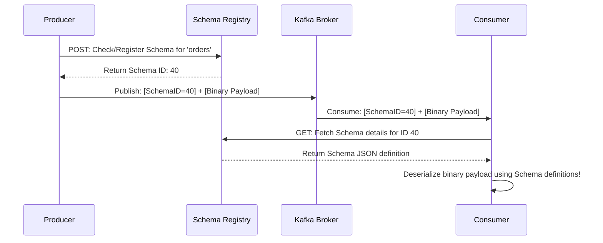

# Module 5.7: Schema Management

Welcome to **Schema Management in Kafka**. Sending raw JSON messages is easy, but in enterprise production environments, schema contracts are critical. If a developer renames a field in a user database from `user_name` to `full_name`, and your downstream Spark pipeline expects `user_name`, the pipeline will crash. In this module, you will learn how to enforce schema contracts using **Schema Registry** (Avro, Protobuf, JSON Schema) and handle schema evolution safely.

---

## 1. Detailed Theory

### Why Enforce Schemas?
- **JSON Overhead**: JSON is a verbose text format. Repeating keys like `"customer_id": 101` in every message wastes network bandwidth and storage.
- **Data Corruption**: Without a schema registry, producers can publish any junk data to a topic, corrupting downstream data lake ingestion pipelines.
- **Serialization Formats**:
  - **Apache Avro**: A binary serialization format with a JSON-defined schema. Highly optimized for Kafka.
  - **Protobuf (Protocol Buffers)**: Google's binary format. Extremely fast and compact.
  - **JSON Schema**: Integrates JSON with validation schemas.

### Confluent Schema Registry
The Schema Registry sits alongside Kafka.
- When a producer sends a message, it doesn't send the schema. It checks the Schema Registry, gets a **Schema ID**, and attaches only that 4-byte Schema ID to the binary message payload.
- When the consumer reads the message, it extracts the Schema ID, fetches the schema from the registry, and deserializes the binary payload back into a structured object.

### Schema Evolution Rules
When database tables change, schemas evolve. You must configure compatibility rules:
- **BACKWARD Compatibility**: New schema can read data written by old schema. (Allows updating consumers first).
- **FORWARD Compatibility**: Old schema can read data written by new schema. (Allows updating producers first).
- **FULL Compatibility**: Both backward and forward compatible.

---

## 2. Architecture Diagram: Schema Registry Ingestion Flow



---

## 3. Production Use Cases

1. **Enterprise Event Platform**: A bank enforces Avro schemas for all balance transactions. If a developer attempts to write a transaction containing a string in the `amount` column, the producer client rejects it before sending it to Kafka.
2. **Dynamic Data Lakehouse Ingestion**: A Kafka Connect S3 Sink connector automatically reads the Schema ID from incoming Avro records, matches it to the registry, and dynamically updates the Parquet file structure on S3 when new columns are added.

---

## 4. Real Company Examples

- **Capital One**: Enforces strict Avro schema verification across all internal microservice events using Confluent Schema Registry, ensuring client-facing transactions match expected formats.

---

## 5. Coding Examples

### Defining and Writing Avro Schema to Kafka (Python)

```python
from confluent_kafka import SerializingProducer
from confluent_kafka.schema_registry import SchemaRegistryClient
from confluent_kafka.schema_registry.avro import AvroSerializer

# 1. Define the Avro Schema (JSON Format)
value_schema_str = """
{
   "namespace": "enterprise.events",
   "name": "OrderEvent",
   "type": "record",
   "fields": [
       {"name": "order_id", "type": "string"},
       {"name": "user_id", "type": "string"},
       {"name": "amount", "type": "double"},
       {"name": "timestamp", "type": "long"}
   ]
}
"""

# 2. Configure Schema Registry Client
sr_client = SchemaRegistryClient({'url': 'http://localhost:8081'})

# 3. Configure Avro Serializer
avro_serializer = AvroSerializer(sr_client, value_schema_str)

# 4. Configure Producer with Avro Serializer
producer_conf = {
    'bootstrap.servers': 'localhost:9092',
    'key.serializer': None, # Keep key as raw string
    'value.serializer': avro_serializer
}
producer = SerializingProducer(producer_conf)

# 5. Produce validated data
order_data = {"order_id": "order_999", "user_id": "user_42", "amount": 149.99, "timestamp": 1697300000}
producer.produce(topic='orders', value=order_data)
producer.flush()
```

---

## 6. Hands-on Labs

**Lab: Schema Registry API**
**Objective**: Interact with the Registry REST API.
**Instructions**:
Write down the HTTP request (method, URL, headers) required to list all registered subjects (topics/schemas) in a Schema Registry instance running locally on port 8081. (Hint: Look up `/subjects` endpoint).

---

## 7. Assignments

**Assignment: Schema Evolution Trade-offs**
A developer wants to add a new column `middle_name` to a user database.
Explain:
1. The difference between BACKWARD and FORWARD compatibility.
2. Why you must provide a **default value** (`"default": "N/A"`) in the Avro schema to ensure FULL compatibility.

---

## 8. Interview Questions

1. **How does Schema Registry reduce network bandwidth usage in Kafka?**
   *Answer Hint: Instead of sending the full schema (column names, types, constraints) with every JSON message, Avro/Schema Registry sends only a 4-byte Schema ID alongside a compact binary payload. The consumer uses the ID to look up the schema once and cache it.*
2. **What is BACKWARD compatibility?**
   *Answer Hint: A compatibility rule stating that consumers running the newest schema can read historical data written using the previous schema version, allowing you to update consumer applications first.*

---

## 9. Best Practices (FDE Standards)

- **Always Provide Defaults**: When adding new fields to schemas, always specify a default value. This guarantees the schema remains fully backward and forward compatible.
- **Never Change Types**: If a column changes from an integer to a string, do not alter the schema. Create a new field (e.g., `user_id_str`) or a new topic to prevent breaking downstream pipelines.

---

## 10. Common Mistakes

- **Swallowing Schema Check Exceptions**: Writing producer code that fails to check schema registry changes, leading to silent serialization failures.
- **Type Mismatch in Avro**: Attempting to send a float value to an Avro schema field defined as `long`, causing serialization client errors before it reaches the broker.
