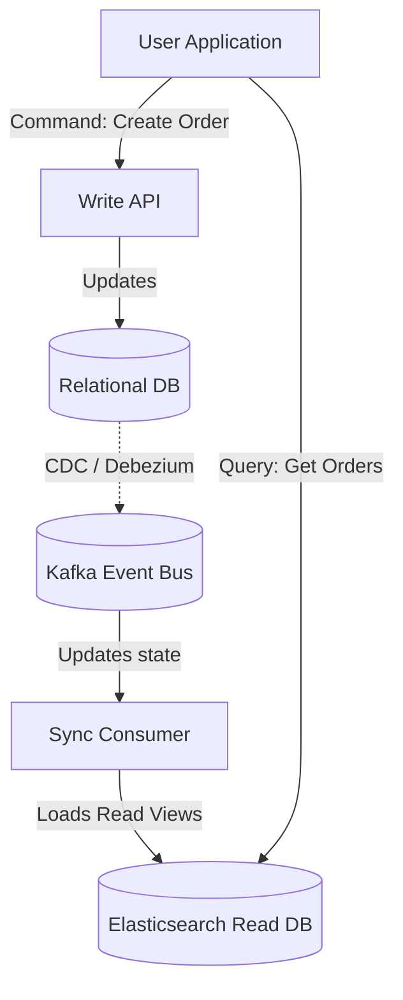

# Module 5.8: Kafka + Data Engineering

Welcome to **Kafka + Data Engineering**. Modern data platforms do not treat streaming and batch as separate systems. They combine them into unified architectures (like Lambda or Kappa Architectures). In this module, you will learn how to design streaming ETL/ELT pipelines, integrate Kafka with databases, and apply software patterns like Event Sourcing and CQRS.

---

## 1. Detailed Theory

### Unified Architectures
- **Kappa Architecture**: A software architecture pattern where all data processing is handled as a stream. Instead of separate batch and streaming codebases, you run everything through a stream processing engine (like Spark Streaming or Kafka Streams). If you need to reprocess historical data, you simply reset the consumer offset to 0 and re-stream the logs.
- **Event Sourcing**: Storing the state of an application as a sequence of events (e.g., instead of saving a bank balance of `$100`, you save `deposit $50`, `withdraw $20`, `deposit $70` in an immutable log).
- **CQRS (Command Query Responsibility Segregation)**: Segregating the operations that write data (Commands) from the operations that read data (Queries). Kafka acts as the event bus that keeps the read databases updated with write changes.

---

## 2. Architecture Diagram: CQRS with Kafka



---

## 3. Production Use Cases

1. **Customer 360 Real-Time Sync**: Ingesting user click events from Kafka and profile updates from databases via CDC. A streaming join aggregates these events to create a unified profile state, enabling immediate personalization on the web dashboard.
2. **Insurance Claims Streaming Platform**: Claims events stream into Kafka. Downstream Spark and Airflow jobs consume the events to update risk models, register claims status, and notify adjusters automatically.

---

## 4. Real Company Examples

- **Netflix**: Moved their telemetry infrastructure to a unified Kappa-like stream processing model, allowing them to recompute historical metrics simply by re-streaming Parquet log data through Spark.

---

## 5. Coding Examples

### Implementing CQRS Event Synchronization (Python Consumer)

```python
from confluent_kafka import Consumer
import json
import sqlite3

# Initialize Local SQLite database acting as the "Read DB"
conn = sqlite3.connect('read_store.db')
cursor = conn.cursor()
cursor.execute("CREATE TABLE IF NOT EXISTS customer_profiles (id TEXT PRIMARY KEY, email TEXT, active BOOLEAN)")
conn.commit()

# Configure Kafka Consumer to read database change event stream (CDC)
conf = {
    'bootstrap.servers': "localhost:9092",
    'group.id': "cqrs-read-sync",
    'auto.offset.reset': 'earliest'
}
consumer = Consumer(conf)
consumer.subscribe(['db.customer.changes'])

try:
    while True:
        msg = consumer.poll(timeout=1.0)
        if msg is None: continue
        
        # Parse CDC message payload
        event = json.loads(msg.value().decode('utf-8'))
        op = event.get("op") # c = create, u = update, d = delete
        
        # Update Read DB based on CDC event operation
        if op in ['c', 'u']:
            after_state = event.get("after")
            cursor.execute(
                "INSERT OR REPLACE INTO customer_profiles (id, email, active) VALUES (?, ?, ?)",
                (after_state["id"], after_state["email"], after_state["active"])
            )
        elif op == 'd':
            before_state = event.get("before")
            cursor.execute("DELETE FROM customer_profiles WHERE id = ?", (before_state["id"],))
            
        conn.commit()
        
except KeyboardInterrupt:
    pass
finally:
    consumer.close()
    conn.close()
```

---

## 6. Hands-on Labs

**Lab: Kappa Architecture Design**
**Objective**: Map execution flows.
**Instructions**:
A client wants to change their average order value formula. In a standard Batch/ETL system, you would rewrite a SQL script and run it over 3 years of tables.
Describe the steps to recalculate this metric in a **Kappa Architecture** (using Kafka log retention and offset management).

---

## 7. Assignments

**Assignment: Event Sourcing Audit**
Write a technical memo analyzing the auditing benefits of **Event Sourcing** (storing a stream of incremental transactions) over traditional state storage (overwriting a single row in a database). Under what scenarios is event sourcing a strict requirement for financial compliance?

---

## 8. Interview Questions

1. **What is the primary difference between Lambda and Kappa architectures?**
   *Answer Hint: Lambda architecture uses two parallel paths: a Batch layer (for historical accuracy, slow) and a Speed layer (for real-time streaming, fast). Kappa architecture simplifies this by removing the batch layer, processing all historical and streaming data through a single stream-processing engine.*
2. **What is CQRS?**
   *Answer Hint: Command Query Responsibility Segregation. A software pattern that separates the system components that modify data (Commands) from those that query data (Queries), using an event bus like Kafka to propagate updates from the write store to the read store.*

---

## 9. Best Practices (FDE Standards)

- **Use CDC for CQRS**: Do not rely on application-level double-writing (writing to database and publishing to Kafka concurrently in code). A database write might succeed but Kafka might fail, desynchronizing the systems. Use CDC (Debezium) to stream logs after database commits.
- **De-duplicate event streams**: In streaming ETL, always assume network failure will cause retries and duplicate messages. Enforce idempotency keys on the database level during consumption.

---

## 10. Common Mistakes

- **Swallowing delete events in ETL**: Ingesting database logs but ignoring `op='d'` (Delete) events, resulting in deleted source records remaining active in downstream reporting dashboards.
- **Over-relying on streaming for analytics**: Trying to perform complex, multi-table historical joins in streaming memory rather than landing data to a Lakehouse for Spark batch joins.
