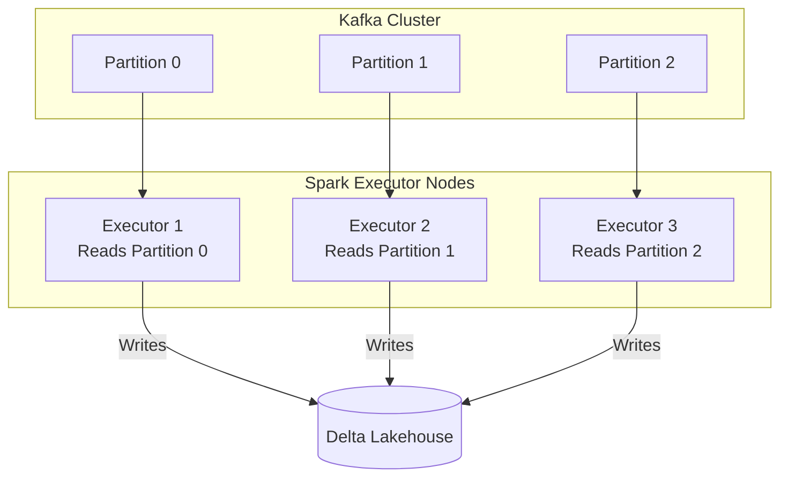

# Module 5.9: Kafka + Spark

Welcome to **Kafka + Spark**. As an FDE, you will frequently connect these two technologies: Kafka acts as the high-throughput real-time ingestion queue, while Spark Structured Streaming serves as the distributed computing engine that processes, enriches, and writes that stream at scale.

---

## 1. Detailed Theory

### Processing Integration
Spark Structured Streaming integrates natively with Kafka as a streaming source.
- Spark acts as a Kafka consumer. It queries the Kafka brokers for partition metadata and starts tasks that fetch events in parallel.
- **Micro-Batch Processing**: The default mode. Spark queries Kafka offsets, processes the batch of events that arrived since the last run, and writes results.
- **Continuous Processing (Low Latency)**: An experimental mode that achieves sub-millisecond end-to-end latency by continuously polling Kafka brokers, bypassing micro-batch overhead.

### Offset and State Tracking
To guarantee Exactly-Once semantics, Spark does not store offsets in Kafka.
- Spark records the processed offsets in its own internal **Checkpoint Directory** (on S3/GCS).
- If the Spark cluster restarts, it reads the checkpoint logs to see which Kafka offsets were successfully written to the destination sink, and fetches only the missing offsets from Kafka.

### Distributed Event Enrichment
- **Stream-Static Join**: Joining a Kafka stream (e.g., clicks) with a static dimension table (e.g., user profiles) loaded into Spark memory. The join occurs in parallel across executors.
- **Stream-Stream Join**: Joining two separate Kafka streams (e.g., clicks and orders) using a sliding time window constraint (e.g., join click and order events for a user that occur within 30 minutes of each other).

---

## 2. Architecture Diagram: Parallel Spark-Kafka Ingestion



---

## 3. Production Use Cases

1. **Real-Time Clickstream Enrichment**: Streaming user clicks from Kafka, joining them in real-time with a static user demographics table loaded from a SQL database, and writing conformed analytics back to a Delta Lake.
2. **Streaming Aggregations**: Calculating transaction rates per credit card in 1-minute sliding windows to trigger immediate security alerts.

---

## 4. Real Company Examples

- **Uber**: Connects Kafka and Spark Structured Streaming to aggregate driver and passenger location updates, calculating surge pricing multipliers in real-time.
- **Netflix**: Integrates Spark Streaming with Kafka queues to monitor real-time playback buffers, notifying engineers of localized CDN delivery degradation in seconds.

---

## 5. Coding Examples

### PySpark Structured Streaming Read & Write to Delta

```python
from pyspark.sql import SparkSession
import pyspark.sql.functions as F

spark = SparkSession.builder \
    .appName("SparkKafkaIntegration") \
    .config("spark.sql.shuffle.partitions", "4") \
    .getOrCreate()

# 1. Read Stream from Kafka topic
kafka_stream = spark.readStream \
    .format("kafka") \
    .option("kafka.bootstrap.servers", "localhost:9092") \
    .option("subscribe", "customer.transactions") \
    .option("startingOffsets", "latest") \
    .load()

# 2. Extract key and value fields (cast from binary to string)
parsed_df = kafka_stream.selectExpr(
    "CAST(key AS STRING) as transaction_id",
    "CAST(value AS STRING) as json_payload",
    "timestamp"
)

# 3. Parse JSON schema
json_schema = "user_id STRING, amount DOUBLE, type STRING"
enriched_df = parsed_df.select(
    F.col("transaction_id"),
    F.from_json(F.col("json_payload"), json_schema).alias("data"),
    F.col("timestamp")
).select("transaction_id", "data.*", "timestamp")

# 4. Stream-Static Join: Enrich with static blacklist in S3
blacklist_df = spark.read.parquet("s3://raw-security/blacklist/")

final_stream = enriched_df.join(
    F.broadcast(blacklist_df), 
    on="user_id", 
    how="left"
).withColumn("is_blocked", F.coalesce(F.col("blocked"), F.lit(False)))

# 5. Write output stream as Delta Table with Checkpoints
query = final_stream.writeStream \
    .format("delta") \
    .outputMode("append") \
    .option("checkpointLocation", "s3://lakehouse-checkpoints/transactions/") \
    .start("s3://lakehouse/gold/transactions/")

query.awaitTermination()
```

---

## 6. Hands-on Labs

**Lab: Stream-Stream Join Constraints**
**Objective**: Understand window boundaries.
**Instructions**:
Write the PySpark syntax to perform a **Stream-Stream Join** between an `impressions` DataFrame and a `clicks` DataFrame on `ad_id`, ensuring you define a watermark of 1 hour on both streams and restrict the join to clicks occurring within 30 minutes after the impression.

---

## 7. Assignments

**Assignment: Driver-Broker Connection Management**
Explain why Spark executors talk directly to Kafka brokers during execution, while only the Driver queries the cluster for partition offsets. What would happen to the Driver if it had to fetch all message bytes and distribute them to executors?

---

## 8. Interview Questions

1. **How does Spark Structured Streaming handle partition discovery in Kafka?**
   *Answer Hint: The Spark Driver queries the Kafka cluster coordinator at the start of each micro-batch. If new partitions are added to the topic, Spark automatically creates new executor tasks to read from the new partitions in the next micro-batch.*
2. **Where does Spark store Kafka offsets to ensure exactly-once processing?**
   *Answer Hint: Spark records the processed offsets in its metadata log within the `checkpointLocation` directory. It does not commit offsets back to Kafka (`__consumer_offsets`), ensuring that the offset state remains perfectly consistent with the target database writes.*

---

## 9. Best Practices (FDE Standards)

- **Use Broadcast for static joins**: When joining a stream with a lookup table smaller than 100MB, always broadcast the static table. Shuffling a streaming dataset is extremely expensive.
- **Match Partition Counts**: Ensure your Kafka topic partition count is at least equal to the number of Spark executor cores allocated to the streaming job, allowing for 1-to-1 parallel task assignment.

---

## 10. Common Mistakes

- **Omitting Kafka Package Configs**: Starting a PySpark shell without specifying the Kafka connector package coordinates (`--packages org.apache.spark:spark-sql-kafka-0-10_2.12:3.x.x`), causing the read operation to fail on start.
- **Ignoring Checkpoint Bucket Limits**: Storing checkpoints on a storage class with slow directory listings, leading to micro-batch execution delays.
