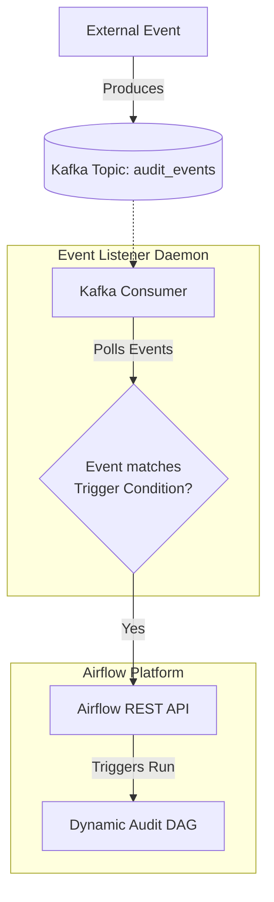

# Module 5.10: Kafka + Airflow

Welcome to **Kafka + Airflow**. Real-time streaming (Kafka) and batch orchestration (Airflow) are complementary. Airflow handles the scheduling, controls Kafka Connect setups, monitors stream lag, and uses events in Kafka to trigger dynamic workflow executions. In this module, you will learn how to build event-driven pipelines and monitor streaming health.

---

## 1. Detailed Theory

### Event-Driven Orchestration Triggers
Traditional Airflow pipelines run on time-based schedules (e.g., daily). Event-driven pipelines are triggered by data.
- **Kafka Sensor / Listener**: An Airflow sensor pokes a Kafka topic, waiting for a specific event (or message threshold) before letting the DAG proceed.
- **Triggering DAGs via API**: A lightweight Kafka consumer service listens to a topic. When a specific event is found (e.g., `model_drift_detected`), the consumer calls the Airflow REST API to trigger a retraining DAG immediately.

### Streaming Pipeline Control
Airflow coordinates the operational lifecycle of Kafka components:
- **Connector Management**: Automatically updating, pausing, or restarting Kafka Connect tasks via REST API queries.
- **Lag Monitoring**: Schedulers check consumer group offset lag against broker offsets. If lag exceeds thresholds, Airflow triggers notification alerts or spins up more consumer containers on Kubernetes.

---

## 2. Architecture Diagram: Event-Driven DAG Triggering



---

## 3. Production Use Cases

1. **Enterprise Data Platform Ingest**: An Airflow DAG is triggered when a file upload completes. Airflow spins up a Kafka connector to stream the file data into a Kafka topic, runs schema checks, and shuts down the connector once processing metrics are verified.
2. **Automated Incident Response**: An infrastructure topic logs error events. A consumer service detects 5 consecutive database timeouts, calls the Airflow API, and triggers an recovery DAG to restart database replicas.

---

## 4. Real Company Examples

- **Airbnb**: Orchestrates their heavy streaming connectors using Airflow DAGs, automating the recovery of stuck JDBC source connectors dynamically.

---

## 5. Coding Examples

### Triggering an Airflow DAG from a Kafka Event Listener (Python)

```python
from confluent_kafka import Consumer
import requests
import json

# 1. Initialize Kafka Consumer to listen for trigger events
conf = {
    'bootstrap.servers': "localhost:9092",
    'group.id': "airflow-event-trigger",
    'auto.offset.reset': 'latest'
}
consumer = Consumer(conf)
consumer.subscribe(['system-alerts'])

# 2. Airflow Trigger Configuration
AIRFLOW_API_URL = "http://localhost:8080/api/v1/dags/auto_retrain_model/dagRuns"
AIRFLOW_AUTH = ("admin", "admin") # API Basic Auth

print("Listening for Kafka events to trigger Airflow...")

try:
    while True:
        msg = consumer.poll(timeout=1.0)
        if msg is None: continue
        
        event = json.loads(msg.value().decode('utf-8'))
        alert_type = event.get("alert_type")
        
        # 3. Check for specific condition to trigger DAG
        if alert_type == "MODEL_DRIFT":
            print("Drift detected! Triggering Airflow DAG...")
            
            payload = {
                "conf": {
                    "model_id": event.get("model_id"),
                    "drift_score": event.get("drift_score")
                }
            }
            
            # Post request to Airflow REST API
            response = requests.post(
                AIRFLOW_API_URL,
                json=payload,
                auth=AIRFLOW_AUTH,
                headers={"Content-Type": "application/json"}
            )
            
            if response.status_code == 201:
                print("Successfully triggered Airflow DAG!")
            else:
                print(f"Failed to trigger DAG: {response.text}")
                
except KeyboardInterrupt:
    pass
finally:
    consumer.close()
```

---

## 6. Hands-on Labs

**Lab: REST API Authentication**
**Objective**: Configure Airflow API permissions.
**Instructions**:
Write the step-by-step instructions to enable the REST API in Airflow (`airflow.cfg` configurations) and generate a service account token to allow external Kafka consumers to execute trigger commands securely.

---

## 7. Assignments

**Assignment: Monitoring Lag via DAG**
Write a design proposal for an Airflow DAG that runs every 10 minutes to verify if the consumer group `checkout-analytics-group` is falling behind its Kafka partitions. Detail what endpoints or CLI utilities you would call and how you would trigger a Slack alert.

---

## 8. Interview Questions

1. **Why is it a bad pattern to let an Airflow Sensor listen to a Kafka topic indefinitely?**
   *Answer Hint: Airflow worker nodes have limited execution slots. If a sensor runs in 'poke' mode indefinitely waiting for an event, it consumes a worker thread 24/7, blocking other scheduled DAGs from running. Always use 'reschedule' mode or trigger DAGs externally via API.*
2. **What does triggering a DAG with a 'conf' payload do?**
   *Answer Hint: It allows you to pass custom runtime variables (like a specific model ID or filepath) from the triggering event into the Airflow DAG context, which tasks can access dynamically at execution time.*

---

## 9. Best Practices (FDE Standards)

- **Use Reschedule Mode for Sensors**: If you use a `KafkaSensor` in Airflow, always configure `mode='reschedule'`. This releases the worker slot between checks, preventing resource starvation.
- **Externalize Listeners**: Prefer running lightweight, containerized consumer microservices to listen for events and trigger Airflow via API, rather than hosting listening logic inside Airflow.

---

## 10. Common Mistakes

- **Blocking API Calls**: Triggering an Airflow DAG from a Kafka consumer loop synchronously without timeout limits, causing the consumer to hang if the Airflow webserver goes offline.
- **Rate-limit storms**: Triggering a new DAG run for every single event in a high-volume topic, crashing the Airflow metadata database. (Aggregate events before calling the API).
