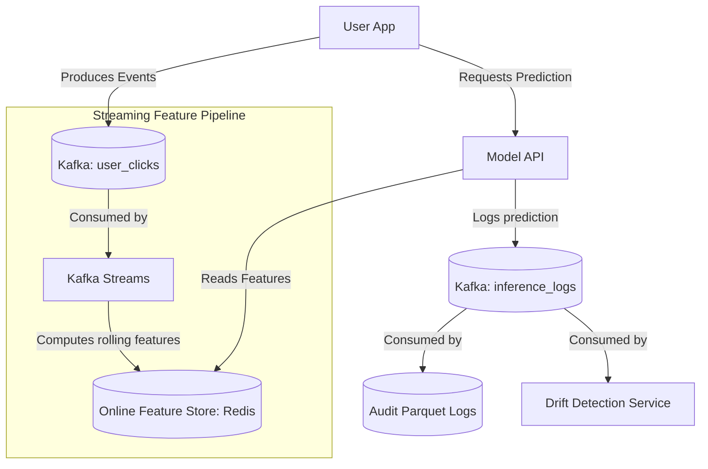

# Module 5.11: Kafka + MLOps

Welcome to **Kafka + MLOps**. Traditional batch machine learning predicts on static database records. Real-time machine learning processes streaming user actions to serve immediate recommendations or block fraudulent card swipes. Kafka acts as the event pipeline that streams features, logs inference events, and monitors model drift.

---

## 1. Detailed Theory

### Real-Time Feature Ingestion
For real-time model serving, you cannot wait for Spark batch feature aggregations.
- **Feature Streaming**: User activities stream into Kafka topics. Stream processors (like Kafka Streams or Flink) compute rolling window aggregates (e.g., `spend_last_5_minutes`) and write them immediately to an Online Feature Store (like Redis).
- When a user requests a prediction, the model API reads the pre-computed streaming features from the online store in milliseconds.

### Inference Event Logging
Every time a model makes a prediction in production, the input features and output score should be published as an event to an `inference_logs` Kafka topic.
- A downstream consumer saves these logs to a database for historical auditing.
- Concurrently, a drift detection service reads the stream to evaluate if model predictions are drifting from the historical baseline.

---

## 2. Architecture Diagram: Streaming Feature Store & Inference Logging



---

## 3. Production Use Cases

1. **Real-Time Recommendation System**: Ingesting user click events from Kafka, updating user preferences in an online feature store in real-time, and using the updated features to rank homepage items on the next page load.
2. **Fraud Detection Pipeline**: Streaming transaction events through a model API, logging inputs and probabilities to Kafka, and immediately alerting operators if transaction velocities shift.

---

## 4. Real Company Examples

- **Uber (Michelangelo)**: Connects Kafka streams to their feature store online database, enabling drivers' locations and routing telemetry features to stay updated in real-time.
- **Stitch Fix**: Streams style feedback and user preference updates to coordinate microservices running real-time recommendation rankers.

---

## 5. Coding Examples

### Streaming Model Inference Log Producer (Python)

This script shows how a model serving API logs predictions to a Kafka topic for downstream auditing and monitoring.

```python
from confluent_kafka import Producer
import json
import time

# 1. Configure Producer for logging
conf = {'bootstrap.servers': "localhost:9092", 'acks': 1}
producer = Producer(conf)

def predict_and_log(user_id, input_features):
    # Simulating model prediction logic
    prediction_score = 0.89  # Churn probability
    prediction_time = int(time.time())
    
    # 2. Package inputs, outputs, and metadata into a structured log
    inference_log = {
        "user_id": user_id,
        "features": input_features,
        "prediction": prediction_score,
        "model_version": "churn_model_v2.1",
        "timestamp": prediction_time
    }
    
    # 3. Publish log to Kafka asynchronously (non-blocking for the API)
    producer.produce(
        topic='model.inference.logs',
        key=user_id.encode('utf-8'),
        value=json.dumps(inference_log).encode('utf-8')
    )
    # Trigger callbacks
    producer.poll(0)
    
    return prediction_score

# Run a test prediction
features = {"avg_session_duration": 120.5, "days_active": 5}
score = predict_and_log("user_90210", features)
producer.flush()
```

---

## 6. Hands-on Labs

**Lab: Drift Detection Sensor**
**Objective**: Build a basic drift monitor.
**Instructions**:
Write a python consumer script that reads from the `model.inference.logs` topic, calculates the moving average of `prediction` scores over the last 100 messages, and prints an alert if the average score shifts by more than 30% from a baseline score of `0.50`.

---

## 7. Assignments

**Assignment: Online Feature Store Latency**
Compare the lookup latency and scalability of using a Relational Database (SQL) vs. a Key-Value Store (Redis/DynamoDB) as the **Online Feature Store** for a model API that receives 50,000 requests per second. Explain why the database selection is critical for user-facing systems.

---

## 8. Interview Questions

1. **Why do we write inference logs to Kafka instead of writing directly to a SQL database from the model API?**
   *Answer Hint: Writing to a SQL database is synchronous and adds write latency (50-200ms) to the model API response, which degrades the user experience. Publishing to Kafka is asynchronous and takes sub-milliseconds. Downstream consumers can write logs to databases in parallel without affecting the API's responsiveness.*
2. **What is training-serving skew, and how does Kafka help prevent it?**
   *Answer Hint: Training-serving skew is when features used in model training differ from features received during live prediction. By using a unified streaming feature store, you guarantee that feature logic is calculated consistently across both training (offline) and serving (online) environments.*

---

## 9. Best Practices (FDE Standards)

- **Do Not Block Model APIs**: Ensure all logging to Kafka Connect or brokers uses asynchronous producers with flush queues to prevent blocking response paths.
- **Enforce Schemas on Logs**: Use Avro or Protobuf for inference logs to ensure that downstream auditing tools can always parse metrics safely.

---

## 10. Common Mistakes

- **Swallowing delivery errors**: Failing to monitor Kafka producer delivery exceptions on the model server, resulting in lost audit logs.
- **Storing PII in logs**: Logging sensitive user details (like passwords, names, or cleartext credit card numbers) to Kafka topics where auditing systems can read them. Mask data first.
