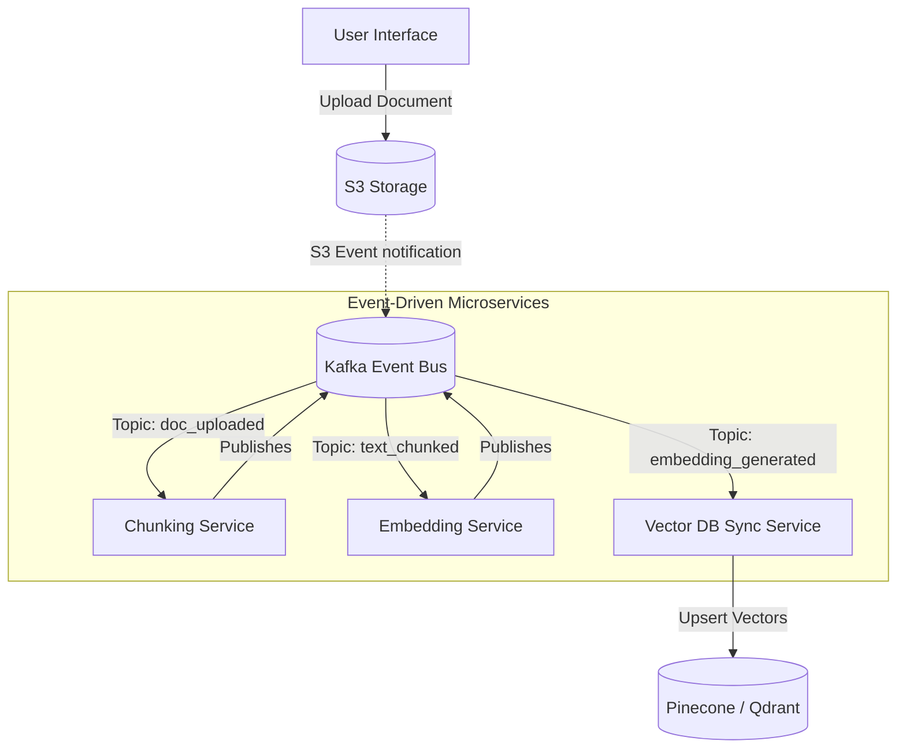

# Module 5.12: Kafka + LLMOps

Welcome to **Kafka + LLMOps**. Generative AI introduces new orchestration challenges: processing massive documents, coordinate multi-agent communications, and syncing vector databases. In this module, you will learn how to use Kafka as an event-driven backplane to manage RAG ingestion stages, coordinate AI Agent messaging, and track model pipelines.

---

## 1. Detailed Theory

### Event-Driven RAG Ingestion
Instead of processing files in large, synchronous chunks, modern LLMOps uses an event-driven architecture:
1. **Document Upload**: A document is saved to S3, publishing a `document_uploaded` event to Kafka.
2. **Text Chunking**: A chunking microservice reads the event, downloads the file, splits it into chunks, and publishes a `text_chunked` event containing the text blocks to Kafka.
3. **Embedding Generation**: An embedding microservice reads the chunks, calls the embedding API in parallel, and publishes an `embedding_generated` event.
4. **Vector DB Ingest**: A sync microservice reads the embeddings and writes them to Pinecone/Qdrant.

### Multi-Agent Communication
When building complex systems where multiple specialized LLM agents work together (e.g., researcher -> writer -> editor), the agents communicate via a Kafka message bus:
- Each agent runs as a microservice subscribing to the `agent_communication` topic.
- Kafka's message keys (e.g., `task_id`) ensure all messages related to a specific project route to the same thread, preserving execution context.

---

## 2. Architecture Diagram: Event-Driven RAG Ingestion Pipeline



---

## 3. Production Use Cases

1. **Enterprise Knowledge Base platform**: A company embeds Confluence pages. When pages are modified, a webhook streams changes to Kafka. Independent consumer microservices handle chunking, embedding, and vector synchronization in parallel, keeping the database updated in seconds.
2. **Multi-Agent Coding Workspace**: Connecting 3 coding agents (Planner, Coder, Tester) via a Kafka topic. Each agent reads instructions, publishes task statuses, and handles errors asynchronously.

---

## 4. Real Company Examples

- **Palantir (AIP)**: Merges streaming ontology events with LLM agent systems, coordinating how multiple agents read corporate data models via a real-time event pipeline.
- **Scale AI**: Integrates Kafka topics to pass document segments and labeling states between human-in-the-loop workers and LLM processing nodes.

---

## 5. Coding Examples

### Event-Driven Document Ingestion (Python Consumer-Producer)

This script shows the **Embedding Service** in the pipeline: it consumes chunked text events, calls the OpenAI API, and produces embedding events for the Vector DB Sync Service.

```python
from confluent_kafka import Consumer, Producer
import json
import openai

# 1. Configure Kafka Clients
consumer_conf = {'bootstrap.servers': "localhost:9092", 'group.id': "embedding-service", 'auto.offset.reset': 'earliest'}
producer_conf = {'bootstrap.servers': "localhost:9092", 'acks': 1}

consumer = Consumer(consumer_conf)
producer = Producer(producer_conf)

consumer.subscribe(['text.chunks'])

print("Embedding Service Listening for chunks...")

try:
    while True:
        msg = consumer.poll(timeout=1.0)
        if msg is None: continue
        
        # 2. Consume text chunk event
        event = json.loads(msg.value().decode('utf-8'))
        doc_id = event["document_id"]
        chunk_index = event["chunk_index"]
        text_content = event["text"]
        
        # 3. Call OpenAI Embedding API
        response = openai.Embedding.create(
            input=text_content,
            model="text-embedding-3-small"
        )
        vector = response['data'][0]['embedding']
        
        # 4. Create and publish embedding event
        embedding_event = {
            "document_id": doc_id,
            "chunk_index": chunk_index,
            "embedding": vector,
            "metadata": {"text": text_content, "source": event["source"]}
        }
        
        producer.produce(
            topic='document.embeddings',
            key=doc_id.encode('utf-8'),
            value=json.dumps(embedding_event).encode('utf-8')
        )
        producer.poll(0)
        
except KeyboardInterrupt:
    pass
finally:
    consumer.close()
```

---

## 6. Hands-on Labs

**Lab: Multi-Agent Topology Design**
**Objective**: Map communication routing.
**Instructions**:
Write down a Kafka topic design for a three-agent system consisting of:
- `research_agent`
- `writer_agent`
- `critic_agent`
Decide whether you should use one single topic with message metadata filtering, or three independent topics. Explain your design choice.

---

## 7. Assignments

**Assignment: Asynchronous RAG Consistency**
In an event-driven RAG pipeline, a document is deleted on the user interface. Describe how you would route the deletion event through Kafka to ensure the chunk text is removed, the vectors are deleted in Pinecone, and downstream LLM agents no longer access the source files.

---

## 8. Interview Questions

1. **Why use an event-driven Kafka pipeline for RAG ingestion instead of a simple cron script?**
   *Answer Hint: RAG ingestion involves heavy file parsing, NLP text splitting, and calling external APIs, which can take a long time and fail. A cron script is a single point of failure and hard to scale. A Kafka pipeline splits the work into isolated microservices that scale independently and retry on failure without losing their place in the queue.*
2. **How does partitioning help in multi-agent communication workloads?**
   *Answer Hint: If multiple projects/conversations are processed concurrently, using `conversation_id` as the message key ensures that all messages for a specific conversation route to the same partition. This guarantees strict chronological message order for the agent reading the stream.*

---

## 9. Best Practices (FDE Standards)

- **Decouple Chunking and Embedding**: Keep chunking and embedding logic in separate services connected by Kafka. This allows you to scale up the embedding containers (which wait on slow APIs) without wasting resources on the CPU-bound chunking containers.
- **Implement Dead Letter Queues for Unparseable Files**: If a PDF is corrupted and fails text extraction, publish it to a `failed_documents` topic for manual review instead of crashing the consumer loop.

---

## 10. Common Mistakes

- **JSON Payload Bloat**: Passing the full text of a 50-page document inside the Kafka event payload. This exceeds Kafka's message size limits (default is 1MB). Store the document on S3 and pass the S3 URL in the event instead.
- **Ignoring API Rate Limits**: Running 50 concurrent consumer threads that call OpenAI without rate-limit retry logic, causing the embedding phase to halt.
