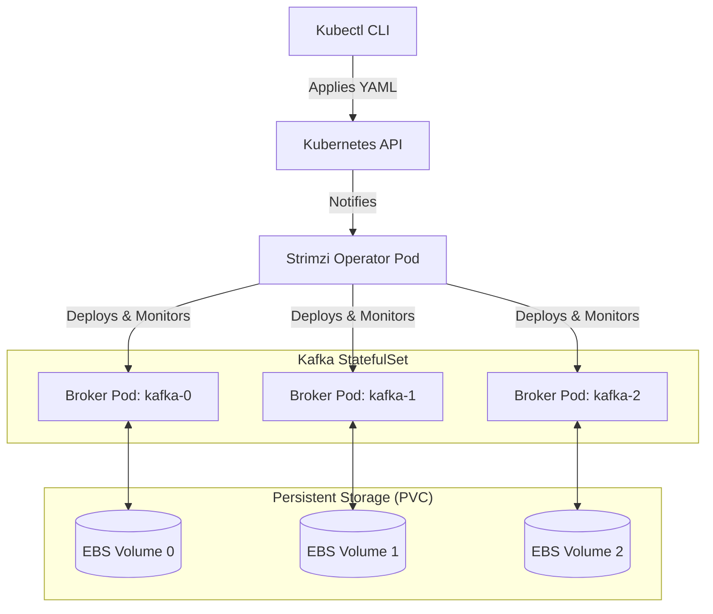

# Module 5.13: Kafka on Kubernetes

Welcome to **Kafka on Kubernetes**. In modern cloud-native environments, hosting stateful systems (like databases and queues) on Kubernetes is standard practice. Kafka has unique requirements on Kubernetes because it is a stateful service: brokers need stable network identities and persistent disks. In this module, you will learn how to deploy and manage production-grade Kafka clusters on Kubernetes using the **Strimzi Operator**.

---

## 1. Detailed Theory

### StatefulSets and Persistent Volumes
- **StatefulSet**: Unlike standard stateless Deployments (where pods are interchangeable and have random names), a StatefulSet maintains a sticky identity for each pod (e.g., `kafka-0`, `kafka-1`, `kafka-2`). The identities are persistent across restarts.
- **Persistent Volume Claims (PVC)**: Each broker pod must be linked to its own physical cloud disk (AWS EBS, GCP Persistent Disk) that stores the partition logs. If a broker pod crashes, Kubernetes recreates it and remounts the exact same disk to prevent data loss.

### Strimzi Operator
The **Strimzi Operator** is the CNCF standard for running Kafka on Kubernetes.
- It uses Custom Resource Definitions (CRDs) allowing you to declare your Kafka cluster, Kafka Connect setup, and even individual topics as standard Kubernetes YAML files.
- Strimzi handles the operational complexity: upgrading brokers without downtime, configuring security, and generating certificates automatically.

---

## 2. Architecture Diagram: Strimzi Operator Topology



---

## 3. Production Use Cases

1. **Cloud-Native Event Platform**: Deploying a shared, multi-broker Kafka cluster on AWS EKS using Strimzi. The cluster uses EBS volumes for storage, authenticates client connections via TLS certificates, and automates topic creation using Kubernetes YAML manifests.
2. **Dynamic Connector Deployment**: Sizing and deploying Kafka Connect clusters on Kubernetes, allowing tasks to scale dynamically based on Kafka consumer lag metrics.

---

## 4. Real Company Examples

- **Lyft**: Runs their entire event backbone on AWS EKS, managing hundreds of brokers and connectors using containerized operators.
- **Cisco**: Manages global IoT data ingestion pipelines by hosting Strimzi-backed Kafka clusters across multiple GKE environments.

---

## 5. Coding Examples

### Declaring a Kafka Cluster on Kubernetes (Strimzi Custom Resource)

This YAML file is applied to a Kubernetes cluster running the Strimzi Operator to automatically spin up a 3-broker cluster.

```yaml
# kafka-cluster.yaml
apiVersion: kafka.strimzi.io/v1beta2
kind: Kafka
metadata:
  name: production-cluster
  namespace: kafka-infra
spec:
  kafka:
    version: 3.5.1
    replicas: 3
    listeners:
      - name: plain
        port: 9092
        type: internal
        tls: false
      - name: tls
        port: 9093
        type: internal
        tls: true
        authentication:
          type: tls
    config:
      offsets.topic.replication.factor: 3
      transaction.state.log.replication.factor: 3
      transaction.state.log.min.isr: 2
      default.replication.factor: 3
      min.insync.replicas: 2
    storage:
      type: persistent-claim
      size: 100Gi
      class: gp3 # AWS GP3 storage class
      deleteClaim: false # Do not delete physical disk if cluster is deleted
  zookeeper:
    replicas: 3
    storage:
      type: persistent-claim
      size: 10Gi
      class: gp3
```

---

## 6. Hands-on Labs

**Lab: Declaring a Topic via YAML**
**Objective**: Build a topic CRD.
**Instructions**:
Write the YAML configuration for a Strimzi `KafkaTopic` custom resource named `user-signups`. Configure it to target the `production-cluster` Kafka instance, with `3 partitions` and a `replication factor of 3`. (Hint: Look up `KafkaTopic` apiVersion and specs).

---

## 7. Assignments

**Assignment: StatefulSets vs. Deployments**
Write a technical analysis explaining why you cannot deploy an Apache Kafka broker cluster using standard Kubernetes **Deployments** and must use **StatefulSets** instead. Focus on network resolution (headless services) and disk mounting behaviors during pod failures.

---

## 8. Interview Questions

1. **What is the Strimzi Operator?**
   *Answer Hint: Strimzi is a Kubernetes operator that simplifies the deployment, configuration, management, and scaling of Apache Kafka clusters and components on Kubernetes, utilizing Custom Resources like `Kafka`, `KafkaConnect`, and `KafkaTopic`.*
2. **What does the parameter `deleteClaim: false` guarantee in a Strimzi configuration?**
   *Answer Hint: It ensures that if the Kubernetes `Kafka` resource is deleted (manually or due to an error), the underlying cloud storage volumes (Persistent Volumes) containing the topic data logs are NOT deleted, preventing permanent data loss.*

---

## 9. Best Practices (FDE Standards)

- **Set deleteClaim to False**: Always configure `deleteClaim: false` on production Kafka and Zookeeper storage. Disks should be deleted manually by administrators only.
- **Use headful/headless services**: Configure headless services to assign persistent DNS names (e.g., `kafka-0.kafka-headless.kafka-infra.svc.cluster.local`) to each broker pod to ensure stable routing.

---

## 10. Common Mistakes

- **Storing Logs on Ephemeral EmptyDir**: Sizing storage using `type: ephemeral` (which uses the host node's temporary storage). If the pod restarts, all topic messages are deleted.
- **Starving brokers of CPU/RAM**: Setting Kubernetes resource requests too low, causing memory-intensive Java/Kafka JVMs to freeze during heavy disk writes.
