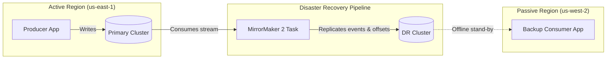

# Module 5.14: Production Kafka

Welcome to **Production Kafka**. Moving from a local single-node docker compose to an enterprise production cluster requires addressing the operational realities of scalability tuning, high availability, security controls, and disaster recovery. In this module, you will learn how to secure connections, analyze metrics, and configure disaster recovery tools.

---

## 1. Detailed Theory

### Security Controls
Unsecured Kafka clusters are major liabilities. You must implement security on three layers:
1. **Encryption (SSL/TLS)**: Encrypting traffic between clients and brokers, and between brokers internally.
2. **Authentication (SASL)**: Verifying client identities.
   - **SASL/PLAIN**: Simple username/password authentication (must run over SSL).
   - **SASL/SCRAM**: Cryptographically salted passwords stored in ZooKeeper/Metadata.
   - **Mutual TLS (mTLS)**: Using client certificates for authentication.
3. **Authorization (ACLs)**: Fine-grained access control lists specifying exactly which user can read or write to which topic.

### Observability
To monitor cluster health, you must track metrics using tools like the **Kafka Exporter** integrated with Prometheus and Grafana. Key metrics to monitor include:
- **Under-Replicated Partitions**: The count of partitions that do not have the requested replication factor active. Any number > 0 indicates a broker failure or network issue.
- **Consumer Group Lag**: The difference between the latest broker offset and the consumer committed offset. High lag indicates a slow or stuck consumer.
- **Broker Bytes In/Out**: Network bandwidth utilization.

### Disaster Recovery
- **Exactly-Once Semantics (EOS)**: Combining idempotent producers, transactional writes across multiple topics, and committed offsets to guarantee that data is processed exactly once from end-to-end.
- **MirrorMaker 2**: An open-source tool used to replicate topics and offset mappings across geographical regions (e.g., active-passive setup between `us-east-1` and `us-west-2` for disaster recovery).

---

## 2. Architecture Diagram: Disaster Recovery with MirrorMaker 2



---

## 3. Production Use Cases

1. **Enterprise Security Audit**: Securing a bank's event broker. You configure the brokers to only accept connections over SASL_SSL, register ACL rules restricting the AI team's service account to read-only access on specific topics, and enforce TLS encryption on disk.
2. **Geographic Failure Recovery**: A company hosts their primary Kafka cluster in Europe. Using MirrorMaker 2, they stream all checkout events in real-time to a backup cluster in the US. When the Europe data center goes offline, DNS routes traffic to the US cluster, and consumers resume processing.

---

## 4. Real Company Examples

- **Salesforce**: Connects global networks of Kafka clusters using MirrorMaker to ensure customer transactional events are synchronized across geographical data centers for low-latency reporting.
- **Capital One**: Relies on strict ACL configurations and SASL/SCRAM authentication to enforce regulatory compliance (SOC2/PCI) across all streaming database records.

---

## 5. Coding Examples

### Defining Topic Access Control Lists (ACLs)

Using the Kafka admin CLI to restrict access to a specific user principal.

```bash
# 1. Allow User 'ai-agent' to Read from Topic 'customer-data'
kafka-acls.sh --bootstrap-server localhost:9092 \
    --add \
    --allow-principal User:ai-agent \
    --operation Read \
    --topic customer-data \
    --group *

# 2. Allow User 'web-app' to Write to Topic 'customer-data'
kafka-acls.sh --bootstrap-server localhost:9092 \
    --add \
    --allow-principal User:web-app \
    --operation Write \
    --topic customer-data

# 3. List active ACLs for validation
kafka-acls.sh --bootstrap-server localhost:9092 --list
```

---

## 6. Hands-on Labs

**Lab: Metric Identification**
**Objective**: Identify critical alerts.
**Instructions**:
Write down the specific actions you would take (e.g., scale consumers, restart brokers, check network) if your Grafana dashboard triggers alerts for:
1. `UnderReplicatedPartitions > 0`
2. `Consumer Lag on user-checkout topic > 100,000`

---

## 7. Assignments

**Assignment: Exactly-Once Semantics (EOS)**
Explain how Kafka achieves **Exactly-Once Semantics** from a software architecture perspective. Define the role of the **Transaction Coordinator** and transactional IDs in ensuring that a consumer reading from Topic A and writing to Topic B either completes both actions successfully or rolls back completely.

---

## 8. Interview Questions

1. **What is an under-replicated partition and why is it dangerous?**
   *Answer Hint: An under-replicated partition means that one or more follower replicas are not synchronized with the leader partition. If the leader broker crashes, there is a risk of data loss or topic unavailability since there are no caught-up followers to take over.*
2. **What is the difference between SASL and SSL in Kafka?**
   *Answer Hint: SSL (or TLS) is used to encrypt the network communication channel between clients and brokers. SASL is used for authentication (proving who the client is, e.g., via username/password or Kerberos).*

---

## 9. Best Practices (FDE Standards)

- **Always Monitor Consumer Lag**: Do not just monitor CPU/Memory. Consumer offset lag is the most critical metric for identifying bottlenecks in streaming architectures.
- **Enforce SASL_SSL**: Never allow unencrypted plaintext connections (`PLAINTEXT://`) in production environments. Always secure endpoints with TLS and authentication.

---

## 10. Common Mistakes

- **Wildcard ACLs**: Assigning wildcard write permissions (`--operation All --topic *`) to developer service accounts, allowing a bug in a development script to overwrite production logs.
- **Ignoring Broker Disk Limits**: Letting topic retention run indefinitely without size limits, causing broker disks to fill up and forcing the entire Kafka cluster into a read-only locked state.
