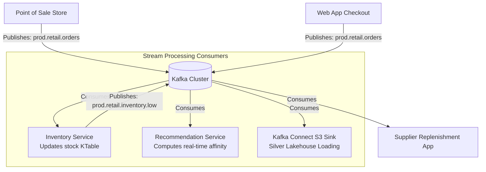

# Module 5.15: Enterprise Kafka Architectures

Welcome to the final module of the Kafka curriculum: **Enterprise Kafka Architectures**. As a Forward Deployed Engineer, you will design architectures where Kafka acts as the central event nervous system. In this module, you will learn how to design streaming topologies and topic namespaces for Customer 360, Banking, Insurance, and Retail platforms.

---

## 1. Detailed Theory

### Core Architecture Design Rules
1. **Domain-Driven Design (DDD)**: Group topics by business domains (e.g., `billing`, `inventory`, `shipping`) rather than technical layers.
2. **Standardized Naming Conventions**: Enforce a strict topic naming standard (e.g., `environment.domain.subdomain.event_type`, such as `prod.retail.inventory.replenished`).
3. **Partition Sizing**: Align partition counts with the maximum expected parallel consumer counts and CPU limits.

### Platform Architectures
- **Customer 360 Event Platform**: Streaming customer actions, login checks, and purchase records to Kafka. Real-time stream processors join these streams on `user_id` keys to update customer profile states dynamically.
- **Banking Transaction Platform**: Financial actions require absolute delivery guarantees. Topics are configured with `min.insync.replicas=2` and `acks=all`. A transaction event is produced, processed, and checked for fraud within a sub-second window.

---

## 2. Architecture Diagram: Enterprise Retail Streaming Architecture



---

## 3. Production Use Cases

1. **Banking Real-time Transaction Routing**: Ingesting credit card swipes to a `prod.banking.transactions` topic. You configure the topic with strict exactly-once transactional settings, routing events through a fraud scoring microservice before releasing the transaction to the ledger database.
2. **Retail Inventory Replenishment**: Online and offline store sales publish to `prod.retail.sales`. A stream-processing application updates inventory counts in real-time, publishing `inventory_low` events when stock falls below thresholds.

---

## 4. Real Company Examples

- **Walmart**: Connects thousands of retail stores, distribution centers, and their e-commerce web platform using Kafka, streaming every purchase to coordinate dynamic logistics and supply chain replenishment in real-time.
- **Capital One**: Uses a centralized, multi-tenant Kafka event platform that hosts hundreds of individual finance domain topics, using strict ACL permissions and schemas to ensure compliance.

---

## 5. Coding Examples

### Multi-Domain Event Processing Topology (Conceptual Design)

This Python script models an orchestrator that splits an incoming `raw_orders` stream into domain-specific topics (`inventory` and `finance`) based on payload checks.

```python
from confluent_kafka import Consumer, Producer
import json

# Configure Clients
consumer_conf = {'bootstrap.servers': "localhost:9092", 'group.id': "retail-dispatcher", 'auto.offset.reset': 'earliest'}
producer_conf = {'bootstrap.servers': "localhost:9092", 'acks': 1}

consumer = Consumer(consumer_conf)
producer = Producer(producer_conf)

consumer.subscribe(['prod.retail.raw_orders'])

print("Retail Dispatcher Streaming...")

try:
    while True:
        msg = consumer.poll(timeout=1.0)
        if msg is None: continue
        
        event = json.loads(msg.value().decode('utf-8'))
        order_id = event["order_id"]
        items = event["items"]
        total_price = event["total_price"]
        
        # 1. Dispatch Event to Inventory Domain
        inventory_event = {"order_id": order_id, "items": items}
        producer.produce(
            topic='prod.retail.inventory.orders',
            key=order_id.encode('utf-8'),
            value=json.dumps(inventory_event).encode('utf-8')
        )
        
        # 2. Dispatch Event to Finance/Billing Domain
        billing_event = {"order_id": order_id, "total_price": total_price}
        producer.produce(
            topic='prod.retail.finance.billing',
            key=order_id.encode('utf-8'),
            value=json.dumps(billing_event).encode('utf-8')
        )
        
        # Poll to trigger callbacks
        producer.poll(0)
        
except KeyboardInterrupt:
    pass
finally:
    consumer.close()
```

---

## 6. Hands-on Labs

**Lab: Naming Convention Design**
**Objective**: Build structured names.
**Instructions**:
A company is designing a data platform with three environments (`dev`, `staging`, `prod`), two domains (`logistics`, `billing`), and three event types (`created`, `updated`, `deleted`).
Write down the specific topic names for:
1. Production billing creations.
2. Development logistics deletions.

---

## 7. Assignments

**Assignment: Multi-Tenant Tenant Isolation**
Design a Kafka topic and partition architecture for a multi-tenant retail SaaS platform where 100 different companies (tenants) send orders.
Explain:
1. The trade-offs of using **One Topic per Tenant** (e.g., `prod.tenantA.orders`, `prod.tenantB.orders`) vs. **Shared Topic with Key Partitioning** (e.g., `prod.retail.orders` where `key = tenant_id`).
2. How to ensure security isolation in each scenario.

---

## 8. Interview Questions

1. **What is Domain-Driven Design (DDD) in Kafka topic architecture?**
   *Answer Hint: DDD is the practice of structuring Kafka topics around business domains and capability boundaries (e.g., `billing`, `inventory`, `checkout`) rather than technical details (e.g., `python-service-topic`, `database-updates-topic`). This aligns data streams with business ownership and schemas.*
2. **Why is a consistent topic naming convention critical in enterprise platforms?**
   *Answer Hint: Without naming conventions, different teams create overlapping, confusing topics (e.g., `order_updates`, `orders_v2`, `completed-orders`), making it impossible to govern schemas, configure security ACLs, or discover datasets.*

---

## 9. Best Practices (FDE Standards)

- **Use Key-Based Partitioning**: Always route messages using key-based partitions (like `customer_id` or `order_id`) to ensure chronological consistency across streaming consumers.
- **Enforce Topic Creation Controls**: Disable auto-topic creation on production brokers (`auto.create.topics.enable = false`). Topics must be created via GitOps YAML manifests to enforce partition and replication policies.

---

## 10. Common Mistakes

- **Auto-topic creation failures**: Leaving auto-creation enabled in production, allowing developers' typo errors in scripts (e.g., subscribing to `customer-event` instead of `customer-events`) to dynamically create empty, unconfigured topics on the brokers.
- **Sharing Zookeeper Access**: Allowing application teams to connect directly to Zookeeper/Metadata nodes instead of brokers, enabling unauthorized users to modify cluster states.
