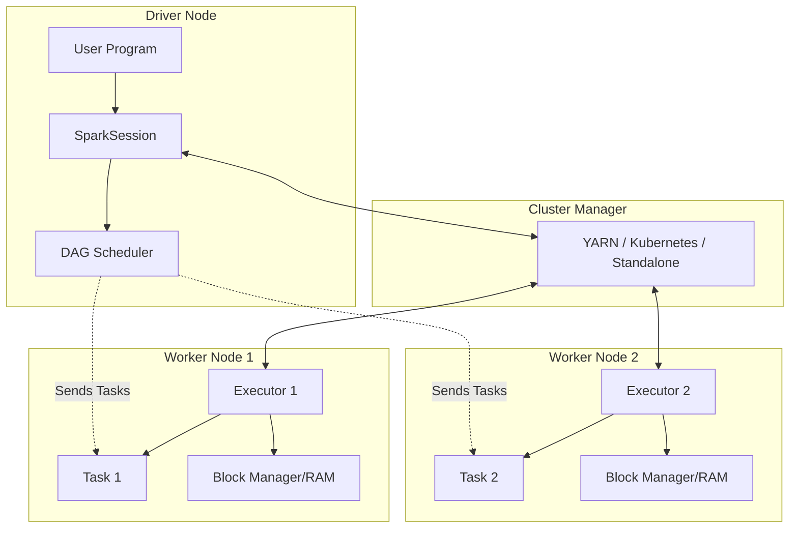

# Module 4.1: Spark Fundamentals

Welcome to **Spark Fundamentals**. As an AI Forward Deployed Engineer (FDE), you will routinely deal with scale. When datasets grow beyond the memory limits of a single machine (typically 16GB - 128GB), standard libraries like Pandas or Scikit-learn will crash with Out Of Memory (OOM) errors. Apache Spark is the industry standard for distributed cluster-scale data processing.

---

## 1. Detailed Theory

### What is Apache Spark?
Apache Spark is a unified, multi-language analytics engine for large-scale data processing. It handles both batch and real-time streaming workloads. Unlike traditional MapReduce (which writes intermediate results to physical disks), Spark processes data in-memory, making it up to 100x faster.

### Distributed Computing Concepts
Instead of processing data sequentially on one processor, distributed computing splits a massive dataset into chunks (partitions) and distributes them across a cluster of independent computer nodes, processing them in parallel.

### Spark Architecture
Spark runs in a Master-Worker architecture:
- **Driver Program**: The master node. Runs the `main()` function of your application, creates the `SparkSession`, translates user code into a Directed Acyclic Graph (DAG) of tasks, and coordinates work with the Executors.
- **Cluster Manager**: Coordinates resources across the cluster (e.g., Kubernetes, YARN, Standalone, Mesos).
- **Executor**: Worker nodes. Processes the tasks assigned by the Driver and stores data in RAM or disk.
- **Worker Nodes**: The physical or virtual servers that host Executors.

### DAG Execution Engine & Lazy Evaluation
- **Lazy Evaluation**: Spark does not execute transformations (like filtering or mapping) immediately when they are defined. Instead, it records them in a logical plan (DAG). The operations are only executed when an **Action** (like counting or writing data) is explicitly called.
- **DAG (Directed Acyclic Graph)**: The visual dependency graph representing the sequence of transformations Spark will perform when triggered by an action.

### Fault Tolerance
If a worker node crashes mid-job, Spark doesn't crash the pipeline. Because of the DAG, Spark knows the exact lineage of the lost partition and can recompute only the missing chunk on another healthy executor.

---

## 2. Architecture Diagram: Spark Cluster Architecture



---

## 3. Production Use Cases

1. **Large-scale Text Cleansing for LLMs**: Cleaning a 10TB corpus of raw web scrapings. Spark partitions the text across 100 executor nodes, running HTML parsing and PII filtering in parallel on each partition, saving the output as parquet files.
2. **IoT Sensor Ingestion**: Real-time aggregation of telemetry data from millions of connected cars streaming into a Kafka queue, analyzed via Spark Structured Streaming.

---

## 4. Real Company Examples

- **Netflix**: Uses Spark to process user viewing history, search history, and device metrics to feed their personalized recommendation engine.
- **Databricks**: Founded by the original creators of Apache Spark. They built a unified analytics platform around Spark to simplify cluster provisioning and execution.

---

## 5. Coding Examples

### Lazy Evaluation Showcase (Conceptual Python/PySpark)

```python
# This code defines transformations but does not process any files yet
raw_df = spark.read.text("s3://raw-logs/*.txt")  # Logical Read
filtered_df = raw_df.filter(raw_df.value.contains("ERROR"))  # Transformation
mapped_df = filtered_df.selectExpr("split(value, ' ')[0] as ip_address")  # Transformation

# The action below triggers the DAG execution
ip_counts = mapped_df.groupBy("ip_address").count()  # Transformation
ip_counts.write.mode("overwrite").parquet("s3://clean-logs/ip_counts")  # ACTION!
```

---

## 6. Hands-on Labs

**Lab: DAG Interpretation**
**Objective**: Understand execution pathways.
**Instructions**:
Look at the coding example above. Map out the DAG stages:
1. Which operations represent Transformations?
2. Which operation represents the Action that kicks off the cluster?
3. Draw a mental diagram of the dependencies between these tasks.

---

## 7. Assignments

**Assignment: Driver vs. Executor OOM**
You run a Spark script. It fails with an OutOfMemoryError. 
Explain the difference in troubleshooting if the error occurred on the **Driver** (e.g., calling `.collect()` on a massive DataFrame) vs. the **Executor** (e.g., performing a massive join without enough partition memory).

---

## 8. Interview Questions

1. **What is Lazy Evaluation in Apache Spark and what is its benefit?**
   *Answer Hint: Spark does not run transformations immediately. Instead, it builds a logical execution plan (DAG). This allows the query optimizer (Catalyst) to see the entire pipeline and optimize operations (e.g., pushing filters down to the source level) before execution.*
2. **How does Spark handle fault tolerance?**
   *Answer Hint: Through RDD lineage (the DAG). If an executor fails and a data partition is lost, Spark uses the recorded lineage of transformations to recalculate only that lost partition on a healthy executor.*

---

## 9. Best Practices (FDE Standards)

- **Avoid `.collect()` in Production**: Calling `.collect()` pulls the entire distributed dataset from the executors into the Driver's memory. If the dataset is larger than the Driver's RAM, the master node will crash immediately.
- **Scale Ephemerally**: In cloud environments, use auto-scaling Spark clusters that boot up for a job and shut down immediately when complete.

---

## 10. Common Mistakes

- **Forgetting Actions**: Writing a complex Spark script and realizing it finished in 0.5 seconds and produced no output because no Action (like `write` or `count`) was ever called to trigger execution.
- **Under-partitioning**: Having a 100GB dataset but only 2 partitions. Only 2 executors will do the work while the other 98 executors sit idle.
