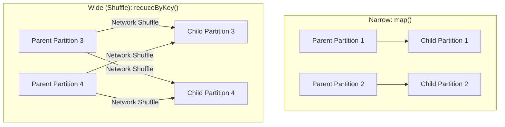

# Module 4.2: Spark Core

Welcome to **Spark Core**. Before high-level DataFrames and SQL were introduced, Spark operated on Resilient Distributed Datasets (RDDs). Understanding RDDs, transformations, actions, and partitioning is critical because these foundational concepts govern how Spark behaves under the hood.

---

## 1. Detailed Theory

### Resilient Distributed Dataset (RDD)
- **Resilient**: Fault-tolerant; can recompute missing partitions.
- **Distributed**: Split across multiple nodes in a cluster.
- **Dataset**: Immutable collection of objects.
- RDD is the low-level API of Spark. Modern Spark code uses DataFrames, which are internally compiled into RDDs.

### Transformations vs. Actions
- **Transformations**: Operations that create a new RDD from an existing one (e.g., `map`, `filter`). They are always lazy.
- **Actions**: Operations that trigger calculation and return a value to the Driver or write to external storage (e.g., `count`, `collect`, `saveAsTextFile`).

### Narrow vs. Wide Transformations
This is the most critical concept for Spark performance:
- **Narrow Transformations**: Each partition of the parent RDD is used by at most one partition of the child RDD (e.g., `map`, `filter`). No data is moved across the network. Extremely fast.
- **Wide Transformations (Shuffles)**: Multiple child partitions depend on data from multiple parent partitions (e.g., `groupByKey`, `reduceByKey`, `join`). Requires data to be written to disk and copied across the network (Shuffle). Extremely expensive.

### Partitioning & Caching
- **Partitioning**: The division of an RDD into logical chunks. Ideal partition size is 100MB - 1GB.
- **Caching (`.cache()`)**: Storing an RDD/DataFrame in the executor's RAM so it doesn't need to be recomputed if used multiple times in downstream steps.
- **Persistence (`.persist()`)**: A more flexible version of caching allowing you to specify storage levels (e.g., RAM only, RAM and Disk, serialized).

---

## 2. Architecture Diagram: Narrow vs. Wide Transformations



---

## 3. Production Use Cases

1. **Word Count / Tokenizer Pipeline**: Reading raw corpus files, executing `flatMap` to split lines into words, and using `reduceByKey` to compute vocabulary frequency counts.
2. **Re-partitioning for Writes**: Before writing data back to S3, using `coalesce` or `repartition` to avoid writing millions of tiny files, which creates the "small file problem" for cloud storage.

---

## 4. Real Company Examples

- **Scale AI**: Uses low-level RDD processing when extracting raw image bytes and coordinates for machine learning annotation pipelines where structured schemas do not apply.

---

## 5. Coding Examples

### Low-Level RDD Transformations and Actions

```python
# Assuming we have a SparkContext 'sc'
raw_rdd = sc.parallelize(["error: connection failed", "warning: retrying", "error: timeout"])

# 1. Narrow Transformation: Map and Filter
parsed_rdd = raw_rdd.map(lambda x: x.split(": "))
errors_only = parsed_rdd.filter(lambda x: x[0] == "error")

# 2. Wide Transformation: Map values and Reduce by key
error_pairs = errors_only.map(lambda x: (x[1], 1))
error_counts = error_pairs.reduceByKey(lambda a, b: a + b) # Shuffle occurs here!

# 3. Action: Collect results to Driver
results = error_counts.collect()
print(results)
# Output: [('connection failed', 1), ('timeout', 1)]
```

---

## 6. Hands-on Labs

**Lab: reduceByKey vs groupByKey**
**Objective**: Understand memory implications of wide transformations.
**Instructions**:
Write a short explanation of why `reduceByKey` is significantly faster and uses less memory than `groupByKey`. (Hint: Look at "Map-side Aggregations").

---

## 7. Assignments

**Assignment: Narrow or Wide?**
Classify the following RDD operations as either **Narrow** or **Wide** transformations:
1. `filter(lambda x: x > 10)`
2. `join(other_rdd)`
3. `flatMap(lambda x: x.split(" "))`
4. `distinct()`

---

## 8. Interview Questions

1. **What is an RDD?**
   *Answer Hint: Resilient Distributed Dataset. It is the basic abstraction of Spark representing an immutable, fault-tolerant collection of elements partitioned across cluster nodes.*
2. **Why is a Shuffle operation expensive?**
   *Answer Hint: Shuffling involves serializing data, writing it to local executor disk, moving it across the physical network to other executor nodes, and deserializing it to compute the output.*

---

## 9. Best Practices (FDE Standards)

- **Prefer `reduceByKey` over `groupByKey`**: `reduceByKey` performs local aggregations on each worker before sending data across the network. `groupByKey` transfers all key-value pairs across the network, easily causing executor memory crashes.
- **Cache strategically**: Only cache data if you plan to use it in multiple distinct actions. Caching consumes RAM that executors need for processing.

---

## 10. Common Mistakes

- **Caching everything**: Caching every intermediate DataFrame or RDD, leading to memory starvation and forcing Spark to write cached data to disk, negating speed benefits.
- **Missing Shuffles**: Forgetting that operations like `distinct()` or `groupBy()` cause heavy network traffic, and calling them unnecessarily inside loops.
