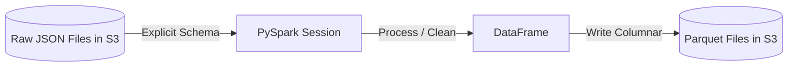

# Module 4.3: PySpark Fundamentals

Welcome to **PySpark Fundamentals**. While RDDs are the low-level API, PySpark's **DataFrame API** is what you will use 99% of the time. PySpark DataFrames are conceptually similar to Pandas DataFrames, but they are distributed across a cluster and execute using Spark's optimized execution planner.

---

## 1. Detailed Theory

### SparkSession
The unified entry point for reading, writing, and executing SQL queries in Spark. In PySpark, it is typically instantiated as `spark`.

### PySpark DataFrames
A distributed collection of data organized into named columns. Under the hood, DataFrames utilize the **Catalyst Optimizer** to generate highly optimized physical RDD execution plans.

### Schema Definition
Unlike Python, Spark is strictly typed. Defining schemas explicitly (using `StructType` and `StructField`) is crucial for production:
- **Schema-on-Read**: Spark infers the schema by scanning files (slow).
- **Explicit Schema**: You tell Spark what the schema is. This prevents pipeline crashes when files are malformed and runs significantly faster.

### File Formats
Data enters and exits Spark via cloud object storage (S3/GCS) in structured formats:
- **Parquet**: Columnar format with schema support, compression, and partition support. The default standard for Spark.
- **Delta Lake**: Adds ACID transactions, versioning (time-travel), and upsert support to Parquet files.

---

## 2. Architecture Diagram: PySpark Ingestion Pipeline



---

## 3. Production Use Cases

1. **Enterprise Customer Data Processing**: Ingesting messy JSON records from API dumps, applying a strict schema, casting date strings to timestamps, and writing clean Parquet files to a staging bucket.
2. **Sales Analytics Pipeline**: Joining daily transaction records with product dimension tables, calculating total sales, and writing partitions.

---

## 4. Real Company Examples

- **Airbnb**: Relies on PySpark DataFrames to ingest, clean, and structure the massive quantities of booking and listing data generated daily.

---

## 5. Coding Examples

### PySpark Ingestion and Output Script

```python
from pyspark.sql import SparkSession
from pyspark.sql.types import StructType, StructField, StringType, IntegerType, DoubleType

# 1. Initialize SparkSession
spark = SparkSession.builder \
    .appName("PySparkFundamentals") \
    .config("spark.sql.shuffle.partitions", "4") \
    .getOrCreate()

# 2. Define Explicit Schema
schema = StructType([
    StructField("customer_id", StringType(), False),
    StructField("customer_name", StringType(), True),
    StructField("age", IntegerType(), True),
    StructField("total_spend", DoubleType(), True)
])

# 3. Read data with Schema
df = spark.read \
    .format("json") \
    .schema(schema) \
    .load("raw_customers.json")

# 4. Perform Transformations
clean_df = df.filter(df.age >= 18) \
             .withColumnRenamed("customer_name", "full_name")

# 5. Write to Parquet (Action)
clean_df.write \
    .format("parquet") \
    .mode("overwrite") \
    .save("clean_customers.parquet")
```

---

## 6. Hands-on Labs

**Lab: Schema Definition**
**Objective**: Build a schema for sales data.
**Instructions**:
Write the PySpark schema (`StructType`) for a dataset with columns: `transaction_id` (string), `product_id` (string), `quantity` (integer), `price` (double), `timestamp` (timestamp).

---

## 7. Assignments

**Assignment: Infer Schema vs. Explicit Schema**
Write a short paragraph analyzing the performance trade-offs of using `inferSchema=True` on a 10TB CSV dataset compared to defining the schema explicitly. What steps does the Spark cluster take in each case?

---

## 8. Interview Questions

1. **How do you instantiate a Spark entry point in PySpark?**
   *Answer Hint: Using the `SparkSession.builder` method to configure and construct a unified session instance.*
2. **Why is Parquet preferred over CSV for big data processing in Spark?**
   *Answer Hint: Parquet is a columnar format. Spark only needs to read the columns requested in the query, whereas for CSV, it must scan every row and column. Parquet also stores schema metadata and supports compression natively.*

---

## 9. Best Practices (FDE Standards)

- **Never use `inferSchema` in production**: Inference requires Spark to read the entire dataset once to guess types before reading it again to run the job, doubling execution time on large datasets.
- **Tune Shuffle Partitions**: By default, Spark uses 200 shuffle partitions. If your dataset is small, this creates 200 tiny tasks (overhead). Set `spark.sql.shuffle.partitions` to match your cluster core count and data size.

---

## 10. Common Mistakes

- **Incorrect Data Types**: Defining a column as `IntegerType` when the source data contains decimals or text, causing Spark to output `null` values for that column.
- **Path Overwrites**: Running overwrite write commands (`.mode("overwrite")`) on a folder containing required source files, resulting in data loss.
