# Module 4.4: Spark SQL

Welcome to **Spark SQL**. In modern enterprise systems, you will often work alongside analysts who write pure SQL, and you will need to orchestrate SQL engines at scale. Spark SQL is a Spark module for structured data processing that allows you to run SQL queries against Spark DataFrames.

---

## 1. Detailed Theory

### Spark SQL Architecture
Spark SQL translates SQL statements and DataFrame operations into the same execution plans. Whether you write `.filter()` in Python or `WHERE` in SQL, the performance is identical because they both compile down to the same optimized JVM bytecode.

### Key Optimization Components
1. **Catalyst Optimizer**: An extensible query optimizer. It compiles the SQL/DataFrame statement and performs optimizations:
   - **Analysis**: Resolves table and column names using the catalog.
   - **Logical Optimization**: Applies rules like *Predicate Pushdown* (filtering data at the source before reading it) and *Constant Folding* (evaluating constants in the compiler).
   - **Physical Planning**: Generates multiple physical plans and selects the most cost-efficient one.
2. **Tungsten Engine**: Optimizes execution by managing memory manually (off-heap) to avoid Java Garbage Collection overhead and compiling query plans into optimized machine code (Whole-Stage Code Generation).

### Views and SQL Execution
- **Temporary Views**: To query a DataFrame with SQL, you must register it as a temporary view. Temporary views are session-scoped and disappear when the SparkSession stops.
- **Global Temporary Views**: Shared across all Spark Sessions within a single Spark application.

---

## 2. Architecture Diagram: Catalyst Optimizer Compilation Flow

```mermaid
flowchart LR
    Code[SQL Query / DataFrame Code] --> Unresolved[Unresolved Logical Plan]
    Unresolved -->|Catalog Lookup| Analyzed[Analyzed Logical Plan]
    Analyzed -->|Optimization Rules| Optimized[Optimized Logical Plan]
    Optimized -->|Physical Planning| Physical[Physical Plans]
    Physical -->|Cost Model Evaluation| Selected[Selected Physical Plan]
    Selected -->|Code Generation| RDD[Optimized RDDs / Code]
```



---

## 3. Production Use Cases

1. **Enterprise Reporting System**: Ingesting daily sales data, registering it as a temp view, and running complex SQL queries containing window functions, CTEs (Common Table Expressions), and joins to calculate regional performance metrics.
2. **Cross-Language Collaboration**: Data Engineers build clean DataFrames in PySpark and register them as tables, allowing Business Intelligence analysts to query them directly using Spark SQL in SQL notebooks.

---

## 4. Real Company Examples

- **Uber**: Uses Spark SQL to parse billions of weekly trip records, running complex analytical SQL queries directly on top of their Hudi data lakehouse.

---

## 5. Coding Examples

### Running SQL Queries on PySpark DataFrames

```python
from pyspark.sql import SparkSession

spark = SparkSession.builder.appName("SparkSQLShowcase").getOrCreate()

# 1. Load data
df = spark.read.parquet("s3://clean-orders/")

# 2. Register as a Temporary View
df.createOrReplaceTempView("orders")

# 3. Execute SQL Query with CTE and Window Function
sql_query = """
    WITH regional_sales AS (
        SELECT 
            region,
            customer_id,
            SUM(amount) AS total_spend
        FROM orders
        GROUP BY region, customer_id
    )
    SELECT 
        region,
        customer_id,
        total_spend,
        RANK() OVER (PARTITION BY region ORDER BY total_spend DESC) as rank
    FROM regional_sales
"""

ranked_sales_df = spark.sql(sql_query)

# Filter for top customers in each region
top_customers = ranked_sales_df.filter("rank <= 3")
top_customers.write.parquet("s3://reports/top_regional_customers")
```

---

## 6. Hands-on Labs

**Lab: Explaining the Plan**
**Objective**: Inspect the physical plan.
**Instructions**:
Write a short PySpark script that reads a dataset, filters it, and calls `.explain(True)`. Look at the output in the console. Identify the sections for: `Parsed Logical Plan`, `Analyzed Logical Plan`, `Optimized Logical Plan`, and `Physical Plan`.

---

## 7. Assignments

**Assignment: Predicate Pushdown Analysis**
Explain the concept of **Predicate Pushdown** in the Catalyst Optimizer. Why does pushing a filter (e.g., `WHERE age > 30`) down to a Parquet data source level dramatically improve query performance compared to reading all data and filtering it in memory?

---

## 8. Interview Questions

1. **What is the difference between a temporary view and a global temporary view?**
   *Answer Hint: A temporary view is session-scoped and visible only to the specific Spark session that created it. A global temporary view is application-scoped and shared across all sessions of that Spark application (accessed via the `global_temp` database).*
2. **What does the Tungsten engine do?**
   *Answer Hint: Tungsten optimizes Spark execution by bypassing the JVM heap to avoid garbage collection overhead (managing off-heap memory) and generating custom machine code at runtime (Whole-Stage Code Generation).*

---

## 9. Best Practices (FDE Standards)

- **Use CTEs for Readability**: When writing complex SQL, avoid nested subqueries. Use Common Table Expressions (CTEs) to make the SQL query maintainable.
- **SQL vs DataFrame API**: Choose whichever is more readable for the task. The compiler output is identical. For complex schemas and pipelines, DataFrames are easier to unit test, while for analytical summaries, SQL is often cleaner.

---

## 10. Common Mistakes

- **Name Collisions in Temp Views**: Re-using the same temporary view name (`df.createOrReplaceTempView("data")`) in a large notebook, leading to downstream tasks accidentally reading the wrong intermediate data.
- **Top-level execution of `.explain()`**: Leaving debug `.explain()` calls active in production jobs, which clutters the logs with thousands of lines of query plans.
