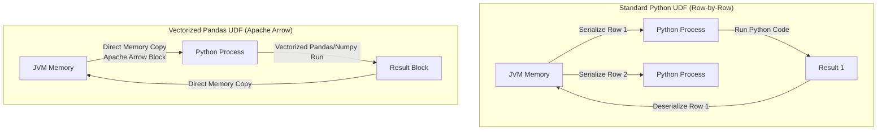

# Module 4.5: Data Transformations

Welcome to **Data Transformations in Spark**. Transforming data at scale requires combining declarative DataFrame operations with custom user-defined logic. As an FDE, you will build complex pipelines that clean user activity, join multi-million-row tables, and run python-based machine learning calculations using Pandas UDFs.

---

## 1. Detailed Theory

### Core DataFrame Transformations
- **Select & Filter**: Projecting columns and subsetting rows.
- **GroupBy & Aggregation**: Summarizing metrics across grouping keys.
- **Join Operations**: Joining datasets. Spark supports Inner, Outer, Left, Right, Semi, Anti, and Cross joins.
- **Window Operations**: Performing calculations across a range of rows related to the current row (e.g., calculating a moving average or rank).

### User-Defined Functions (UDFs)
When SQL or DataFrame APIs cannot express your logic (e.g., parsing a complex string using a custom python library), you must write a **UDF**.
- **Standard Python UDF**: Very slow. Spark must serialize each row, send it from the JVM to a Python worker process, run the function, and send it back to the JVM (PySpark Serialization Bottleneck).
- **Pandas UDFs (Vectorized UDFs)**: Extremely fast. Utilizes **Apache Arrow** to transfer data between JVM and Python in high-performance column blocks, executing vector operations using Pandas/Numpy.

---

## 2. Architecture Diagram: Standard vs. Pandas UDF Execution



---

## 3. Production Use Cases

1. **Customer 360 Transformation Pipeline**: Taking customer profiles, web clicks, and purchase histories, joining them via outer joins, and running a window function to calculate the time difference between a customer's first click and their first purchase.
2. **Real-time Feature Generation (Pandas UDF)**: Applying a pre-trained Python machine learning model (e.g., a Scikit-learn model) to score batches of incoming data in parallel across executors.

---

## 4. Real Company Examples

- **Spotify**: Uses Spark Window functions extensively to compute rolling listening history metrics for their personalized weekly playlist recommendations.

---

## 5. Coding Examples

### Window Function & Vectorized Pandas UDF

```python
from pyspark.sql import SparkSession
from pyspark.sql.window import Window
import pyspark.sql.functions as F
from pyspark.sql.functions import pandas_udf
import pandas as pd

spark = SparkSession.builder.appName("TransformationShowcase").getOrCreate()
df = spark.read.parquet("s3://sales-data/")

# 1. Window Function: Calculate 3-day rolling average spend per customer
window_spec = Window.partitionBy("customer_id") \
                    .orderBy("transaction_date") \
                    .rowsBetween(-2, 0) # Current row and 2 preceding rows

rolling_avg_df = df.withColumn("rolling_avg_spend", F.avg("amount").over(window_spec))

# 2. Vectorized Pandas UDF: Apply a custom exponential decay score to customer spend
@pandas_udf("double")
def calculate_decay_score(spend: pd.Series, days_active: pd.Series) -> pd.Series:
    # Runs vectorized numpy/pandas operations directly
    return spend * (0.95 ** days_active)

scored_df = rolling_avg_df.withColumn("decay_score", calculate_decay_score(F.col("amount"), F.col("days_active")))
scored_df.write.parquet("s3://clean-features/")
```

---

## 6. Hands-on Labs

**Lab: Inner vs. Anti Join**
**Objective**: Detect missing keys.
**Instructions**:
Write the PySpark syntax to perform an **Anti Join** between a `users` DataFrame and an `orders` DataFrame on `user_id` to find all users who have never placed an order.

---

## 7. Assignments

**Assignment: Python UDF vs Pandas UDF Performance**
Write a short technical analysis explaining why standard Python UDFs degrade Spark's performance. Explain how Apache Arrow resolves this issue in Pandas UDFs.

---

## 8. Interview Questions

1. **What is a Window Function in Spark?**
   *Answer Hint: A function that performs calculations across a set of table rows that are related to the current row (defined by a Window Spec partition and order), without collapsing the rows into a single group (unlike groupByKey).*
2. **What is an Anti Join and when would you use it?**
   *Answer Hint: An Anti Join returns only the rows from the left table that have no matching keys in the right table. Useful for finding anomalies, missing values, or exclusions (e.g., finding inactive users).*

---

## 9. Best Practices (FDE Standards)

- **Avoid Standard UDFs**: Always attempt to write transformations using built-in Spark SQL functions (`pyspark.sql.functions`) first. If you must write custom logic, use Vectorized Pandas UDFs.
- **Never collect inside UDFs**: UDF logic executes on the workers. Do not attempt to query databases or read files from within a UDF.

---

## 10. Common Mistakes

- **Incorrect UDF Return Type**: Specifying a Pandas UDF return type as `DoubleType()` but returning a Pandas Series containing strings, leading to silent null values or executor crashes.
- **Window partitioning without Ordering**: Using a window specification with `partitionBy` but omitting `orderBy`, which makes the window boundaries unpredictable.
