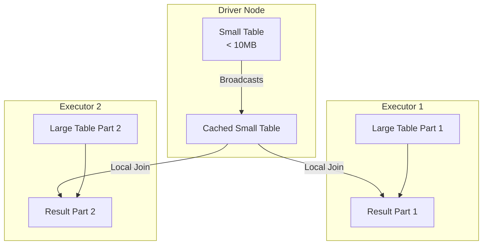

# Module 4.6: Advanced Spark

Welcome to **Advanced Spark**. Writing working code is the first step. Designing optimized, production-grade Spark pipelines that avoid network bottlenecks, manage data skew, and execute fast is the goal. In this module, we dive deep into Spark internals, performance tuning, and shuffle optimizations.

---

## 1. Detailed Theory

### Shared Variables
Spark tasks run on independent workers. If a task needs access to a variable, Spark sends a copy of that variable to every worker node.
- **Broadcast Variables**: Allows the programmer to keep a read-only variable cached on each machine rather than shipping a copy of it with tasks. Extremely useful for joining a large table with a small lookup table.
- **Accumulators**: Variables that are only "added" to through an associative and commutative operation (e.g., counters for tracking corrupt records). Only the Driver can read the accumulator's value.

### Shuffle Optimization and Partitioning
- **Shuffle Operations**: Triggered by wide transformations. Shuffling is the biggest bottleneck in Spark.
- **Repartition vs. Coalesce**:
  - `repartition(N)`: Reshuffles all data across the network to create exactly N partitions. Can increase or decrease partitions. Extremely expensive.
  - `coalesce(N)`: Decreases partitions without a full shuffle. It merges local partitions. Use this before writing data to reduce file count.
- **Bucketing**: Pre-sorting and partitioning data on a column when saving it. If two large tables are bucketed on the same column, Spark can join them without performing any shuffles (a Sort-Merge Join becomes a simple localized read).

### Spark Join Optimization
- **Broadcast Hash Join (Map-Side Join)**: If one table is small (default < 10MB, configurable), Spark broadcasts the small table to all executors. The join happens locally on each executor. No shuffling occurs. Extremely fast.

---

## 2. Architecture Diagram: Broadcast Hash Join



---

## 3. Production Use Cases

1. **Broadcast Join for Fraud Detection**: Joining a 10TB transaction stream (large DataFrame) with a 5MB blacklist of known fraud IPs (small DataFrame). By broadcasting the blacklist, the job runs in minutes instead of hours.
2. **Coalescing Output Files**: Running a massive aggregation that generates 2,000 tasks. Before writing the output to S3, calling `.coalesce(10)` to write 10 large Parquet files instead of 2,000 tiny 5KB files.

---

## 4. Real Company Examples

- **Facebook / Meta**: Processes petabytes of user data daily, relying heavily on pre-bucketed tables to perform massive joins without triggering cluster-crashing shuffles.

---

## 5. Coding Examples

### Implementing Broadcast Joins and Accumulators

```python
from pyspark.sql import SparkSession
import pyspark.sql.functions as F

spark = SparkSession.builder.appName("AdvancedSparkShowcase").getOrCreate()

# 1. Using an Accumulator to track corrupt rows
corrupt_records_count = spark.sparkContext.accumulator(0)

def parse_and_count_corrupt(row):
    global corrupt_records_count
    if row.value is None or len(row.value) == 0:
        corrupt_records_count += 1 # Increments the counter on the worker
        return False
    return True

# 2. Broadcast Join Example
large_df = spark.read.parquet("s3://raw-activity/")
small_lookup_df = spark.read.parquet("s3://country-codes/") # ~5MB

# Explicitly tell Spark to broadcast the small table
optimized_join_df = large_df.join(
    F.broadcast(small_lookup_df), 
    on="country_code", 
    how="left"
)

# 3. Coalescing before writing
optimized_join_df.coalesce(5) \
                 .write \
                 .mode("overwrite") \
                 .parquet("s3://clean-activity/")

print(f"Corrupt records encountered: {corrupt_records_count.value}")
```

---

## 6. Hands-on Labs

**Lab: Repartition vs Coalesce**
**Objective**: Understand execution plans for repartitioning.
**Instructions**:
Write a script that takes a DataFrame and calls `.repartition(10)`. Save the plan using `.explain()`. Then modify the script to use `.coalesce(10)` and inspect the plan again. Identify where the Shuffle operation (`Exchange`) appears.

---

## 7. Assignments

**Assignment: Handling Data Skew**
You are joining two tables on `user_id`. 99% of users have 1-2 transactions, but the "Guest" user account (`user_id = 'GUEST'`) has 50 million transactions. This causes one executor to process 50 million rows (skew) while the other executors sit idle.
Propose a solution to handle this data skew (Hint: Look up "Salting" keys).

---

## 8. Interview Questions

1. **What is the difference between `repartition()` and `coalesce()`?**
   *Answer Hint: `repartition()` creates a brand-new set of partitions by performing a full network shuffle. It can increase or decrease partitions. `coalesce()` avoids a shuffle by merging local partitions on the same node, meaning it can only decrease partitions.*
2. **What is a Broadcast Hash Join?**
   *Answer Hint: An optimization where Spark copies a small table to all executor nodes. This allows each executor to perform a localized map-side join with its partition of the large table, completely avoiding a network shuffle.*

---

## 9. Best Practices (FDE Standards)

- **Use Broadcast Joins**: Whenever joining a dataset smaller than 100MB with a large table, always use `F.broadcast()`.
- **Salt Skewed Keys**: If a partition key is heavily skewed (e.g., nulls or generic values), add a random number suffix (salt) to distribute the data evenly across partitions during joins.

---

## 10. Common Mistakes

- **Incorrect Coalesce usage**: Calling `.coalesce(100)` to increase partitions from 10 to 100. `coalesce` cannot increase partitions; the command will execute silently without changing partition count.
- **Reading Accumulators on Workers**: Attempting to print or read the value of an Accumulator within an RDD/DataFrame map task. Workers can only write/add to accumulators. Only the Driver can read the final value.
