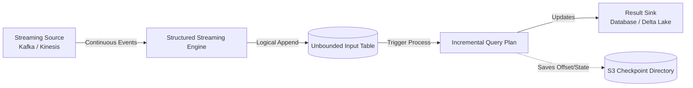

# Module 4.7: Structured Streaming

Welcome to **Spark Structured Streaming**. In modern enterprise systems, waiting for a nightly batch job is often too slow. You need real-time answers. Structured Streaming is a scalable and fault-tolerant stream processing engine built on the Spark SQL engine, treating streaming data as an unbound, continuously growing table.

---

## 1. Detailed Theory

### Streaming Concepts
- **Unbounded Table**: Conceptually, Structured Streaming treats the incoming stream as a table that is constantly appended to.
- **Trigger**: Defines the timing of streaming data processing (e.g., run every 10 seconds, or run in micro-batches).

### Event-Time Processing & Watermarking
- **Event-Time**: The time when the event actually occurred at the source (e.g., when a user clicked a button on their phone), not when Spark received it.
- **Watermarking**: A threshold that tells Spark how long to wait for late-arriving data (e.g., if a phone goes offline and sends data 10 minutes late). A watermark of `10 minutes` tells Spark to discard any events arriving older than `current_max_event_time - 10 minutes` to prevent memory bloat.
- **Windowing**: Grouping streaming data into time buckets (e.g., 5-minute tumbling windows) based on the event-time.

### Checkpointing & Fault Tolerance
- **Checkpointing**: Saving the execution state (metadata and offset tracking) to a durable storage location (like S3/GCS). If the streaming query crashes, it can restart from the exact offset it left off, guaranteeing **Exactly-Once** semantics.

---

## 2. Architecture Diagram: Structured Streaming Model



---

## 3. Production Use Cases

1. **Real-Time Fraud Detection**: Financial transactions stream into a Kafka topic. Spark Structured Streaming reads the stream, joins it with customer profile features, scores it using an ML model, and writes flagged transactions to a database in sub-second latency.
2. **Real-Time Web Analytics**: Aggregation of website pageviews in 10-minute sliding windows to display an active visitor dashboard.

---

## 4. Real Company Examples

- **Uber**: Employs Structured Streaming to process real-time driver locations, matching algorithms, and ETAs, streaming results directly back into their maps engine.

---

## 5. Coding Examples

### Read from Kafka, Window with Watermark, and Write to Console

```python
from pyspark.sql import SparkSession
import pyspark.sql.functions as F

spark = SparkSession.builder \
    .appName("StructuredStreamingShowcase") \
    .config("spark.sql.shuffle.partitions", "2") \
    .getOrCreate()

# 1. Read Stream from Kafka
kafka_stream = spark.readStream \
    .format("kafka") \
    .option("kafka.bootstrap.servers", "localhost:9092") \
    .option("subscribe", "user_activity") \
    .load()

# Convert value from binary to string and cast timestamp
activity_df = kafka_stream.selectExpr("CAST(value AS STRING) as json_payload", "timestamp")

# 2. Parse JSON and define schema
parsed_df = activity_df.select(
    F.from_json(F.col("json_payload"), "user_id STRING, action STRING").alias("data"),
    F.col("timestamp")
).select("data.*", "timestamp")

# 3. Apply Watermarking and 5-Minute Windowing
windowed_counts = parsed_df \
    .withWatermark("timestamp", "10 minutes") \
    .groupBy(
        F.window(F.col("timestamp"), "5 minutes"),
        F.col("action")
    ).count()

# 4. Write the output stream to Console (Append or Update mode)
query = windowed_counts.writeStream \
    .format("console") \
    .outputMode("complete") \
    .option("checkpointLocation", "s3://my-checkpoint-bucket/streaming_counts") \
    .trigger(processingTime="10 seconds") \
    .start()

query.awaitTermination()
```

---

## 6. Hands-on Labs

**Lab: Output Modes**
**Objective**: Understand Output Modes in Streaming.
**Instructions**:
Write a short explanation of the differences between the three streaming output modes:
1. **Append Mode**: (Only writes new rows).
2. **Update Mode**: (Only writes rows that changed).
3. **Complete Mode**: (Writes the entire table every time).
Explain which mode is required when performing aggregations without watermarking.

---

## 7. Assignments

**Assignment: Watermark Memory Management**
Describe exactly what happens to the memory (RAM) of a Spark executor if you run a stateful streaming aggregation query (like `groupBy("event_time").count()`) *without* defining a watermark. What is the eventual result?

---

## 8. Interview Questions

1. **What is the purpose of Watermarking in Structured Streaming?**
   *Answer Hint: Watermarking is used to handle late-arriving data. It defines how long Spark will keep state in memory for late data. Once an event's time falls older than the watermark threshold, Spark clears it from memory to prevent OutOfMemory crashes.*
2. **How does Spark guarantee exactly-once processing in streaming?**
   *Answer Hint: Through the combination of write-ahead logging (WAL) and checkpointing (which records the processed data source offsets in S3/GCS), alongside idempotent sinks (like Delta Lake or databases supporting upserts).*

---

## 9. Best Practices (FDE Standards)

- **Always Specify Checkpoints**: Never deploy a production streaming query without specifying `checkpointLocation`. Without it, you cannot recover from cluster failures.
- **Tune Shuffle Partitions**: The default partition count is 200. If your streaming micro-batches are small, this creates massive scheduling overhead. Set `spark.sql.shuffle.partitions` to a small number (e.g., 2 - 8) for low latency.

---

## 10. Common Mistakes

- **Applying Batch Operations**: Attempting to call `.show()` or `.count()` directly on a streaming DataFrame. These are batch actions; calling them on a stream will throw an `AnalysisException`.
- **Ignoring Driver RAM**: Letting the streaming state grow indefinitely without watermarks, causing the JVM to run out of memory.
