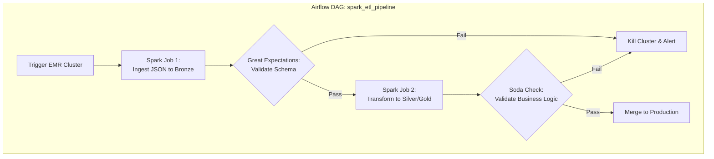

# Module 4.9: Spark + Data Engineering

Welcome to **Spark + Data Engineering**. Moving data is easy; ensuring that data pipelines are orchestrable, idempotent, tested, and high-quality is the actual engineering challenge. In this module, you'll learn how to build production-grade Spark ETL/ELT pipelines, integrate data quality frameworks, and orchestrate Spark jobs with Airflow.

---

## 1. Detailed Theory

### PySpark ETL vs. ELT Pipelines
- **ETL in Spark**: Extract raw files (e.g., CSV/JSON) from a source, perform heavy transformations in a Spark cluster's memory, and load the conformed results into a Delta/Parquet target (Standard pattern).
- **ELT in Spark**: Load the raw data as-is into a Bronze layer table, and use Spark SQL to run transformations that load Silver and Gold layer tables (Medallion architecture).

### CDC Processing in Spark
Change Data Capture (CDC) streams event logs (Inserts, Updates, Deletes) from transactional systems.
- In Spark, you must consume this stream and apply it to a target Lakehouse table. This is done by writing logic that processes CDC record actions: appending new rows, updating existing rows, and handling hard/soft deletes (often using Delta `MERGE` inside a streaming sink).

### Data Quality & Validation
Do not write data blindly. You must validate schemas and value bounds:
- **Great Expectations / Soda**: Open-source libraries that allow you to define declarative rules (e.g., "This column must not contain nulls", "This value must be between 0 and 100") and run them directly against Spark DataFrames to block bad runs.

### Orchestration Integration
- **Airflow / Dagster**: Run Spark jobs using asynchronous operators (e.g., `DatabricksSubmitRunOperator`, `EmrAddStepsOperator`). Airflow triggers the cluster compute and monitors execution status.

---

## 2. Architecture Diagram: Production Spark ETL Pipeline



---

## 3. Production Use Cases

1. **Insurance Claims Pipeline**: Ingesting complex claims data, joining tables, running business rules validations (e.g., checking that `claim_date >= accident_date`), and loading conformed tables for risk analysis.
2. **Dynamic CDC Processor**: Reading raw transaction logs, identifying whether a row is an `INSERT`, `UPDATE`, or `DELETE`, and executing a vectorized merge statement to ensure target tables mirror production databases.

---

## 4. Real Company Examples

- **Capital One**: Relies on Spark pipelines to ingest credit card transactions, running extensive data quality validation checks using custom data frameworks before releasing data to internal ML platforms.

---

## 5. Coding Examples

### Spark ETL with Data Quality Check (Great Expectations)

```python
from pyspark.sql import SparkSession
import pyspark.sql.functions as F
import great_expectations as ge

# 1. Initialize Session
spark = SparkSession.builder.appName("DataEngineeringETL").getOrCreate()

# 2. Extract
raw_df = spark.read.csv("s3://raw-claims/*.csv", header=True, inferSchema=True)

# 3. Transform & Clean
clean_df = raw_df.withColumn("claim_amount", F.coalesce(F.col("claim_amount"), F.lit(0.0))) \
                 .filter(F.col("claim_id").isNotNull())

# 4. Validate (Great Expectations Integration)
# Wrap Spark DataFrame with Great Expectations wrapper
ge_df = ge.dataset.SparkDFDataset(clean_df)

# Define expectations
validation_result1 = ge_df.expect_column_values_to_not_be_null("claim_id")
validation_result2 = ge_df.expect_column_values_to_be_between("claim_amount", min_value=0.0)

# Evaluate results
if not (validation_result1["success"] and validation_result2["success"]):
    # Write corrupt data to a Dead Letter Queue (DLQ)
    clean_df.write.parquet("s3://dlq/corrupt-claims/")
    raise ValueError("Data Quality Validation Failed!")

# 5. Load
clean_df.write.format("delta").mode("append").save("s3://lakehouse/claims")
```

---

## 6. Hands-on Labs

**Lab: Schema Verification**
**Objective**: Build a schema assertion check.
**Instructions**:
Write a Python function that takes a Spark DataFrame and an expected list of columns (with types). Programmatically check if the DataFrame schema matches the expectation, and raise an error if any columns are missing or have incorrect types.

---

## 7. Assignments

**Assignment: Idempotent Load Design**
You have a daily Spark job that runs at 3 AM. On Tuesday, the job fails halfway through writing data to the destination database because the network dropped. 
Describe how you would design this write phase so that re-running the Spark job on Tuesday at 4 AM does not result in duplicate records or corrupt data in the target table.

---

## 8. Interview Questions

1. **How do you integrate Spark with workflow orchestrators like Airflow?**
   *Answer Hint: You use Airflow providers/operators (like Databricks or EMR operators) to call APIs that trigger jobs on external Spark compute clusters. Airflow periodically pings the API (sensors) to check status, keeping the Airflow nodes free from heavy compute load.*
2. **What is the purpose of a Dead Letter Queue (DLQ) in Spark ETL?**
   *Answer Hint: If a pipeline encounters malformed records that fail data quality validation, instead of halting the entire job (which affects clean records), you write the corrupt rows to a separate folder (DLQ) for inspection and proceed to process the healthy data.*

---

## 9. Best Practices (FDE Standards)

- **Write to Staging First**: During the Load phase, write your Spark DataFrame to a temporary staging table or path first, run validation checks on it, and then perform a metadata swap or merge into production.
- **Isolate Code from Orchestration**: Do not put your Spark processing logic directly inside Airflow Python files. Keep the PySpark code in `.py` files inside a separate repository, and use Airflow merely to invoke them.

---

## 10. Common Mistakes

- **Swallowing Exceptions**: Writing `try...except` blocks that catch and print errors but do not raise them, causing Airflow to mark a failed Spark job as successful.
- **Relying on Source Data Ordering**: Assuming file systems return files in alphabetical or chronological order when loading directory paths. Always sort file paths explicitly if ingestion order matters.
